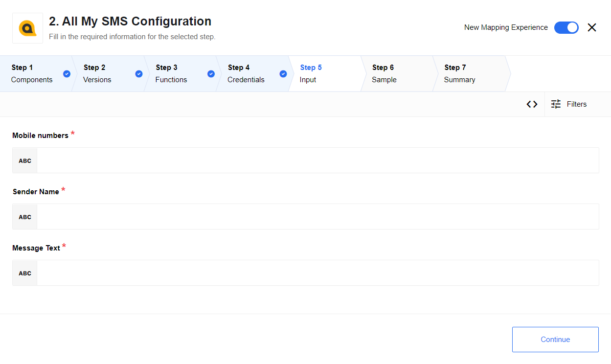

## How works

The component enables sending of the SMS from the platform.
It includes a demo API key and `Trial` sending ability, when the trial is used
the message that is sent has a prefix of `TRIAL USE: ` added to the message, the
number of senders is limited to 2 in trial mode.

## Credentials

*   `API key` - API key to access AllMySMS service API.
*   `login` - Login of user account for AllMySMS API.

If one of the credential fields is blank then component will work in a trial mode:

*   `TRIAL USE: ` will be added before the text
*   Number of recipients will be limited to two.

## Requirements

### Environment variables
No.

### Technical Notes

The [technical notes](technical-notes) page gives some technical details about
AllMySMS component like [changelog](technical-notes#changelog).

## Triggers

This component has no trigger functions. This means you can not select it as a first
component during the integration flow design.

## Actions

### Send

This action will send SMS to one or multiple numbers provided all the input
fields are filled are filled correctly.

Here are the input fields:

*   **Mobile numbers** - List of receivers mobile numbers separated with comma. E.g. `"3xxxxxxxx,3xxxxxxxxx"`. Recommended to limit number of receivers to 2000. **N.B. Specific number validation is not performed by the platform.**
*   **Sender Name** - Sender name that will be displayed on receiver side. Requirements: 3 to 11 characters, only alpha-numeric (`A-Z/0-9`) and must start with a letter.
*   **Message Text** - Text that will be sent. Requirements: Maximal length is 160. Everything above will be truncated.

### Additional information

Check [AllMySMS API online documentation](https://doc.allmysms.com/api/en/) for details.

## Known limitations

Here are the limitation of this component enforced by the [AllMySMS](https://www.allmysms.com/en/).

*   **Sender Name** must be 3 to 11 characters long and contain only alpha-numeric (`A-Z/0-9`) values and must start with a letter.
*   **Message Text** must be no longer than 160 characters for a single SMS.
*   **Number of recipients** is recommended to keep below 2000.
