## Description

Data integration with Amazon enables high levels of selling automation, which can help sellers grow
their business. Please visit [Amazon Marketplace Web Service (Amazon MWS) Documentation](http://docs.developer.amazonservices.com/en_UK/dev_guide/index.html) for more information.

### How works

This Amazon MWS component can be used to connect your Amazon Seller account with
other services.

> If you intend to use the Amazon MWS API you must have an Amazon MWS-eligible seller account and you must register to use Amazon MWS. Please [visit Registering to use Amazon MWS](http://docs.developer.amazonservices.com/en_US/dev_guide/DG_Registering.html) page to choose your country applicable developer's page.

### Technical Notes

The [technical notes](technical-notes) page gives some technical details about AWS-S3 component like [changelog](/components/amazon-mws/technical-notes#changelog) and [completeness matrix](/components/amazon-mws/technical-notes#completeness-matrix).

## Credentials

Here are the credentials necessary to authenticate with the Amazon MWS:

*   `Seller ID` - your seller ID. Check [connecting the Amazon Seller account](#connecting-the-amazon-seller-account) for more.
*   `MWS Auth Token` - a token associated with the ID. Check [connecting the Amazon Seller account](#connecting-the-amazon-seller-account) for more. It is required but in some cases (e.g. when the seller and the developer are the same) it may not be needed. You can input any dummy value in this case (e.g. `test`).
*   `Amazon MWS Secret Access Key` - your developer account **AWS Access Key ID**. Check [locating your developer keys](#locating-your-developer-keys) for more.
*   `Amazon MWS Access Key` - your developer account **Secret Key**. Check [locating your developer keys](#locating-your-developer-keys) for more.
*   `Amazon Marketplace ID` (Country specific) - the marketplace ID where you are connecting. To find the specific marketplace ID check the [Amazon MWS endpoints and Marketplace Id values](http://docs.developer.amazonservices.com/en_US/dev_guide/DG_Endpoints.html) documentation.

Please refer to the document [how to provide us access to your Amazon seller account](https://developer.amazonservices.com/gp/mws/faq.html#mawsportal-faq-accessToDeveloper) for details.

## Requirements

### Environment variables

|Name|Mandatory|Description|Values|
|----|---------|-----------|------|
|RESPONSE_CHECK_DELAY| false | Determines delay for requesting submit feed result (in milliseconds)| Default: `30000` |

## Triggers

### Get New And Updated Orders

This trigger polls for the orders in your seller account based on the selected Order Status.
All orders which are retrieved according to specified parameters are stored in component memory and will be emited in one message after the last order is retrieved.

User is able to use following input fields to configure the step:

#### Order Status

Is the only required field, it has the following available values:

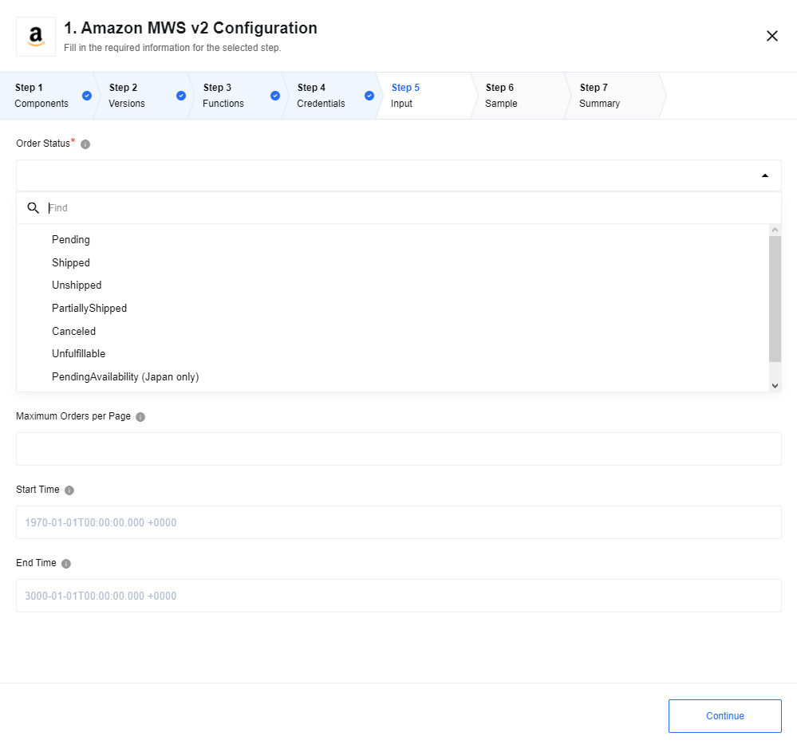

*   `Pending` - all the pending orders
*   `Shipped` - all the shipped orders
*   `Unshipped` - all unshipped orders
*   `PartiallyShipped` - partially shipped orders
*   `Canceled` - canceled orders
*   `Unfulfillable` - not fulfillable orders
*   `PendingAvailability (Japan only)` - all orders with status `pending availability`, only available in the Japan store
*   `InvoiceUnconfirmed (China only)` - all orders with status `invoice unconfirmed`, only specific to Chinese store

#### Maximum Orders per Page

Number of maximum orders per request page, find more info about `MaxResultsPerPage` in [Amazon MWS documentation](https://docs.developer.amazonservices.com/en_US/orders-2013-09-01/Orders_ListOrders.html).

>**Please Note:**
1. Sample would be retrieved according to specified value.
2. Trigger would retrieve all requested objects during runtime (each request to Amazon MWS would be sent according to specified value).

#### Start Time

Starting from this time trigger retrieves orders from Amazon MWS (`LastUpdatedAfter` in Amazon MWS).

Use `1970-01-01T00:00:00.000 +0000` format for input data, it will be transformed under hood to [Amazon MWS date format](https://docs.developer.amazonservices.com/en_US/dev_guide/DG_ISO8601.html)

#### End Time

Before this time trigger retrieves orders from Amazon MWS (`LastUpdatedBefore` in Amazon MWS).

Use `1970-01-01T00:00:00.000 +0000` format for input data, it will be transformed under hood to [Amazon MWS date format](https://docs.developer.amazonservices.com/en_US/dev_guide/DG_ISO8601.html)

>**Please Note:**
1. Trigger debug task (sample retrieve) makes ONLY one API request for throttling safe purposes. Component will throw an exception, if Amazon MWS returns a response with code 503 caused by throttling. In any other cases trigger will poll Amazon MWS API till correct response any 30 seconds (by default).
2. Next flow steps after `Get New And Updated Orders` trigger may require additional memory in case when big number of orders emited by the trigger, or they could fail with error `Reason: OOMKilled Exit Code: 137`.
3. We recommend to use real-time flow in cases when more than ~2000 orders are expected to be emitted by the trigger.

#### Limitations

1. Trigger throws an error in case when no more orders found for specified time range in case when `End Time` has been specified : `Caused by: com.amazonservices.mws.orders._2013_09_01.MarketplaceWebServiceOrdersException: LastUpdatedAfter date [2021-02-19T13:38:48.974Z] cannot be after LastUpdatedBefore date [2021-01-20T10:00:00.000Z]`

## Actions

### Get Order

Takes an array of Amazon Order IDs as an input and returns an array of orders for each order.


Input sample:

```json
{
  "amazonOrderIds": ["114-3808039-1650643", "114-3665772-3967461"]
}
```


### List Order Items

This action would fetch and give the Order Items on output. This action only
needs the Amazon `Order Id` on input:

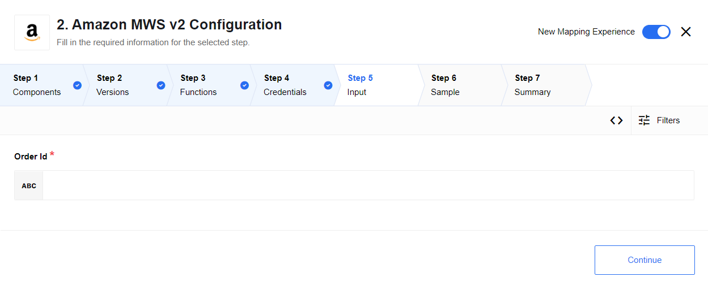

The output object contains an array of values listing the `order Items` of the
given the Amazon `Order Id`. The output has the following structure:

```json
{
    "type": "object",
    "required": true,
    "properties": {
        "amazonOrderId": {
            "type": "string",
            "title": "Order Id",
            "required": true
        },
        "orderItems": {
            "type": "array",
            "title": " Order Items",
            "required": true,
            "properties": {}
        }
    }
}
```

### Submit Product

This action can be configured using two parameters: `Operation` and `Category`.

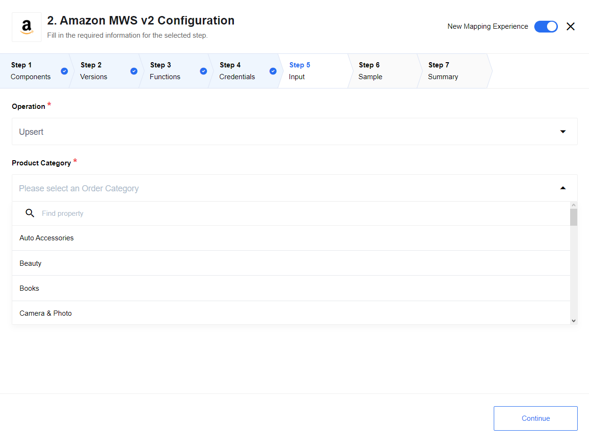

**Operation** defines the action type you wish to do:

*   `Upsert` - upsert the records
*   `Delete` - delete the records
*   `PartialUpdate` - update only one part of the records


**Category** defines the specific category of the product and it can have the
following types:

> Auto Accessories, Beauty, Books, Camera & Photo, Cell Phones & Accessories (Wireless), Clothing Accessories & Luggage, Computers, Consumer Electronics, Entertainment Collectibles, Grocery & Gourmet Food, Health, Home Improvement, Industrial & Scientific: Lab & Scientific Supplies, Industrial & Scientific: Power Transmission, Industrial & Scientific: Raw Materials, Jewelry, Lighting, Miscellaneous, Musical Instruments, Music, Office, Outdoors, Pet Supplies, Shoes Handbags and Sunglasses, Software and Video Games, Sports, Sports Collectibles, Tires & Wheels, Tools, Toys & Games


### Submit Product (Category from payload)

This action can be configured to submit the product information based on
dynamically selectable products from the payload.

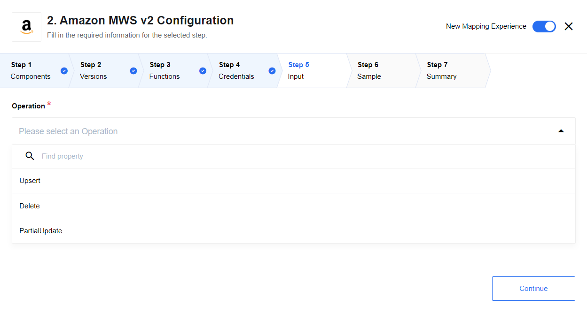

Action perform the following operations:

*   `Upsert` - upsert the records
*   `Delete` - delete the records
*   `PartialUpdate` - update only one part of the records

### Update Order

This action is for updating 'Order' entities using submitting feed mechanism.
The action includes mechanism for polling submit feed result.

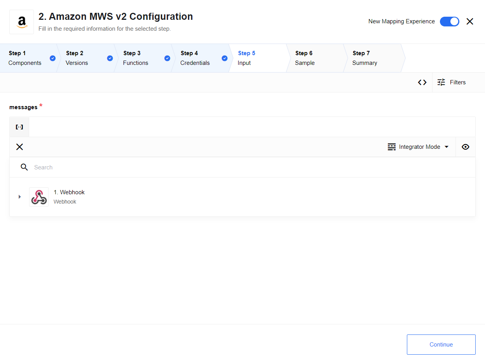

#### Input metadata

Action requires an array with items description as input data

```
{
    "type": "object",
    "required": true,
    "properties": {
        "messages": {
            "type": "array",
            "required": true,
            "items": {
                "amazonOrderID": {
                    "type": "string",
                    "required": true
                },
                "merchantOrderID": {
                    "type": "number",
                    "required": true
                },
                "statusCode": {
                    "type": "string",
                    "required": true
                },
                "amazonOrderItemCode": {
                    "type": "string",
                    "required": true
                },
                "merchantOrderItemID": {
                    "type": "number",
                    "required": true
                }
            }
        }
    }
}
```

### Update Item

This action is for updating 'Item' entities en using submitting feed mechanism.
The action includes mechanism for polling submit feed result.


#### Input metadata

Action requires an array with items description as input data

```
{
    "type": "object",
    "required": true,
    "properties": {
        "messages": {
            "type": "array",
            "required": true,
            "items": {
                "SKU": {
                    "type": "string",
                    "required": true
                },
                "Quantity": {
                    "type": "number",
                    "required": true
                }
            }
        }
    }
}
```

### Submit Inventory

This action can be configured to submit the inventory based on the dynamically
selectable values of the Inventory catalogue:

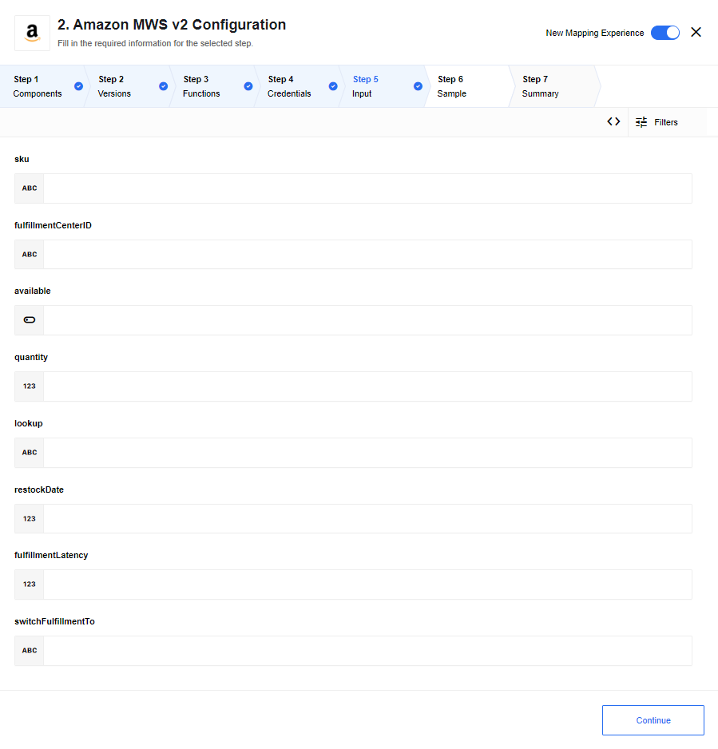

### Change Product Image

This action can be configured to change the product image based on the dynamically
selectable values of the Inventory catalogue:

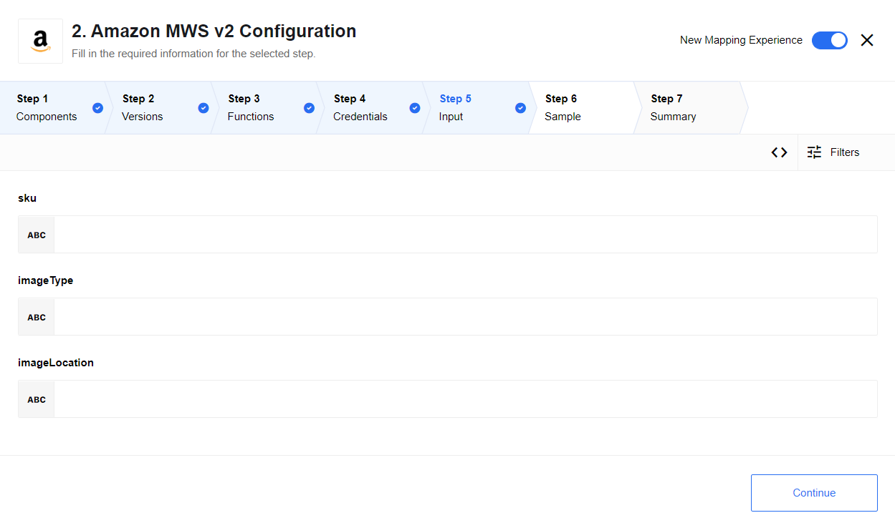

### Change Product Price

This action can be configured to change the product price based on the dynamically
selectable values of the Inventory catalogue:

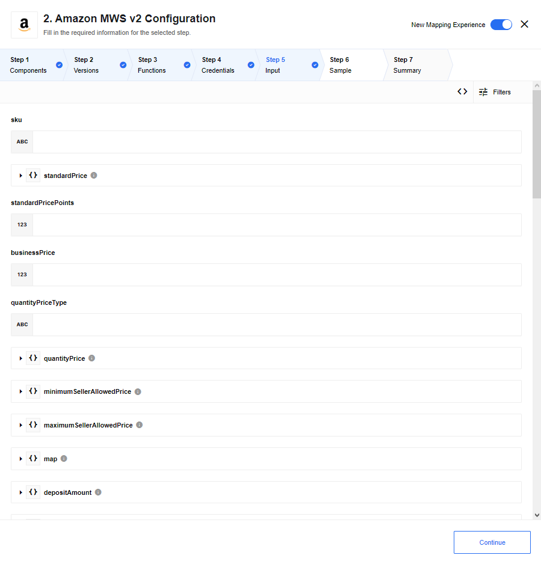

### Establish Product Relationships

This action can be configured to establish the product relationships based on the dynamically
selectable values of the Inventory catalogue:

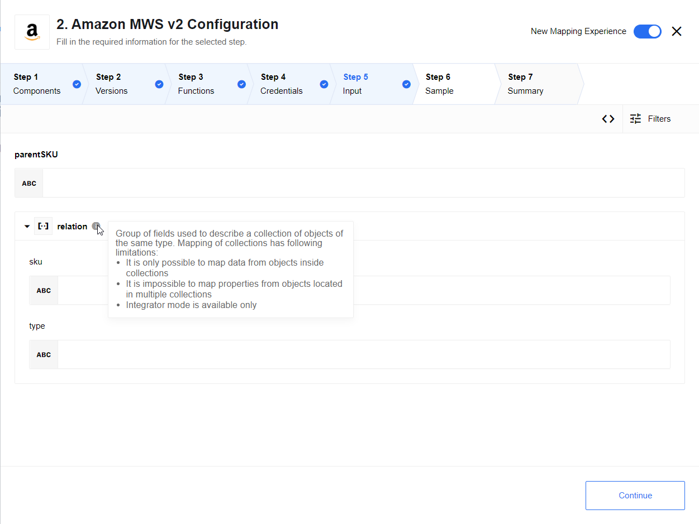

### Get Feed Submission Status

This action is for submitting the status to the feed. It accepts the `Submission ID`
and the `type` as a `string` value on input and outputs the values of the same parameters:

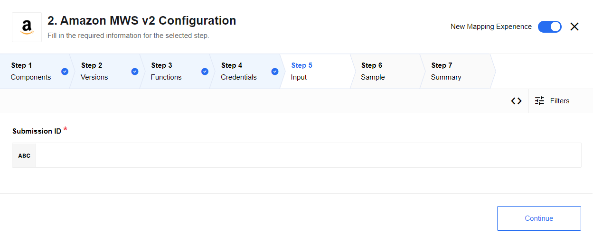

### Get Feed Submission Result

This action is for submitting the result to the feed. It accepts the `Submission ID`
and the `type` as a `string` value on input and outputs the values of the same parameters:

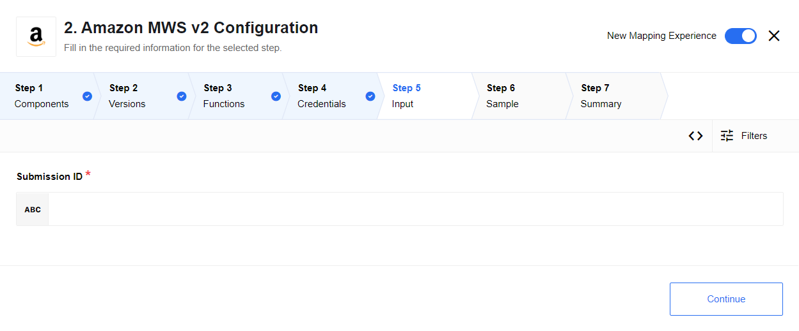

## Additional Information

### Locating your Developer Keys

To locate your developer keys at Amazon MWS follow these steps.

1.  Login to Amazon Seller Central dedicated to your country. To find which one to use simply visit [Amazon Services](https://services.amazon.com/) and navigate your way through your Seller Central page.
2.  After login navigate to your **Settings > User Permissions** page.
3.  When in the User Permissions page scroll-down to find the section called **Amazon MWS Developer Permissions** and check the **Current Authorizations**. Copy the `Developer ID` from here for later use when you would need to create the necessary credentials to use inside the platform Security Credentials part.
4.  Click the link called `View your credentials` in the column entitled **Action Taken**. If you have several Developer IDs in your account then make sure to click on the link in the row where the related Developer ID is located. When clicked a window will pop-up with 3 values: **AWS Access Key ID**, **Secret Key** and **Status**. Make sure that the **Status = Enabled**.
5.  Copy **AWS Access Key ID**, this is your `Amazon MWS Access Key` from the [credentials](#credentials).
6.  Click to *Show* the **Secret Key** value and copy it. This is the `Amazon MWS Secret Access Key` from the [credentials](#credentials).

### Connecting the Amazon Seller account

To retrieve your `Seller ID` and the `MWS Auth Token` values you need to follow
the steps below:

1.  Visit [Amazon Marketplace Web Service (Amazon MWS)](https://developer.amazonservices.com/) and click on **Sign up for MWS** or login if you have done this already previously.
2.  You will be presented with this screen where you would need to select **I want to give a developer access to my Amazon seller account with MWS** option.
3.  Fill in the details for the **Developer's Name** and the **Developer Account Number**. The last one is your `Developer ID`. Check the (3) of the [Locating your Developer Keys](#locating-your-developer-keys) for information. Click Next to go forward.
4.  Agree to the therms and conditions on the next page presented and click Next to finally create credentials.
5.  A page will be presented where you can see the details of your credentials. Please copy the `Seller ID` and the `MWS Auth Token` values before navigating away. This page is shown once.
