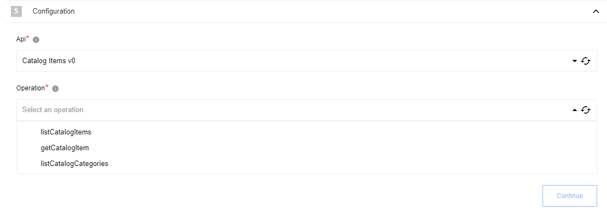
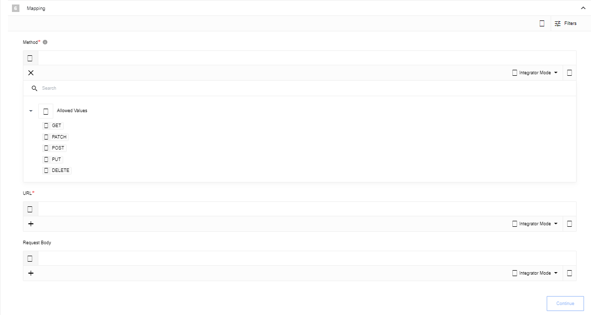

## Description

The Selling Partner API (SP-API) is a REST-based API that helps Amazon selling partners programmatically access their data on orders, shipments, payments, and much more.

## Credentials

To fill up all parameters, you need:

1. Create [IAM policies](https://developer-docs.amazon.com/sp-api/docs/creating-and-configuring-iam-policies-and-entities) to add new access key
2. [Register](https://developer-docs.amazon.com/sp-api/docs/registering-your-application) your Application
3. [Authorize Application](https://developer-docs.amazon.com/sp-api/docs/self-authorization)

From IAM:

From Application:

After Application authorization:

Component credentials configuration fields:

{% include img.html max-width="80%" url="img/credentials.png" title="Credentials" %}

* **The marketplace endpoint** (string, required) - Indicates what URL base needs to be used, one of the [following](https://developer-docs.amazon.com/sp-api/docs/sp-api-endpoints)
* **Client identifier** (string, required) - Application Client identifier
* **Client secret** (string, required) - Application Client secret
* **Refresh token** (string, required) - Token that you got after application authorization
* **App region** (string, required) - region [depends](https://developer-docs.amazon.com/sp-api/docs/sp-api-endpoints) on `The marketplace endpoint`
* **AWS access key** (string, required) - IAM user access key
* **AWS secret access key** (string, required) - IAM user secret access key
* **Role** (string, required) - IAM ARN
* **Role Session Name** (string, optional) - Session Name (may be leaved empty)
* **AWS role region** (string, required) - IAM user region

## Triggers

This component has no trigger functions. This means you can not select it as a first
component during the integration flow design.

## Actions

### Execute operation

Execute operation based on prided information

#### Configuration Fields

* **Api** - (dropdown, required): Select an Api and version to use for this request
* **Operation** - (dropdown, required): Select an operation supported by this Api

#### Input Metadata

And dynamically generated fields according to chosen `Api` and `Operation`

#### Output Metadata

Result of execution provided by server

### Make Raw Request

Executes custom request.

#### Configuration Fields

* **Don't throw error on 404 Response** - (optional, boolean): Treat 404 HTTP responses not as error, defaults to `false`.

#### Input Metadata

* **Url** - (string, required): Path of the resource relative to the base URL.
* **Method** - (string, required): HTTP verb to use in the request, one of `GET`, `POST`, `PUT`, `PATCH`, `DELETE`.
* **Request Body** - (object, optional): Body of the request to send.

#### Output Metadata

* **Status Code** - (number, required): HTTP status code of the response.
* **HTTP headers** - (object, required): HTTP headers of the response.
* **Response Body** - (object, optional): HTTP response body.

## Limitation

All schemas for `Execute operation` action based on [this](https://github.com/amzn/selling-partner-api-models) Amazon repository models
