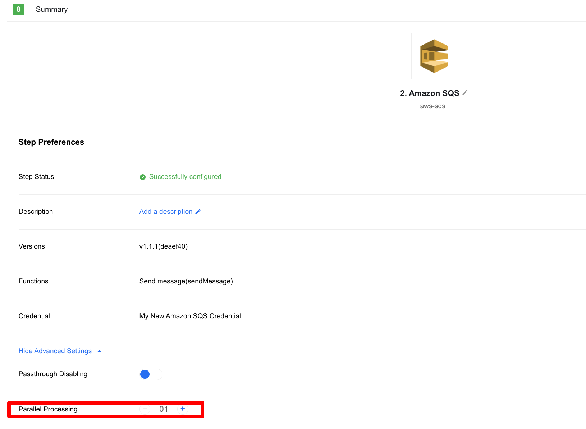

## Table of Contents

* [Description](#description)
* [Credentials](#credentials)
* [Triggers](#triggers)
    * [Receive Messages Long Polling](#receive-messages-long-polling)
* [Actions](#actions)
    * [Delete Message](#delete-message)
    * [Receive Message](#receive-message)
    * [Send Message](#send-message)
* [Limitations](#limitations)
    * [High load performance](#high-load-performance)
    * [Recommendations](#recommendations)

## Description

Amazon AWS SQS (Simple Queue Service) Component is designed to use [Amazon AWS SQS](https://docs.aws.amazon.com/sqs/?icmpid=docs_homepage_serverless) via [AWS SDK](https://www.npmjs.com/package/aws-sdk).

## Credentials

The credentials consist of 4 fields:

* **URL** - (string, required) - A link to the queue you are going to work with. E.g. `https://sqs.us-east-1.amazonaws.com/1234567890/MyTestQueue`
* **Access key ID** - (string, required) - Your private key ID E.g. `JG76FHG67VGHh78KLPOD578`
* **Secret access key** - (string, required) - Your private key secret E.g. `ad67FGh7as5daFHhsd6/jdf75wSW/JBVH56ashjas6S`
* **Region** - (string, required) - Provide [Regional endpoint](https://docs.aws.amazon.com/general/latest/gr/rande.html) E.g. `us-east-1`

[Here](https://docs.aws.amazon.com/sdk-for-javascript/v2/developer-guide/getting-your-credentials.html) is the document explaining where and how to get the keys.

## Triggers

### Receive Messages Long Polling

**Please note: The flow must be set as real-time!** Otherwise, errors may appear.

We recommend you set the lowest flow schedule (cron expression) frequency possible. E.g. once a day (0 0 * * *). And start the flow with the button 'Run Now' manually. Even though it does not affect the logic directly, each scheduled flow execution will create a record in the Executions list with no messages and no logs inside. All the logs and emitted messages will be appearing in the first execution.

Receive messages from the queue in a [long polling manner](https://docs.aws.amazon.com/AWSSimpleQueueService/latest/SQSDeveloperGuide/sqs-long-polling.html).
The component sends long polling requests to the SQS infinitely. Once a message (a set of messages - up to `MaxNumberOfMessages` messages) received it is being emitted per each message. If, say, 3 messages received, 3 individual messages would be emitted.
Right after the first call a new API request starts. And so on until the flow is shut down.


#### Configuration Fields

* **Visibility Timeout** - (optional, string): The duration (in seconds) that the received messages are hidden from subsequent retrieve requests after being retrieved by a ReceiveMessage request. Default: SQS server timeout. Max 12 hours.
* **Max number of messages per 1 API call** - (optional, string): Maximum number of messages to fetch in the single API call. From 0 to 10. Default: 10.
* **Max number of seconds to wait for a message** - (optional, string): The duration (in seconds) that the received messages are hidden from subsequent retrieve requests after being retrieved by a ReceiveMessage request. Default: 0. Max.
* **Delete a message after it is received** - (optional, boolean): Delete a message from a queue after it is received. Default: false.

#### Input Metadata

There is no Input Metadata in this trigger.

#### Output Metadata

* **ResponseMetadata**
  * **RequestId** - ID of the request
* **Messages** - An array of received messages
  * **MessageId** - The MessageId you received when you sent the message to the queue
  * **ReceiptHandle** - The identifier you must provide when deleting the message. For more information, see [Queue and Message Identifiers](https://docs.aws.amazon.com/AWSSimpleQueueService/latest/SQSDeveloperGuide/sqs-queue-message-identifiers.html) in the Amazon SQS Developer Guide.
  * **MD5OfBody** - An MD5 digest of the message body. For information about MD5, see RFC1321
  * **Body** - Body of the message
  * **Attributes** - An object containing a set of attributes (sender ID, timestamp, etc.)

## Actions

### Delete Message

Deletes the specified message from the specified queue.
To select the message to delete, use the ReceiptHandle of the message (not the MessageId which you receive when you send the message).
Amazon SQS can delete a message from a queue even if a visibility timeout setting causes the message to be locked by another consumer.
Amazon SQS automatically deletes messages left in a queue longer than the retention period configured for the queue.

>**Please Note:** if you once again delete a message that was deleted before, you will receive a response of the same structure as it would be the real delete:

```json
{
  "ResponseMetadata": {
    "RequestId": "133a...00cd"
  }
}
```

This is the way how Amazon AWS SQS works.

#### Configuration Fields

There is no Configuration Fields in this action.

#### Input Metadata

* **receiptHandle** - (string, required): Receipt Handle

#### Output Metadata

* **ResponseMetadata**
  * **RequestId** - ID of the request

### Receive Message

Following is an excerpt from the [AWS SQS documentation](https://docs.aws.amazon.com/AWSSimpleQueueService/latest/APIReference/API_ReceiveMessage.html).

Retrieves one or more messages (up to 10), from the specified queue. Using the WaitTimeSeconds parameter enables long-poll support. For more information, see [Amazon SQS Long Polling](https://docs.aws.amazon.com/AWSSimpleQueueService/latest/SQSDeveloperGuide/sqs-long-polling.html) in the Amazon SQS Developer Guide.

Short poll is the default behavior where a weighted random set of machines is sampled on a ReceiveMessage call. Thus, only the messages on the sampled machines are returned. If the number of messages in the queue is small (fewer than 1,000), you most likely get fewer messages than you requested per ReceiveMessage call. If the number of messages in the queue is extremely small, you might not receive any messages in a particular ReceiveMessage response. If this happens, repeat the request.

#### Configuration Fields

* **Visibility Timeout** - (optional, string): The duration (in seconds) that the received messages are hidden from subsequent retrieve requests after being retrieved by a ReceiveMessage request. For more information, see [Visibility Timeout](https://docs.aws.amazon.com/AWSSimpleQueueService/latest/SQSDeveloperGuide/sqs-visibility-timeout.html) in the Amazon SQS Developer Guide. Default: 0.
* **Max number of seconds to wait for a message** - (optional, string): The duration (in seconds) that the received messages are hidden from subsequent retrieve requests after being retrieved by a ReceiveMessage request. Default: 0.
* **Delete a message after it is received** - (optional, boolean): Delete a message from a queue after it is received. Default: false.

#### Input Metadata

There is no Input Metadata in this action.

#### Output Metadata

* **ResponseMetadata**
  * **RequestId** - ID of the request
* **Messages** - An array of received messages
  * **MessageId** - The MessageId you received when you sent the message to the queue
  * **ReceiptHandle** - The identifier you must provide when deleting the message. For more information, see [Queue and Message Identifiers](https://docs.aws.amazon.com/AWSSimpleQueueService/latest/SQSDeveloperGuide/sqs-queue-message-identifiers.html) in the Amazon SQS Developer Guide.
  * **MD5OfBody** - An MD5 digest of the message body. For information about MD5, see RFC1321
  * **Body** - Body of the message
  * **Attributes** - An object containing a set of attributes (sender ID, timestamp, etc.)

### Send Message

Sending a message to a queue

#### Configuration Fields

* **Delay seconds** - (optional, string): The length of time, in seconds, for which to delay a specific message. Valid values: 0 to 900. Maximum: 15 minutes. Messages with a positive DelaySeconds value become available for processing after the delay period is finished. If you don't specify a value, the default value for the queue applies. Default: 0.

#### Input Metadata

* **message** - (object, required): Message (string or object) to send to a queue.

#### Output Metadata

* **ResponseMetadata**
  * **RequestId** - ID of the request
* **MD5OfMessageBody** - An MD5 digest of the message body
* **MD5OfMessageAttributes** - An MD5 digest of the message attributes
* **MessageId** - ID of the message

## Limitations
### High load performance

After several load tests we can make several conclusions:
* `Send Message` action is able to generate:
  * `2-3` messages per second 1 by 1, each up to 10KB in size
  * `10-20` messages per second using parallel processing x10.

* `Receive Messages` trigger is able to receive:
  * `2` messages per second, if you use delete option enabled.
  * `20-30` messages per second w/o delete option.

* No issues with processing large amounts of messages (tested up to 100,000).

These numbers are just for reference and can depend on many factors - like current Amazon SQS server and platform load, network stability, and so on.

### Recommendations

* To reach best performance we recommend using `Parallel Processing` feature in `Send Message` action - optimal size is **10**.

* If you use delete flag, speed decrease to only 2 messages per second, so better split flow logic - delete messages using separate action - `Delete Message`

Here is how to enable "Parallel Processing" option:

  * Open step, where you want to enable this option
  * Go to `Summary` tab
  * Expand `Show Advanced Settings`
  * Increase `Parallel Processing` number


