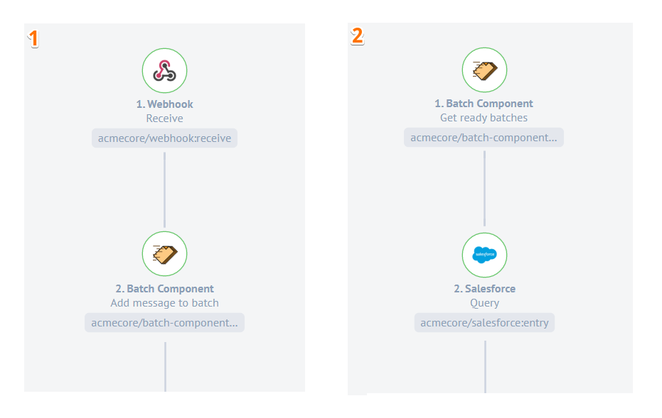

## Latest changelog

**0.0.3 (March 3, 2020)**

* Fix bug with verify credentials
* Update node to v 12
* Update sailor to v 2.6.5

> To see the full **changelog** please use the following [link](/components/batch/changelog).

## Purpose

In some cases, integrator needs a mechanism for collection batches by special criteria. The main purpose is to provide a user with a simple collection and an opportunity to process messages in batches.

## How works

You need to split an integration logic into 2 parts. The first one should use the action `Add message to batch` which starts to collect messages. The second one should start with the trigger `Get ready batches`.

## Environment variables

| Name | Mandatory | Description | Values |
| ---- |--------- |----------- |------ |
| LOG_LEVEL | false | Log Level. Default value (`info`) | `fatal` `error` `warn` `info` `debug` `trace` |

## Credentials

| Property name | Required | Description | Example |
|-------------|--------|-----------|-------|
| prefix       | true   | [MongoDB URI prefix](https://docs.mongodb.com/manual/reference/connection-string/) | `mongo://`; `mongodb+srv://` |
| host         | true   | IP address database host. | `10.22.0.5` |
| port         | false  | Database port. Mandatory if selected `mongo://` prefix | `27017` |
| dbName       | true   | Specifies which database to connect to | `batchDB` |
| login        | true   | Username for authentication | `admin` |
| password     | true   | Password for authentication | `adminPassw` |

## Triggers

### Get ready batches

Emits all batches that are ready to be processed.

#### Input fields description

| Input field | Required | Description | Example |
|-----------|--------|---------|---------|
| Max time in ms before Batch is ready | false | Timeout in millisecond after batch creation, which makes batch ready for processing. Defaults to `60000 ms` | 3000 |
| Max records number in Batch | false | Maximum count of items in batch which makes batch ready for processing. Defaults to `100` | 10 |
| Max size of Batch in bytes | false | Maximum bytes size of items in batch which makes batch ready for processing `1000000(1 MB)` | 500000 |
| Correlation Id | true | Correlation Id between action and trigger. Correlation Id helps identify what collection of batches should be used | Flow1 |

> **Important: Use the same configuration in action for correct batch processing**

## Actions

### Add message to batch

Stores a message in a batch and emits a created/updated batch with a processed item only.

#### Input fields description

| Input field | Required | Description | Example |
|-----------|--------|---------|---------|
| Max time in ms before Batch is ready | false | Timeout in millisecond after batch creation, which makes batch ready for processing. Defaults to `60000 ms` | 3000 |
| Max records number in Batch | false | Maximum count of items in batch which makes batch ready for processing. Defaults to `100` | 10 |
| Max size of Batch in bytes | false | Maximum bytes size of items in batch which makes batch ready for processing `1000000(1 MB)` | 500000 |
| Correlation Id | true | Correlation Id between action and trigger. Correlation Id helps identify what collection of batches should be used | Flow1 |

> **Important: Use the same configuration in trigger for correct batch processing**

## Additional info

Please be aware that the component is not responsible for maintaining batch data in the database.

# Limitations

Version: 1.0.0

1. Currently only Mongo database storage for batches available.
Supported Mongo database versions: 4.0 and higher stable releases.
2. Retry logic is not implemented.
3. Emit rate logic is not implemented.
4. The library does not guarantee a sequence of batch items.
