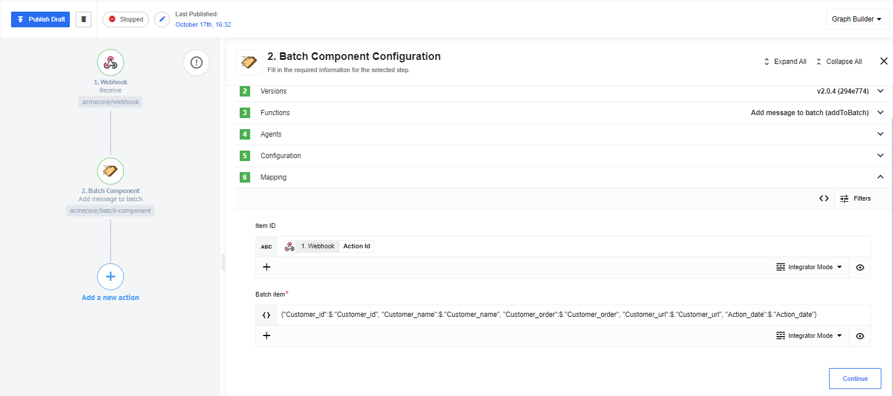
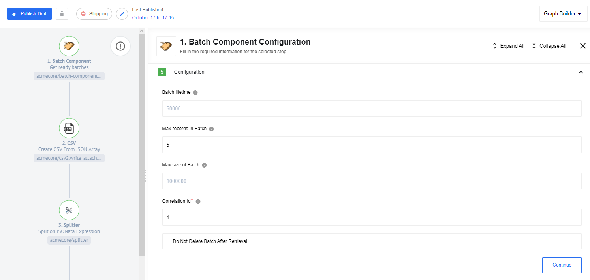
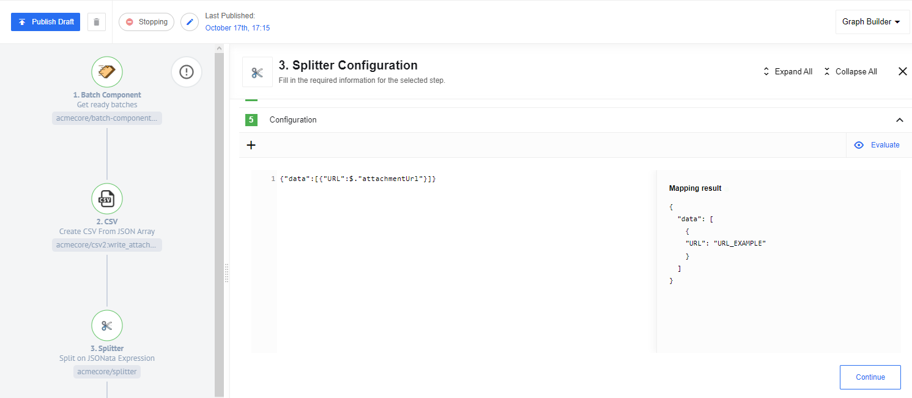

## Szenario

As an example, consider a situation where we need to collect incoming data from Webhook and generate a CSV based on that data. It may happen that there is no possibility to send all data to Webhook at once. For example in case of data arriving in real time, and to generate a representative CSV document we need a set of data with a certain number of lines. In this case, we will use Batch component, which collects all incoming messages into one collection and sends it to CSV component for generating a document. Also, as a check, let's add sending email with the resulting document to the end.

To implement this scenario, we will create two flowss.
In the first, our task will be to initialize the Batch component. In the second flow, we will work with a ready Batch component from the first flow.

## Initialization of Batch

First we need to create an init-flow, which will be responsible for creating a collection of messages. Let's add a [Webhook component](/components/webhook/) and send a POST request that will contain a body with some client data.

After that, let's add a Batch component with the *Add message to batch function*.

Also, we need to specify the configuration parameters of the component. There are three parameters responsible for the behavior of the Batch component and one parameter *Correlation id* for linking Batch components with each other:

* The first three parameters allow us to configure the component behavior and specify at which of the attainable conditions to consider the Batch assembled and start merging and further data sending. We can choose Batch lifetime, which is the parameter where the Batch will be collected based on a predefined time, i.e. it allows us, for example, to merge all messages arrived in a minute/hour/day, etc.

* Max records in Batch - allows you to merge received messages based on their number.
* Max size of Batch - allows to merge messages based on the total size of received batch.

In the mapping parameters we need to specify *Item ID* - the unique message ID and *Batch item*, which allows you to edit the content of a Batch message.

This completes the flow setup for initializing Batch. We chose to generate the Batch based on the number of messages and set the Max records in Batch parameter to 5 for demonstration purposes. You can also add other components to this flow which will allow you to edit even more messages if you need to.

## Working with ready Batch

To process the results of the Batch, you need to create a second flow, which will be activated if the Batch from the previous flow is successfully generated.

For the Batch component to work successfully, you must specify the same values for the parameters in the configurations as in the previous flow.

By making a Sample, we can see the result of combining messages using the Batch component.

In the next step we need to convert the data to CSV. To do this, we will use the [CSV component](/components/csv/). You can not change anything in the configuration of the component, just put a checkbox to collect the data in the Attachment.

In Mapping you can specify whether headers and the data array of interest with the Batch component will be contained as Input Array.

Now we need to send an email with the contents of our Attachment. It should be clarified that Attachments in Email component require a condition to be met: "That it is impossible to map properties from objects located in multiple collections". Therefore, we need to create an additional array with the Attachment URL. The [Splitter component](/components/splitter/) is great for this. with the following configuration.

Then make an [Email component](/components/email/) and add our document to the attachment.

As a result, we get a system of two flows, which generates CSV and sends it to the specified email. In order to see the results, just send the specified number of requests to Webhook and after a while we will get the component we are interested in.

