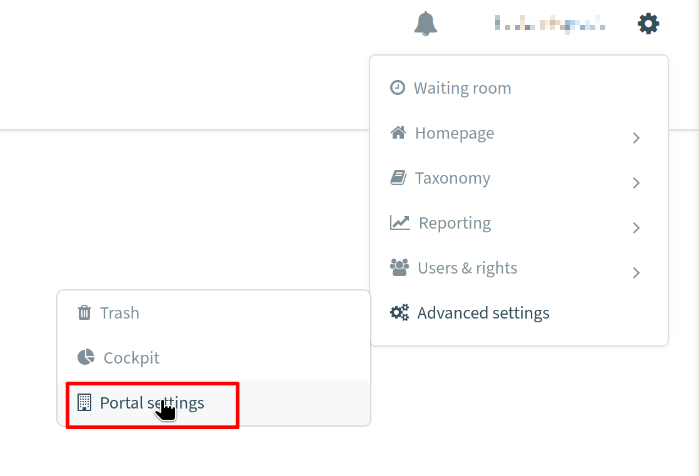

## Description

The Bynder Component facilitates interaction with the [Bynder API](https://bynder.docs.apiary.io/#). This version of the component has been tested with API as of the date `2024-04`.

## Credentials

To embark on building any integration flow, the initial step involves creating an app by following these steps:
1. Go to `Portal settings` in the top right corner.

2. From the left menu select `OAuth Apps`.
3. Press `Add new app` button.
4. Fill in the required fields:
  - **Application name** - Assign any desired name.
  - **Integration** - `Others ->> Others`.
  - **Select grant type** - `Authorization Code + Refresh Token`.
  - **Authorization redirect URI's** as `https://{your-tenant-address}/callback/oauth2`, where `{your-tenant-address}` is the domain of the integration platform.
5. **Select scopes** - select needed scopes, `current.user:read` is required to successfully verify credentials in the component.
6. Press `Register application` button.
7. Save your `Client ID` and `Client Secret` - they will be needed for component credentials.
> **Note:** To be able to enable this feature in your portal you need to have the role of Customer Success Manager.

More information about OAuth App creation can be found [here](https://support.bynder.com/hc/en-us/articles/360013875180-Create-your-OAuth-Apps).

With the app created, proceed to new credentials for the component:
- **Type** (dropdown, required) - OAuth2.
- **Choose Auth Client** (dropdown, required) - choose from previously created clients or select `Add New Auth Client`:
  - **Name** (string, required) - Assign any desired name.
  - **Client ID** (string, required) - Enter the Client ID found in your app.
  - **Client Secret** (string, required) - Enter the Client Secret from your app.
  - **Authorization Endpoint** (string, required) - OAuth2 authorization endpoint `https://{your-bynder-domain}/v6/authentication/oauth2/auth`, where `{your-bynder-domain}` is the domain of your Bynder installation.
  - **Token Endpoint** (string, required) - Refresh token endpoint `https://{your-bynder-domain}/v6/authentication/oauth2/token`, where `{your-bynder-domain}` is the domain of your Bynder installation.
- **Name Your Credential** (string, required) - Put any name you prefer.
- **Scopes (Comma-separated list)** (string, required) - Specify a space-separated list of the scopes to access your Bynder objects and additional `offline` parameter, for example: `offline current.user:read asset:read asset:write collection:read`. For more information on scopes, [click here](https://bynder.docs.apiary.io/#introduction/oauth-scopes). To successfully verify credentials, a minimum of `offline current.user:read` is required. Be careful with spaces between scopes - there should be only one.
- **Additional parameters (Comma-separated list)** (string, required) - Leave this field blank.
- **Base URL** (string, required) - The domain of your Bynder installation, example: `https://your-bynder-domain.bynder.com/`

## Triggers

This component has no trigger functions. This means it will not be accessible to select as a first component during the integration flow design.

## Actions

### Lookup Object By ID 

Retrieve a single object using its ID.

#### Configuration Fields

* **Object Type** - (string, required): The type of object to look up. The currently supported types are:
    - `User`.
    - `Asset`.
    - `Asset content`.
    - `Metaproperty`.
    - `Collection`.

#### Input Metadata

* **ID Value** - (string, required): The ID of the object to look up.

#### Output Metadata

Returns an object with the result of the lookup. If the `Asset content` type is selected, the result will include `attachmentUrl`, which is a link to the file stored within the platform's internal storage (Maester).

#### Known Limitations
* Due to the limited Bynder API documentation that does not provide a full overview of the API objects, the output metadata available by clicking the `Generate Stub Sample` button, might be limited to the fields described in the samples provided in the documentation at the moment of the initial component build.

### Make Raw Request

Allows for the execution of custom requests using the Bynder REST API directly.

#### Configuration Fields
- **Don't throw an error on 404 Response** - (optional, boolean): Configures the handling of 404 HTTP responses as non-errors. The default is `false`.

#### Input Metadata
- **Url** - (string, required): The relative path of the resource, appended to the base URL that was provided in the credentials.
- **Method** - (string, required): Specifies the HTTP method for the request.
- **Request Body** - (object, optional): The body content for the request.
#### Output Metadata
- **Status Code** - (number, required): The HTTP response status code.
- **HTTP headers** - (object, required): The response's HTTP headers.
- **Response Body** - (object, optional): The body of the HTTP response.

