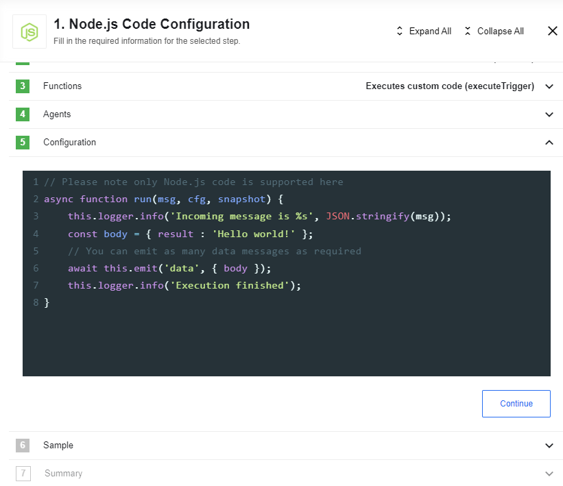

## Description

A code component for the platform, runs a piece of a JavaScript code inside your
integration flow.

## How Works

Pretty much the same way that you would use any other component in our system.
It is deployed by default to production, so no need to deploy it yourself
(although you could if you have extended it yourself). In our Dashboard start
building your integration and include the Code component as well.



However, don't let the simple look fool you - it has a full-fledged interface
with useful features like the ones you would expect from your
favourite desktop developing tool:

*   Syntax highlighting - a standard for any online real-time coding interface
*   Code auto-completion - again a standard that you got used to from your desktop tool
*   Support for number of variables and libraries within the context of the execution
*   Support latest ECMAScript standard
*   Run and troubleshoot within the designer interface.

### Technical Notes

The [technical notes](technical-notes) page gives some technical details about Code component like [changelog](/components/code/technical-notes#changelog).

## Available Variables and Libraries

Here are the available variables and libraries that you can use within the context
of execution. The most up-to-date list can always be found in be used within the context of execution or in `code.js` of the component. Below is a sample for the reference.
Built-in Node.js global objects are also supported.

### {{site.data.tenant.name}} Specific Functionality

- `msg` - incoming message containing the payload from the previous step
- `cfg` - step's configuration. At the moment contains only one property: `code` (the code, being executed)
- `snapshot` - step's snapshot
- `messages` - utility for convenient message creation
- `emitter` user to emit messages and errors

### Other Libraries/functions

- `wait(numberOfMilliscondsToSleep)` - Utility function for sleeping
- [`request`](https://github.com/request/request) - Http Client (wrapped in `co` - [this library](https://www.npmjs.com/package/co-request) so that it is pre-promisified)
- `_` - [Lodash](https://lodash.com/)

## Code component usage Examples

To use the code you can follow these examples:

```javascript
async function run(msg) {
  console.log('Incoming message is %s', JSON.stringify(msg));
  const body = { result : 'Hello world!' };
  // You can emit as many data messages as required
  await this.emit('data', { body });
  console.log('Execution finished');
}
```

```javascript
async function run(msg, cfg, snapshot) {
  return {
      addition: 'You can use code',
      keys: Object.keys(msg)
  };
}
```

> **Please note:** if you have a simple one-in-one-out function you can return a
> JSON object as a result of your function, it will be automatically emitted as data.

## Common usage scenarios

### Doing complex data transformation

If you prefer to transform an incoming message with code then use following sample:

```javascript
async function run(msg) => {
  addition : "You can use code",
  keys : Object.keys(msg)
}
```

### Calling an external REST API

You can code a small REST API call out of the Code component, see
following example:

```javascript
const axios = require('axios');
async function run(msg) {
  const { data: res } = await axios.get('{{site.data.tenant.apiBaseUri}}/v2/users/me', {
    auth: {
      username: process.env.ELASTICIO_API_USERNAME,
      password: process.env.ELASTICIO_API_KEY
    }
  });

  return {
    fullName: `${res.data.attributes.first_name} ${res.data.attributes.last_name}`,
    email: res.data.attributes.email,
    userID: res.data.id
  };
}
```

## Known issues and limitations

-   Credentials are not supported
