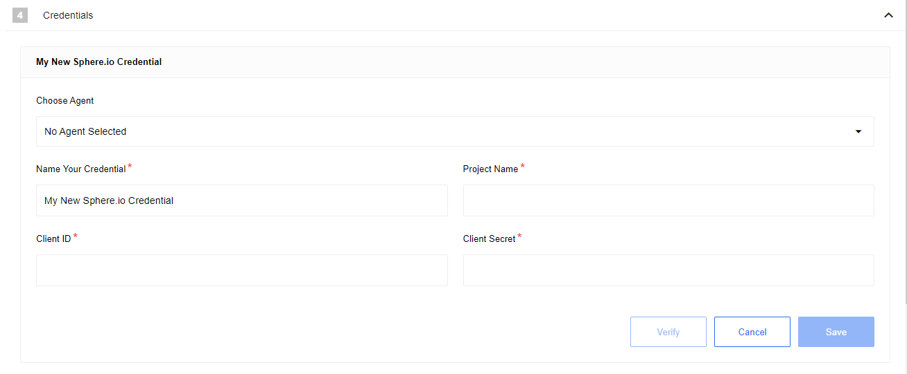

## Requirements

### Credentials

To authenticate this component you need to get the details of the project from
inside the project. The information is in the **Client Credential Flow** part of
the `Developers > API CLIENTS`.

Here are the values to copy to use in the account authentication part:

*   `Project Name` - This is the name of your project that you are trying to get the data from.
*   `Client ID` -  This is the value in the `client_id` field.
*   `Client Secret` - This is the long alpha-numeric code which can be copied from `client_secret` field.

You can configure the credentials in the **Credentials** section by selecting the
component and giving a memorable name for your credential.

## Triggers

If the Sphere.IO connector is used as a trigger then it is possible to
[Query Customers](#query-customers) or [Query Orders](#query-orders).

### Query Customers

After adding the credential there is only one field here to configure - an
Additional predicate to filter customers.

**Additional predicate to filter customers** is an optional field which you can
use to filter and include only the customers needed for the particular integration
flow. More information about how to use this field can be learned from the
[Commercetools help pages](https://docs.commercetools.com/api/predicates/query).

### Query Orders

After adding the credential there are two possible configuration fields:

*   **Additional predicate to filter orders** is an optional field you can used to filter the resources through flexible predicates which are described in the [Commercetools help pages](https://docs.commercetools.com/api/predicates/query).
*   **Expand customer's external ID** is an optional field that you can use to have external ID also included in the outcome. You can use this to pass the data to other components and sync with the records for existing list of customers.

## Actions

As an action component the Commercetools can help with the following activities:

*   Update Customer
*   Create Product
*   Add/Update Price to Variant
*   Query Product Variant by SKU
*   Get Customer by ID
*   Get Order by ID
*   Add Product Variant
*   Set Order Number
*   Add a Delivery
*   Change shipment state

### Update Customer

For this action we have only **Customer id** and **External id** fields to map from
which **Customer id** is a required field. It is worth to mention that you can
use the **External id** optional field to sync your data about the same customer.

### Create Product

The **Create Product** action has more than 10 fields to map the incoming data
from your trigger component. The number and the language settings of the fields
depend on your Commercetools setup and can be different but there are two
required fields which you must use for this component to work:

*   **Name (en)** (required) - Name of your product in English.
*   **Slug (en)** (required) - The Slug of your product.

### Add/Update Price to Variant

In case we want to add or update Price to Variant then **there are only 4 required fields**
to map your incoming data - **Price amount**, **Price currency**, **Product ID** and **Variant ID**.

### Query Product Variant by SKU

When we wish to map the incoming data with Product Variant by SKU then there are
3 required fields to fill-in:

*   **Price amount** (required)
*   **Price currency** (required)
*   **Variant SKU** (required)

### Get Customer by ID

This case is straightforward since only the **Customer id** is required.

### Get Order by ID

Only **Order id** is required to perform this action.

### Add Product Variant

If we wish to map the Product Variant with incoming data then there are 2 required
field - **Master Variant SKU** and **Sku**. There is also one optional field
**Variant Custom attribute** which you can use to further filter the results.

### Set Order Number

This particular action has two required fields to map with the incoming data:

*   **Order ID** (required)
*   **Order number** (required)

### Add a Delivery

When Add a Delivery action component is selected then we have 3 required fields -
**ID of the line item being delivered**, **Order Number** and **Quantity**. There
are 2 optional fields to configure - **Tracking ID to track the delivery** and
**Unique parcel ID**. Use this particular action for reporting the status of
delivery back to your system.

### Change shipment state

You can use this particular action component to track different types of Order IDs
which is a required field. To select use the drop-down menu near the component
section to choose.
