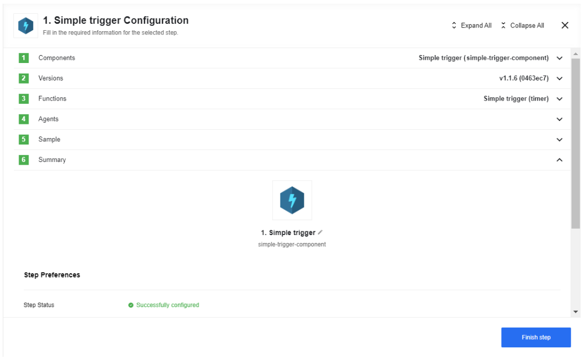
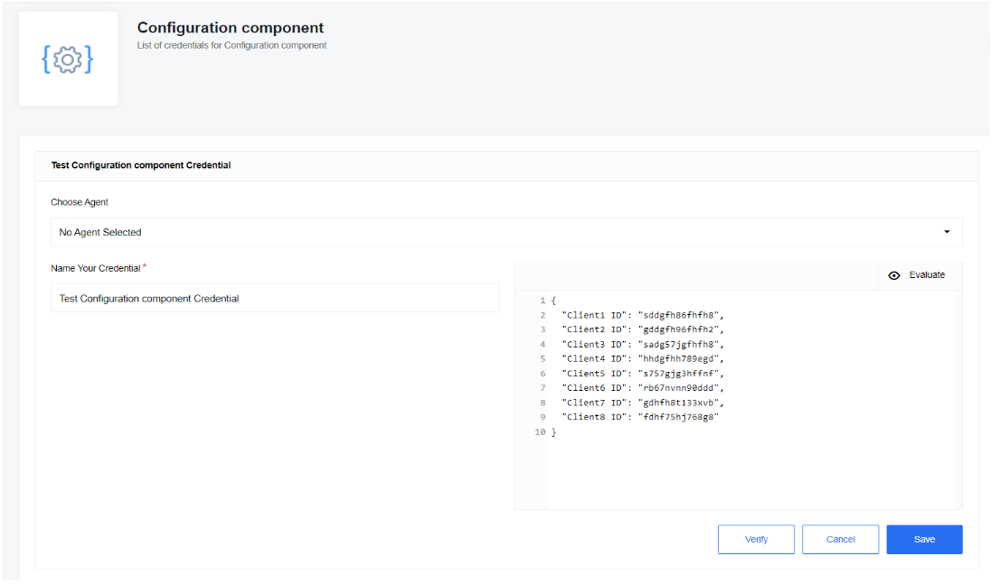
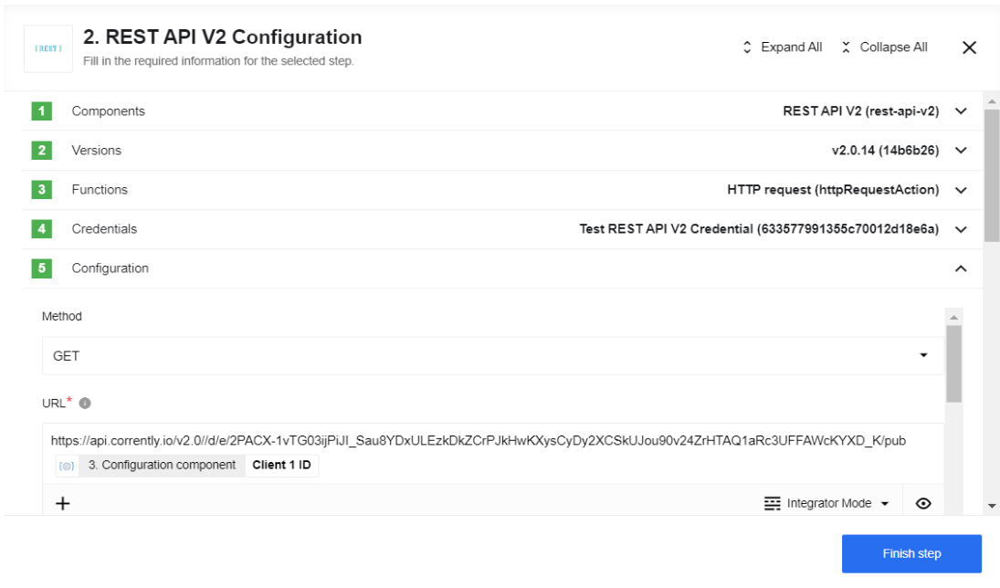
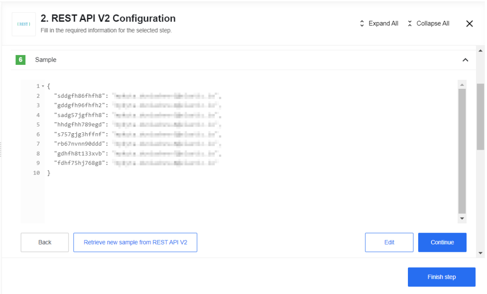
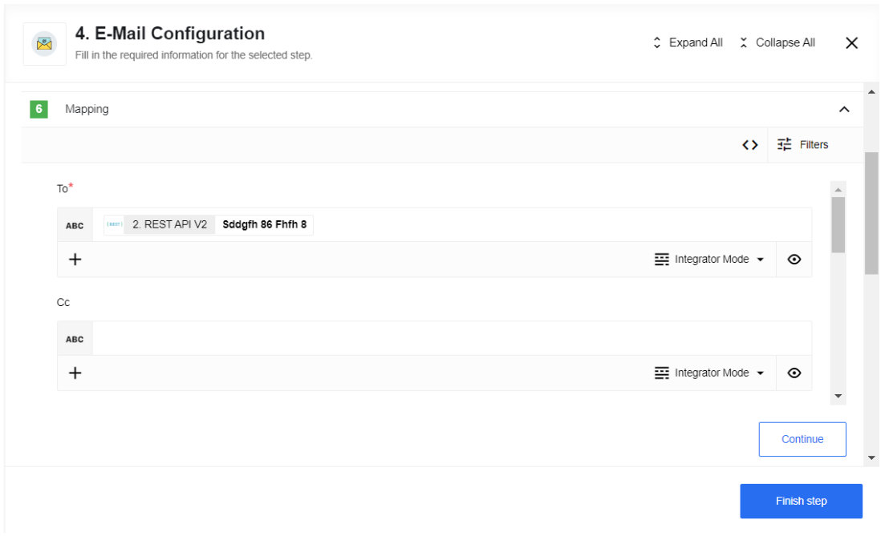
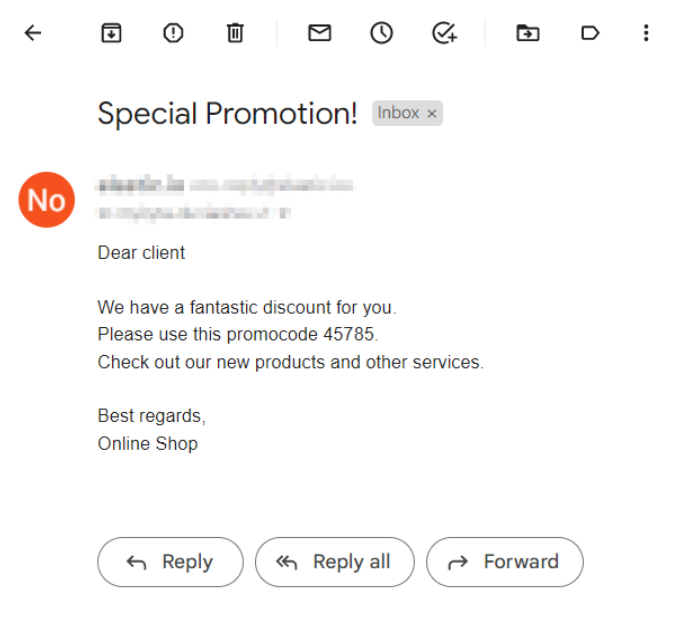

## Online Shop example

In our example, we will be sending emails to our important customers. We will get access to the clients' IDs with the help of a Configuration component that will later pass this data on to get access to the clients' email addresses from the CRM system.

As the first step, we will use the Simpe trigger component, since there is no trigger function in the Configuration component:

In the next step we will use the Configuration component with our credentials - it emits JSON which was put in the credential field. Credential field consist of IDs of the most important clients:

The 3d step is REST API v2 component which makes an API call to the CRM system that retrieves email addresses by client IDs:

Here you can see the client email addresses Sample:

The 4th and the last step is a E-Mail component which sends mail to our clients.

As a result, you can see an example of an email that our client will receive:

