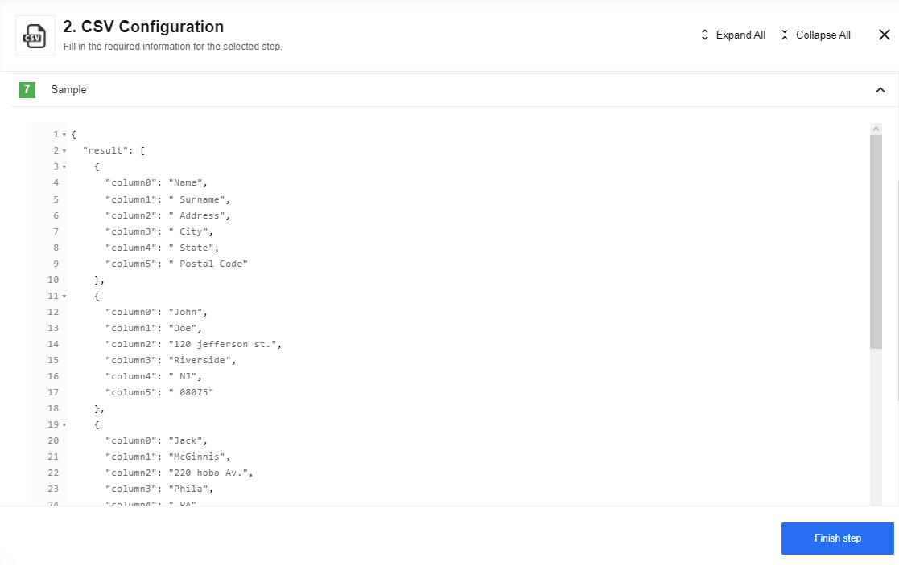

## Read CSV file from URL

This trigger read the CSV file from the URL provided in the configuration fields and output the result as a JSON object.
The trigger works pretty much the same as the [Read CSV attachment action](#read-CSV-attachment). The difference is that all the settings are to be provided in the configuration fields, not in the body message. As the triggers do not have input messages.

#### Config Fields

* `Emit Behavior` (dropdown, required) - this selector configures output behavior of the component.
  * `Fetch All` - the component emits an array of messages.
  * `Emit Individually` - the component emits a message per row.
  * `Emit Batch` - component will produce a series of message where each message has an array of max length equal to the `Batch Size`.
* `Skip empty lines` (checkbox, optional) - by default, empty lines are parsed if checked they will be skipped.
* `Comment char` (string, optional) - if specified, skips lines starting with this string.

#### Input Metadata

*   `URL` (string, required) - URL of the CSV file to parse.
*   `Contains headers` (boolean, optional) - If true, the first row of parsed data will be interpreted as field names, false by default.
*   `Delimiter` (string, optional) - The delimiting character. Leave blank to auto-detect from a list of most common delimiters or provide your own.
    
      **Example**
      
    If you use "$" as Delimiter, this CSV:

        `a$b$c$d`
      
      can be parsed into this JSON:

      ```
      {
      "column0": "a",
      "column1": "b",
      "column2": "c",
      "column3": "d"
      }
      ```

*   `Convert Data types` (boolean, optional) - Numeric data and boolean data will be converted to their type instead of remaining strings, false by default.

#### Output Metadata
- For `Fetch page` and `Emit Batch`: An object with key ***result*** that has an array as its value.
- For `Emit Individually`:  Each object fills the entire message.

## Read CSV attachment

This action will read the CSV attachment of the incoming message or from the specified URL and output a JSON object.

An example of an object stored in the github repository:


To configure this action the following fields can be used:


Here you can see an example of a sample:



### Config Fields

* `Emit Behavior` (dropdown, required) - this selector configures output behavior of the component.
  * `Fetch All` - the component emits an array of messages;
  * `Emit Individually` - the component emits a message per row;
  * `Emit Batch` - component will produce a series of message where each message has an array of max length equal to the `Batch Size`;
* `Skip empty lines` (checkbox, optional) - by default, empty lines are parsed if checked they will be skipped
* `Comment char` (string, optional) - if specified, skips lines starting with this string

### Input Metadata

*   `URL` - We will fetch this URL and parse it as CSV file
*   `Contains headers` - if true, the first row of parsed data will be interpreted as field names, false by default.
*   `Delimiter` - The delimiting character. Leave blank to auto-detect from a list of most common delimiters or provide your own

<details close markdown="block"><summary><strong>Example</strong></summary>

if you use "$" as Delimiter, this CSV:

```
a$b$c$d
```

can be parsed into this JSON

``` json
   {
    "column0": "a",
    "column1": "b",
    "column2": "c",
    "column3": "d"
   }
```

</details>


*   `Convert Data types` - numeric data and boolean data will be converted to their type instead of remaining strings, false by default.

If `Emit Behavior` equals to `Emit Batch` - new field appears: `Batch Size` - max length of array for each message

### Output Metadata

- For `Fetch page` and `Emit Batch`: An object with key *result* that has an array as its value
- For `Emit Individually`:  Each object fill the entire message

### Limitations

* If you use `Fetch All` then component needs to store whole file and object in memory that cause big memory usage
* In `Emit Batch` use wisely `Batch Size`, bigger number cause bigger memory usage
* Possible exception: `[ERR_STREAM_PREMATURE_CLOSE]` could be thrown when flow stopped before finish emiting all data in file, as stream stopped

## Create CSV From Message Stream

Here you can see an Message Stream example created using the Node.js component:


This action will combine multiple incoming events into a CSV file until there is a gap
of more than 10 seconds between events. Afterwards, the CSV file will be closed
and attached to the outgoing message.

To configure this action the following fields can be used:


### Config Fields

* `Upload CSV as file to attachments` (checkbox, optional) -  If checked store the generated CSV data as an attachment. If unchecked, place the CSV as a string in the outbound message.
* `Separator` (string, optional) - A single char used to delimit the CSV file. Default to "`,`" but you can set any

<details close markdown="block"><summary><strong>Example</strong></summary>

if you use "$" as Delimiter, this CSV:

```
a$b$c$d
```

can be parsed into this JSON

``` json
    {
     "column0": "a",
     "column1": "b",
     "column2": "c",
     "column3": "d"
    }
```

</details>

* `Column Order` (string, optional) - A string delimited with the separator indicating which columns & in what order the columns should appear in the resulting file. If omitted, the column order in the resulting file will not be deterministic. Columns names will be trimmed (removed spaces in beginning and end of column name, for example: 'col 1,col 2 ,col 3, col 4' => ['col 1', 'col 2', 'col 3', 'col 4'])
* `New line delimiter` (string, optional, defaults to `\r\n`) - The character used to determine newline sequence.
* `Escape formulae` (checkbox, optional) - If checked, field values that begin with `=`, `+`, `-`, `@`, `\t`, or `\r`, will be prepended with a **"`"** to defend against injection attacks, because Excel and LibreOffice will automatically parse such cells as formulae

### Input Metadata

* `Include Headers` - Indicates if a header row should be included in the generated file. Must be a `boolean`.
* `Input Object` - Object to be written as a row in the CSV file. If the Column Order is specified, then individual properties can be specified.

### Output Metadata

* If **Upload CSV as file to attachments** is checked:
  * `attachmentUrl` - A URL to the CSV output
  * `type` - Always set to `.csv`
  * `size` - Size in bytes of the resulting CSV file
  * `attachmentCreationTime` - When the attachment was generated
  * `attachmentExpiryTime` - When the attachment is set to expire
  * `contentType` - Always set to `text/csv`

* If **Upload CSV as file to attachments** is not checked:
  * `csvString` - The output CSV as a string inline in the body

## Create CSV From JSON Array

This action will convert an incoming array into a CSV file.
Here you can see an JSON Array example created using the Webhook component:


To configure this action the following fields can be used:


### Config Fields

* `Upload CSV as file to attachments` (checkbox, optional) -  If checked store the generated CSV data as an attachment. If unchecked, place the CSV as a string in the outbound message.
* `Separator` (string, optional) - A single char used to delimit the CSV file. Default to "`,`" but you can set any

<details close markdown="block"><summary><strong>Example</strong></summary>

default:

```
a,b,c,d
```

using "`;`" as separator:

```
a;b;c;d
```

</details>

* `Column Order` (string, optional) - A string delimited with the separator indicating which columns & in what order the columns should appear in the resulting file. If omitted, the column order in the resulting file will not be deterministic. Columns names will be trimmed (removed spaces in beginning and end of column name, for example: 'col 1,col 2 ,col 3, col 4' => ['col 1', 'col 2', 'col 3', 'col 4'])
* `New line delimiter` (string, optional, defaults to `\r\n`) - The character used to determine newline sequence.
* `Escape formulae` (checkbox, optional) - If checked, field values that begin with `=`, `+`, `-`, `@`, `\t`, or `\r`, will be prepended with a  **"`"** to defend against injection attacks, because Excel and LibreOffice will automatically parse such cells as formulae

### Input Metadata

* `Include Headers` - Indicates if a header row should be included in the generated file. Must be a `boolean`.
* `Input Array` - Array of objects to be written as rows in the CSV file. (One row per object + headers) If the Column Order is specified, then individual properties can be specified. The component will throw an error when the array is empty.

### Output Metadata

If **Upload CSV as file to attachments** is checked:


  * `attachmentUrl` - A URL to the CSV output
  * `type` - Always set to `.csv`
  * `size` - Size in bytes of the resulting CSV file
  * `attachmentCreationTime` - When the attachment was generated
  * `attachmentExpiryTime` - When the attachment is set to expire
  * `contentType` - Always set to `text/csv`

If **Upload CSV as file to attachments** is not checked:


  * `csvString` - The output CSV as a string inline in the body

## Limitations

* You may get `Component run out of memory and terminated.` error during run-time, that means that component needs more memory, please add
 `EIO_REQUIRED_RAM_MB` environment variable with an appropriate value (e.g. value `1024` means that 1024 MB will be allocated) for the component in this case.
* Maximal possible size for an attachment is 10 MB.
* Attachments mechanism does not work with [Local Agent Installation](/guides/vpn-agent)
* Inbound message in `Message Stream` and each element of `JSON Array` should be a plain Object, if value not a primitive type it will be set as `[object Object]`
