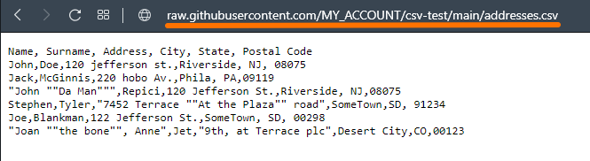
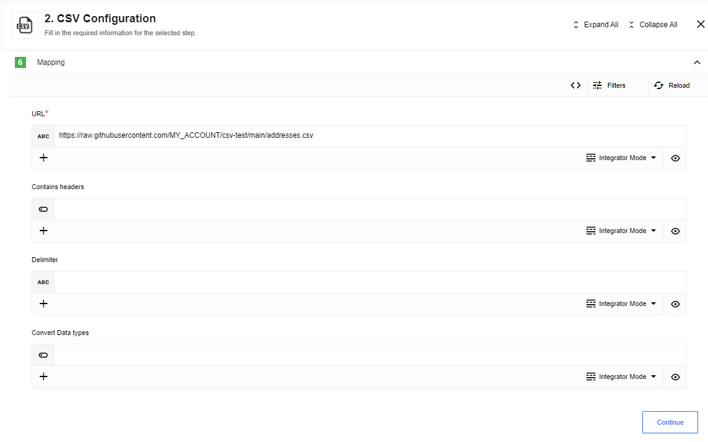

## Read CSV attachment

This action will read the CSV attachment of the incoming message or from the specified URL and output a JSON object.

An example of an object stored in the github repository:

To configure this action the following fields can be used:

Here you can see an example of a sample:

### Config Fields

*   `Emit Behavior` - this selector configures output behavior of the component. If the option is `Fetch All` - the component emits an array of messages, otherwise (`Emit Individually`) - the component emits a message per row.

### Input Metadata

*   `URL` - We will fetch this URL and parse it as CSV file
*   `Contains headers` - if true, the first row of parsed data will be interpreted as field names, false by default.
*   `Delimiter` - The delimiting character. Leave blank to auto-detect from a list of most common delimiters.
*   `Convert Data types` - numeric, date and boolean data will be converted to their type instead of remaining strings, false by default.

## Create CSV From Message Stream

Here you can see an Message Stream example created using the Node.js component:

This action will combine multiple incoming events into a CSV file until there is a gap
of more than 10 seconds between events. Afterwards, the CSV file will be closed
and attached to the outgoing message.

To configure this action the following fields can be used:

### Config Fields

* `Upload CSV as file to attachments` -  If checked store the generated CSV data as an attachment. If unchecked, place the CSV as a string in the outbound message.
* `Separator` - A single char used to delimit the CSV file. Default to `,`
* `Column Order` - A string delimited with the separator indicating which columns & in what order the columns should appear in the resulting file. If omitted, the column order in the resulting file will not be deterministic. Columns names will be trimmed (removed spaces in beginning and end of column name, for example: 'col 1,col 2 ,col 3, col 4' => ['col 1', 'col 2', 'col 3', 'col 4'])

### Input Metadata

* `Include Headers` - Indicates if a header row should be included in the generated file. Must be a `boolean`.
* `Input Object` - Object to be written as a row in the CSV file. If the Column Order is specified, then individual properties can be specified.

### Output Metadata

* If **Upload CSV as file to attachments** is checked:
  * `csvString` - The output CSV as a string inline in the body

* If **Upload CSV as file to attachments** is not checked:
  * `attachmentUrl` - A URL to the CSV output
  * `type` - Always set to `.csv`
  * `size` - Size in bytes of the resulting CSV file
  * `attachmentCreationTime` - When the attachment was generated
  * `attachmentExpiryTime` - When the attachment is set to expire
  * `contentType` - Always set to `text/csv`

## Create CSV From JSON Array

This action will convert an incoming array into a CSV file.
Here you can see an JSON Array example created using the Webhook component:

To configure this action the following fields can be used:

### Config Fields

* `Upload CSV as file to attachments` -  If checked store the generated CSV data as an attachment. If unchecked, place the CSV as a string in the outbound message.
* `Separator` - A single char used to delimit the CSV file. Default to `,`
* `Column Order` - A string delimited with the separator indicating which columns & in what order the columns should appear in the resulting file. If omitted, the column order in the resulting file will not be deterministic.

### Input Metadata

* `Include Headers` - Indicates if a header row should be included in the generated file. Must be a `boolean`.
* `Input Array` - Array of objects to be written as rows in the CSV file. (One row per object + headers) If the Column Order is specified, then individual properties can be specified. The component will throw an error when the array is empty.

### Output Metadata

* If **Upload CSV as file to attachments** is checked:
  * `csvString` - The output CSV as a string inline in the body

* If **Upload CSV as file to attachments** is not checked:
  * `attachmentUrl` - A URL to the CSV output
  * `type` - Always set to `.csv`
  * `size` - Size in bytes of the resulting CSV file
  * `attachmentCreationTime` - When the attachment was generated
  * `attachmentExpiryTime` - When the attachment is set to expire
  * `contentType` - Always set to `text/csv`

## Limitations

* You may get `Component run out of memory and terminated.` error during run-time, that means that component needs more memory, please add
 `EIO_REQUIRED_RAM_MB` environment variable with an appropriate value (e.g. value `1024` means that 1024 MB will be allocated) for the component in this case.
* Maximal possible size for an attachment is 10 MB.
* Attachments mechanism does not work with [Local Agent Installation](https://docs.elastic.io/getting-started/local-agent.html)
* Inbound message in `Message Stream` and each element of `JSON Array` should be a plain Object, if value not a primitive type it will be set as `[object Object]`
