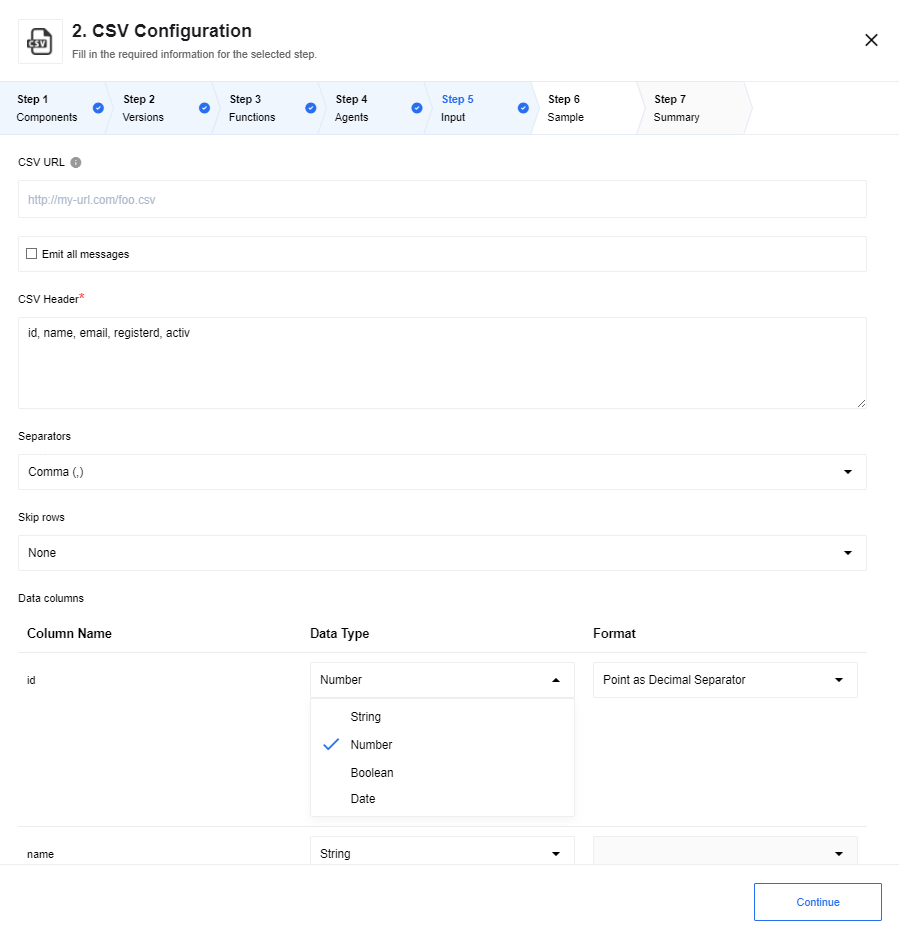
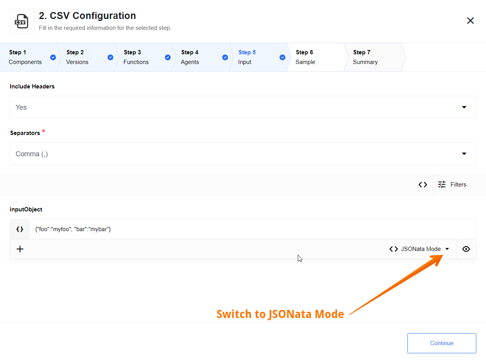
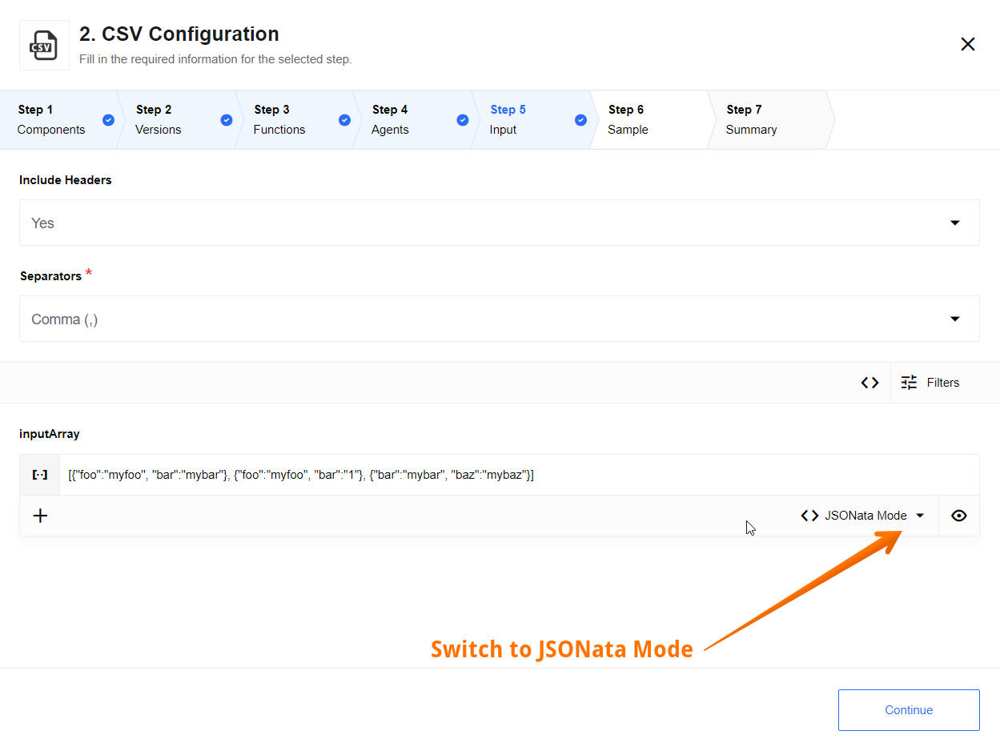

## Deprecated Triggers

Up to component version 2.2.0

### Read CSV file from URL

This trigger will fetch the CSV file from a given URL. The address must be accessible
to the component. The fetched CSV file will be placed in the attachment part of the
outgoing message.


*   `CSV URL` - the full URL to the file for retrieving data.
*   `Emit all messages` - this checkbox configures output behavior of the component. If the option is checked - the component emits an array of messages, otherwise - the component emits a message per row.
*   `CSV Header` - this is a required field. Input the names of headers separated with a comma.
*   `Separators` - Specify the separator type. Usually it is a comma (`,`) but values like Semicolon (`;`), Space (` `), Tab (`\t`) and Hash (`#`) are also supported.
*   `Skip rows` - if you know that the incoming CSV file has certain number of headers you can indicate to skip them. The supported values are `None`, `First row`, `First two`, `First three` and `First four`.
*   `Data columns` - here the values will be added dynamically based on the values in the `CSV Header` field. Here each data column will be listed with the name, Data Type and the Format to enable further configuration.

## Deprecated Actions

### Read CSV attachment

This action will read the CSV attachment of the incoming message or from the specified URL and output a JSON object.
To configure this action the following fields can be used:



*   `CSV URL` - the full URL to the file for retrieving data. Leave the field blank and action will read CSV attachment of the incoming message (if any). Error will be thrown if URL of the CSV is missing and no CSV file in incoming message found
*   `Emit all messages` - this checkbox configures output behavior of the component. If the option is checked - the component emits an array of messages, otherwise - the component emits a message per row.
*   `CSV Header` - this is a required field. Input the names of headers separated with a comma.
*   `Separators` - Specify the separator type. Usually it is a comma (`,`) but values like Semicolon (`;`), Space (` `), Tab (`\t`) and Hash (`#`) are also supported.
*   `Skip rows` - if you know that the incoming CSV file has certain number of headers you can indicate to skip them. The supported values are `None`, `First row`, `First two`, `First three` and `First four`.
*   `Data columns` - here the values will be added dynamically based on the values in the `CSV Header` field. Here each data column will be listed with the name, Data Type and the Format to enable further configuration.

### Write CSV attachment

* `Include Header` - this select configures output behavior of the component. If option is `Yes` or no value chosen than header of csv file will be written to attachment, this is default behavior. If value `No` selected than csv header will be omitted from attachment.

This action will combine multiple incoming events into a CSV file until there is a gap
of more than 10 seconds between events. Afterwards, the CSV file will be closed
and attached to the outgoing message.

As part of the component setup, one must specify the columns of the CSV file.
These columns will be published as the header in the first row. For each incoming
event, the value for each header will be `stringified` and written as the value
for that cell. All other properties will be ignored. For example, headers
`foo,bar` along with the following JSON events:

```
{"foo":"myfoo", "bar":"mybar"}
{"foo":"myfoo", "bar":[1,2]}
{"bar":"mybar", "baz":"mybaz"}
```

will produce the following `.csv` file:

```
foo,bar
myfoo,mybar
myfoo,"[1,2]"
,mybar
```

When columns are added in the UI, you will be presented with an opportunity to
provide a JSONata expression per column. If you require number formatting that
is specific to a locale, the JSONata expression should handle that concern.


The output of the CSV Write component will be a message with an attachment.  In
order to access this attachment, the component following the CSV Write must be
able to handle file attachments.

### Write CSV attachment from JSON Object

* `Include Header` - this select configures output behavior of the component. If option is `Yes` or no value chosen than header of csv file will be written to attachment, this is default behavior. If value `No` selected than csv header will be omitted from attachment.
* `Separator` - this select configures type of CSV delimiter in an output file. There are next options: `Comma (,)`, `Semicolon (;)`, `Space ( )`, `Tab (\t)`, `Pipe (¦)`.

This action will combine multiple incoming events into a CSV file until there is a gap
of more than 10 seconds between events. Afterwards, the CSV file will be closed
and attached to the outgoing message.



This action will convert an incoming array into a CSV file by following approach:

* Header inherits names of keys from the input message;
* Payload will store data from Values of relevant Keys (Columns);
* Undefined values of a JSON Object won't be joined to result set (`{ key: undefined }`);
* False values of a JSON Object will be represented as empty string (`{ key: false }` => `""`).

#### Requirements:

* The inbound message is an JSON Object, wrapped by 'inputObject' object;
* This JSON object has plain structure without nested levels (structured types `objects` and `arrays` are not supported as values). Only primitive types are supported: `strings`, `numbers`, `booleans` and `null`. Otherwise, the error message will be thrown: `Inbound message should be a plain Object. At least one of entries is not a primitive type`.

The keys of an input JSON will be published as the header in the first row. For each incoming
event, the value for each header will be `stringified` and written as the value
for that cell. All other properties will be ignored. For example, headers
`foo,bar` along with the following JSON events:

```
{"foo":"myfoo", "bar":"mybar"}
```

will produce the following `.csv` file:

```
foo,bar
myfoo,mybar
```

The output of the CSV Write component will be a message with an attachment.  In
order to access this attachment, the component following the CSV Write must be
able to handle file attachments.

### Write CSV attachment from JSON Array

* `Include Header` - this select configures output behavior of the component. If option is `Yes` or no value chosen than header of csv file will be written to attachment, this is default behavior. If value `No` selected than csv header will be omitted from attachment.
* `Separator` - this select configures type of CSV delimiter in an output file. There are next options: `Comma (,)`, `Semicolon (;)`, `Space ( )`, `Tab (\t)`, `Pipe (¦)`.



This action will convert an incoming array into a CSV file by following approach:

* Header inherits names of keys from the input message;
* Payload will store data from Values of relevant Keys (Columns);
* Undefined values of a JSON Object won't be joined to result set (`{ key: undefined }`);
* False values of a JSON Object will be represented as empty string (`{ key: false }` => `""`).

#### Requirements:

* The inbound message is an JSON Array of Objects with identical structure, wrapped by 'inputArray' object;
* Each JSON object for a message has plain structure without nested levels (structured types `objects` and `arrays` are not supported as values). Only primitive types are supported: `strings`, `numbers`, `booleans` and `null`. Otherwise, the error message will be thrown: `Inbound message should be a plain Object. At least one of entries is not a primitive type`.

The keys of an input JSON will be published as the header in the first row. For each incoming
event, the value for each header will be `stringified` and written as the value
for that cell. All other properties will be ignored. For example, headers
`foo,bar` along with the following JSON events:

```
[
        {"foo":"myfoo", "bar":"mybar"},
        {"foo":"myfoo2", "bar":"1"},
        {"bar":"mybar", "baz":"mybaz"}
]
```

will produce the following `.csv` file:

```
foo,bar
myfoo,mybar
myfoo2, 1
mybar
```

The output of the CSV Write component will be a message with an attachment. There will be one CSV file generated per incoming message. In order to access this attachment, the component following the CSV Write must be
able to handle file attachments.
