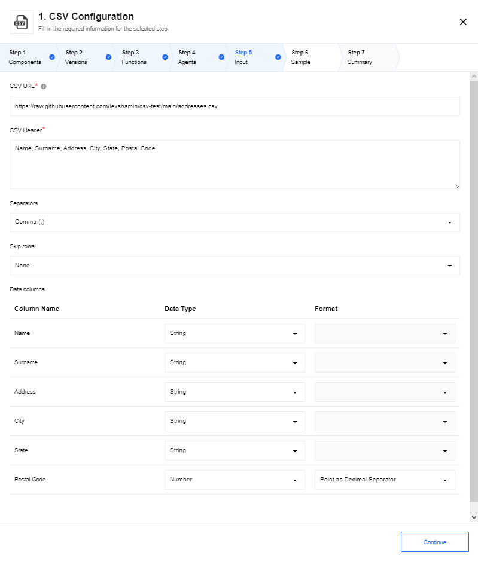
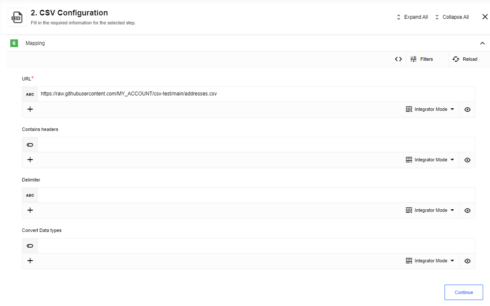
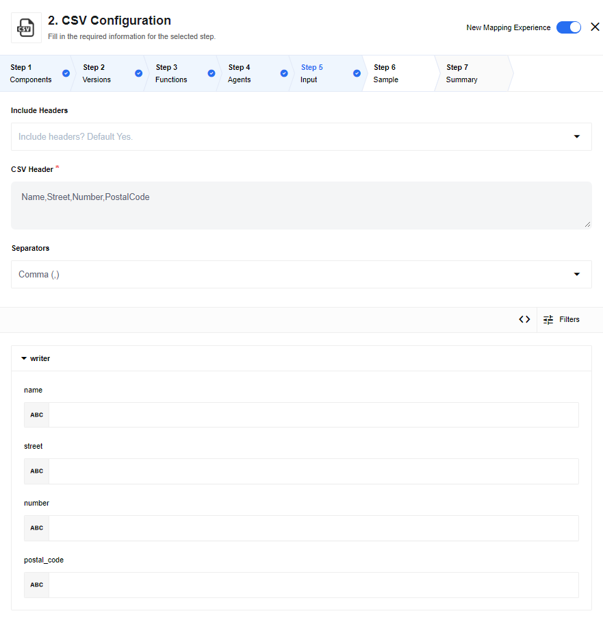

## How works

The component can read the CSV file from a remote URL or from the message
attachment. It can also write a CSV file from the incoming events.

## Requirements

### Environment variables

1. `EIO_REQUIRED_RAM_MB` - recommended value of allocated memory is 512 MB
2. `REQUEST_TIMEOUT - HTTP` request timeout in milliseconds, default value 10000
3. `REQUEST_RETRY_DELAY` - delay between retry attempts in milliseconds, default value 7000
4. `REQUEST_MAX_RETRY` - number of HTTP request retry attempts, default value 7
5. `REQUEST_MAX_CONTENT_LENGTH` - max size of http request in bytes, default value: 10485760
6. `TIMEOUT_BETWEEN_EVENTS` - number of milliseconds write action wait before creating separate attachments, default value: 10000


### Credentials

The component does not require credentials to function.


## Triggers

### Read CSV file from URL

This trigger will fetch the CSV file from a given URL. The address must be accessible
to the component. The fetched CSV file will be placed in the attachment part of the
outgoing message.



*   `CSV URL` - the full URL to the file for retrieving data.
*   `Emit all messages` - this checkbox configures output behavior of the component. If the option is checked - the component emits an array of messages, otherwise - the component emits a message per row.
*   `CSV Header` - this is a required field. Input the names of headers separated with a comma.
*   `Separators` - Specify the separator type. Usually it is a comma (,) but values like Semicolon (;), Space ( ), Tab (\t) and Hash (#) are also supported.
*   `Skip rows` - if you know that the incoming CSV file has certain number of headers you can indicate to skip them. The supported values are None, First row, First two, First three and First four.
*   `Data columns` - here the values will be added dynamically based on the values in the CSV Header field. Here each data column will be listed with the name, Data Type and the Format to enable further configuration.

## Actions

### Read CSV attachment



This action will read the CSV attachment of the incoming message and output
a `JSON` object. To configure this action the following fields can be used:

*   `CSV Header` - this is a required field. Input the names of headers separated with a comma.
*   `Separators` - Specify the separator type. Usually it is a comma (`,`) but values like Semicolon (`;`), Space (` `), Tab (`\t`) and Hash (`#`) are also supported.
*   `Skip rows` - if you know that the incoming CSV file has certain number of headers you can indicate to skip them. The supported values are `None`, `First row`, `First two`, `Dirst three` and `First four`.
*   `Data columns` - here the values will be added dynamically based on the values in the `CSV Header` field. Here each data column will be listed with the name, Data Type and the Format to enable further configuration.


### Write CSV attachment

This action will combine multiple incoming events into a CSV file until there is a gap
of more than 10 seconds between events. Afterwards, the CSV file will be closed
and attached to the outgoing message.

As part of the component setup, one must specify the columns of the CSV file.
These columns will be published as the header in the first row. For each incoming
event, the value for each header will be `stringified` and written as the value
for that cell. All other properties will be ignored. For example, headers
`foo,bar` along with the following JSON events:

```
{"foo":"myfoo", "bar":"mybar"}
{"foo":"myfoo", "bar":[1,2]}
{"bar":"mybar", "baz":"mybaz"}
```

will produce the following `.csv` file:
```
foo,bar
myfoo,mybar
myfoo,"[1,2]"
,mybar
```

When columns are added in the UI, you will be presented with an opportunity to
provide a JSONata expression per column. If you require number formatting that
is specific to a locale, the JSONata expression should handle that concern.



The output of the CSV Write component will be a message with an attachment.  In
order to access this attachment, the component following the CSV Write must be
able to handle file attachments.

## Limitations

  1. You may get `Component run out of memory and terminated.` error during run-time, that means that component needs more memory, please add `EIO_REQUIRED_RAM_MB` environment variable with an appropriate value (e.g. value `512` means that 512 MB will be allocated) for the component in this case.
  2. You may get `Error: write after end` error, as a current workaround try increase value of environment variable: `TIMEOUT_BETWEEN_EVENTS`.
  3. Maximal possible size for an attachment is 10 MB.
  4. Attachments mechanism does not work with [Local Agent Installation](https://support.elastic.io/support/solutions/articles/14000076461-announcing-the-local-agent-).
