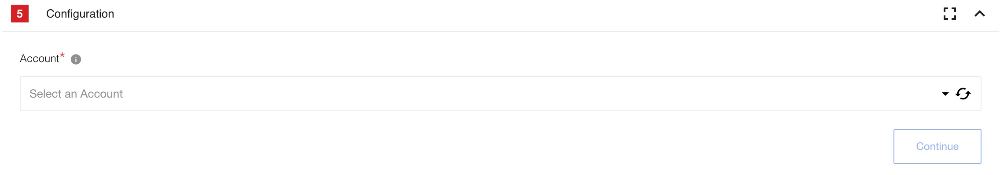
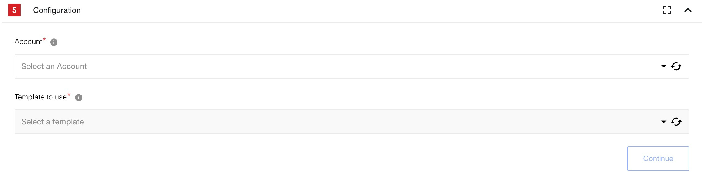

## Environment Variables & OAuth Callback Values

This component requires the following environment variables:
* `OAUTH_KEY`
* `OAUTH_SECRET`

The OAuth Key & Secret can be obtained by:

1. Log in to DocuSign on [https://appdemo.docusign.com](https://appdemo.docusign.com)
2. Click `Go to Admin` on the user picture in the top right
3. Select `API and Keys` from the right hand menu.
4. The value under `Integrator Key` should be used as the value for `OAUTH_KEY`
5. Clicking `Actions` -> `Edit` will open a dialog.
6. The values under `Secret Keys` can be used as a value for `OAUTH_SECRET`
7. There must be an entry of the form `https://<platform base
url>/callback/oauth2` under the section `Redirect URIs` in order for OAuth to
work.

### Technical Notes

The [technical notes](technical-notes) page gives some technical details about
DocuSign component like [changelog](technical-notes#changelog).

## Triggers

### Get Envelope Signing Events Webhook

Webhook enables the receiving of real-time data updates from DocuSign account. These updates are generated by user transactions as the envelope progresses through actions to completion. The DocuSign Connect Service provides updated information about the status of these transactions and returns updates that include the actual content of document form fields.
For example, your application can be notified whenever an individual recipient signs a document or when an envelope is fully signed and completed. Notification messages include information about the current status of the envelope and its recipients. Notification messages can include the envelope's signed document or documents and additional data.

## Actions

### Create Envelope From Template

Allows to create envelope for signing using template in your account. Templates help streamline the sending process when you frequently send the same or similar documents, or send different documents to the same group of people.

## Current Limitations

Currently component does not support local agents.

## Additional info

### DocuSign API and Documentation links

To interact with DocuSign platform, this component interacts with the DocuSign
[REST API (v2)](https://developers.docusign.com/docs/)

### For trigger Get

*   `GET`, `POST` `/v2/accounts/{accountId}/connect`
*   `DELETE` `/v2/accounts/{accountId}/connect/{connectId}`

### For action Create

*   `POST` `/v2/accounts/{accountId}/envelopes`
*   `GET` `/v2/accounts/{accountId}/envelopes/{envelopeId}`
*   `GET` `/v2/accounts/{accountId}/templates`
