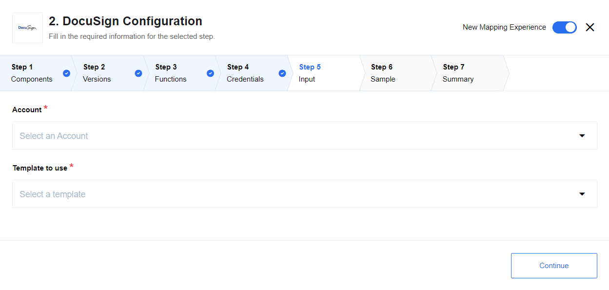

## Table of Contents

* [Description](#description)
* [Requirements](#requirements)
  * [Environment Variables](#environment-variables)
  * [OAuth Callback Values](#oauth-callback-values)
* [Credentials](#credentials)
* [Triggers](#triggers)
  * [Get Envelope Signing Events Webhook](#get-envelope-signing-events-webhook)
* [Actions](#actions)
  * [Create Envelope From Template](#create-envelope-from-template)
* [Known Limitations](#known-limitations)
* [Additional information](#additional-information)
  * [DocuSign API and Documentation links](#docuSign-api-and-documentation-links)
  * [Redirect URI registration](#redirect-uri-registration)

## Description

{{page.description}}

## Requirements

### Environment Variables

This component requires the following environment variables:
* `OAUTH_KEY`
* `OAUTH_SECRET`

### OAuth Callback Values

The OAuth Key & Secret can be obtained by:

1. Log in to DocuSign on [https://appdemo.docusign.com](https://appdemo.docusign.com).
2. Click `Go to Admin` on the user picture in the top right.
3. Select `API and Keys` from the right hand menu.
4. The value under `Integrator Key` should be used as the value for `OAUTH_KEY`.
5. Clicking `Actions` -> `Edit` will open a dialog.
6. The values under `Secret Keys` can be used as a value for `OAUTH_SECRET`.
7. There must be an entry of the form [https://{your-tenant-address}/callback/oauth2](/guides/oauth-callback-redirect-url) under the section `Redirect URIs` in order for OAuth to work.

>**Warning:** To maintain a smooth experience, we recommend reusing stored credentials where possible. Duplicating secrets across OAuth clients can result in errors and complications.

## Credentials

1. Choose the desired environment: `Demo (sandbox)` or `Live production`.
2. Click `Authenticate` to sign in using your account details.
3. After successfully logging in, click `Save` to store your credentials.


## Triggers

### Get Envelope Signing Events Webhook

Webhook enables the receiving of real-time data updates from DocuSign account. These updates are generated by user transactions as the envelope progresses through actions to completion. The DocuSign Connect Service provides updated information about the status of these transactions and returns updates that include the actual content of document form fields.
For example, your application can be notified whenever an individual recipient signs a document or when an envelope is fully signed and completed. Notification messages include information about the current status of the envelope and its recipients. Notification messages can include the envelope's signed document or documents and additional data.

#### Input Metadata


> For additional details, see their [API reference](https://developers.docusign.com/docs/esign-rest-api/reference/connect/connectconfigurations):
*   `GET`, `POST` `/v2/accounts/{accountId}/connect`
*   `DELETE` `/v2/accounts/{accountId}/connect/{connectId}`

#### Output Metadata

Please refer to the **Output json schema** for the full list of metadata fields.

<details close markdown="block"><summary><strong>Click to expand: </strong></summary>
```json
{
  "type": "object",
  "id": "urn:jsonschema:net:docusign:api:_3:EnvelopeStatus",
  "properties": {
    "RecipientStatuses": {
      "type": "object",
      "id": "urn:jsonschema:net:docusign:api:_3:ArrayOfRecipientStatus",
      "required": true,
      "properties": {
        "RecipientStatus": {
          "type": "array",
          "items": {
            "type": "object",
            "id": "urn:jsonschema:net:docusign:api:_3:RecipientStatus",
            "properties": {
              "Type": {
                "type": "string",
                "required": true,
                "enum": [
                  "Signer",
                  "Agent",
                  "Editor",
                  "Intermediary",
                  "CarbonCopy",
                  "CertifiedDelivery",
                  "InPersonSigner",
                  "SigningHost"
                ]
              },
              "Email": {
                "type": "string"
              },
              "UserName": {
                "type": "string"
              },
              "RoutingOrder": {
                "type": "integer"
              },
              "Sent": {
                "type": "integer",
                "format": "utc-millisec"
              },
              "Delivered": {
                "type": "integer",
                "format": "utc-millisec"
              },
              "Signed": {
                "type": "integer",
                "format": "utc-millisec"
              },
              "Declined": {
                "type": "integer",
                "format": "utc-millisec"
              },
              "DeclineReason": {
                "type": "string",
                "required": true
              },
              "AutoRespondedReason": {
                "type": "string"
              },
              "Status": {
                "type": "string",
                "required": true,
                "enum": [
                  "Created",
                  "Sent",
                  "Delivered",
                  "Signed",
                  "Declined",
                  "Completed",
                  "FaxPending",
                  "AutoResponded"
                ]
              },
              "RecipientIPAddress": {
                "type": "string"
              },
              "ClientUserId": {
                "type": "string"
              },
              "AutoNavigation": {
                "type": "boolean"
              },
              "IDCheckInformation": {
                "type": "object",
                "id": "urn:jsonschema:net:docusign:api:_3:IDCheckInformation",
                "properties": {
                  "AddressInformation": {
                    "type": "object",
                    "id": "urn:jsonschema:net:docusign:api:_3:AddressInformation",
                    "properties": {
                      "Street1": {
                        "type": "string"
                      },
                      "Street2": {
                        "type": "string"
                      },
                      "City": {
                        "type": "string"
                      },
                      "State": {
                        "type": "string"
                      },
                      "Zip": {
                        "type": "string"
                      },
                      "ZipPlus4": {
                        "type": "string"
                      }
                    }
                  },
                  "DOBInformation": {
                    "type": "object",
                    "id": "urn:jsonschema:net:docusign:api:_3:DOBInformation",
                    "properties": {
                      "DOB": {
                        "type": "integer",
                        "required": true,
                        "format": "utc-millisec"
                      }
                    }
                  },
                  "SSN4Information": {
                    "type": "object",
                    "id": "urn:jsonschema:net:docusign:api:_3:SSN4Information",
                    "properties": {
                      "SSN4": {
                        "type": "string"
                      }
                    }
                  }
                }
              },
              "RecipientAuthenticationStatus": {
                "type": "object",
                "id": "urn:jsonschema:net:docusign:api:_3:AuthenticationStatus",
                "properties": {
                  "AccessCodeResult": {
                    "type": "object",
                    "id": "urn:jsonschema:net:docusign:api:_3:EventResult",
                    "properties": {
                      "Status": {
                        "type": "string",
                        "required": true,
                        "enum": [
                          "Passed",
                          "Failed"
                        ]
                      },
                      "EventTimestamp": {
                        "type": "integer",
                        "required": true,
                        "format": "utc-millisec"
                      },
                      "FailureDescription": {
                        "type": "string"
                      },
                      "VendorFailureStatusCode": {
                        "type": "string"
                      }
                    }
                  },
                  "IDQuestionsResult": {
                    "type": "object",
                    "properties": {
                      "Status": {
                        "type": "string",
                        "required": true,
                        "enum": [
                          "Passed",
                          "Failed"
                        ]
                      },
                      "EventTimestamp": {
                        "type": "integer",
                        "required": true,
                        "format": "utc-millisec"
                      },
                      "FailureDescription": {
                        "type": "string"
                      },
                      "VendorFailureStatusCode": {
                        "type": "string"
                      }
                    }
                  },
                  "IDLookupResult": {
                    "type": "object",
                    "properties": {
                      "Status": {
                        "type": "string",
                        "required": true,
                        "enum": [
                          "Passed",
                          "Failed"
                        ]
                      },
                      "EventTimestamp": {
                        "type": "integer",
                        "required": true,
                        "format": "utc-millisec"
                      },
                      "FailureDescription": {
                        "type": "string"
                      },
                      "VendorFailureStatusCode": {
                        "type": "string"
                      }
                    }
                  },
                  "AgeVerifyResult": {
                    "type": "object",
                    "properties": {
                      "Status": {
                        "type": "string",
                        "required": true,
                        "enum": [
                          "Passed",
                          "Failed"
                        ]
                      },
                      "EventTimestamp": {
                        "type": "integer",
                        "required": true,
                        "format": "utc-millisec"
                      },
                      "FailureDescription": {
                        "type": "string"
                      },
                      "VendorFailureStatusCode": {
                        "type": "string"
                      }
                    }
                  },
                  "STANPinResult": {
                    "type": "object",
                    "properties": {
                      "Status": {
                        "type": "string",
                        "required": true,
                        "enum": [
                          "Passed",
                          "Failed"
                        ]
                      },
                      "EventTimestamp": {
                        "type": "integer",
                        "required": true,
                        "format": "utc-millisec"
                      },
                      "FailureDescription": {
                        "type": "string"
                      },
                      "VendorFailureStatusCode": {
                        "type": "string"
                      }
                    }
                  },
                  "OFACResult": {
                    "type": "object",
                    "properties": {
                      "Status": {
                        "type": "string",
                        "required": true,
                        "enum": [
                          "Passed",
                          "Failed"
                        ]
                      },
                      "EventTimestamp": {
                        "type": "integer",
                        "required": true,
                        "format": "utc-millisec"
                      },
                      "FailureDescription": {
                        "type": "string"
                      },
                      "VendorFailureStatusCode": {
                        "type": "string"
                      }
                    }
                  },
                  "PhoneAuthResult": {
                    "type": "object",
                    "properties": {
                      "Status": {
                        "type": "string",
                        "required": true,
                        "enum": [
                          "Passed",
                          "Failed"
                        ]
                      },
                      "EventTimestamp": {
                        "type": "integer",
                        "required": true,
                        "format": "utc-millisec"
                      },
                      "FailureDescription": {
                        "type": "string"
                      },
                      "VendorFailureStatusCode": {
                        "type": "string"
                      }
                    }
                  },
                  "LiveIDResult": {
                    "type": "object",
                    "properties": {
                      "Status": {
                        "type": "string",
                        "required": true,
                        "enum": [
                          "Passed",
                          "Failed"
                        ]
                      },
                      "EventTimestamp": {
                        "type": "integer",
                        "required": true,
                        "format": "utc-millisec"
                      },
                      "FailureDescription": {
                        "type": "string"
                      },
                      "VendorFailureStatusCode": {
                        "type": "string"
                      }
                    }
                  },
                  "FacebookResult": {
                    "type": "object",
                    "properties": {
                      "Status": {
                        "type": "string",
                        "required": true,
                        "enum": [
                          "Passed",
                          "Failed"
                        ]
                      },
                      "EventTimestamp": {
                        "type": "integer",
                        "required": true,
                        "format": "utc-millisec"
                      },
                      "FailureDescription": {
                        "type": "string"
                      },
                      "VendorFailureStatusCode": {
                        "type": "string"
                      }
                    }
                  },
                  "GoogleResult": {
                    "type": "object",
                    "properties": {
                      "Status": {
                        "type": "string",
                        "required": true,
                        "enum": [
                          "Passed",
                          "Failed"
                        ]
                      },
                      "EventTimestamp": {
                        "type": "integer",
                        "required": true,
                        "format": "utc-millisec"
                      },
                      "FailureDescription": {
                        "type": "string"
                      },
                      "VendorFailureStatusCode": {
                        "type": "string"
                      }
                    }
                  },
                  "LinkedinResult": {
                    "type": "object",
                    "properties": {
                      "Status": {
                        "type": "string",
                        "required": true,
                        "enum": [
                          "Passed",
                          "Failed"
                        ]
                      },
                      "EventTimestamp": {
                        "type": "integer",
                        "required": true,
                        "format": "utc-millisec"
                      },
                      "FailureDescription": {
                        "type": "string"
                      },
                      "VendorFailureStatusCode": {
                        "type": "string"
                      }
                    }
                  },
                  "SalesforceResult": {
                    "type": "object",
                    "properties": {
                      "Status": {
                        "type": "string",
                        "required": true,
                        "enum": [
                          "Passed",
                          "Failed"
                        ]
                      },
                      "EventTimestamp": {
                        "type": "integer",
                        "required": true,
                        "format": "utc-millisec"
                      },
                      "FailureDescription": {
                        "type": "string"
                      },
                      "VendorFailureStatusCode": {
                        "type": "string"
                      }
                    }
                  },
                  "TwitterResult": {
                    "type": "object",
                    "properties": {
                      "Status": {
                        "type": "string",
                        "required": true,
                        "enum": [
                          "Passed",
                          "Failed"
                        ]
                      },
                      "EventTimestamp": {
                        "type": "integer",
                        "required": true,
                        "format": "utc-millisec"
                      },
                      "FailureDescription": {
                        "type": "string"
                      },
                      "VendorFailureStatusCode": {
                        "type": "string"
                      }
                    }
                  },
                  "OpenIDResult": {
                    "type": "object",
                    "properties": {
                      "Status": {
                        "type": "string",
                        "required": true,
                        "enum": [
                          "Passed",
                          "Failed"
                        ]
                      },
                      "EventTimestamp": {
                        "type": "integer",
                        "required": true,
                        "format": "utc-millisec"
                      },
                      "FailureDescription": {
                        "type": "string"
                      },
                      "VendorFailureStatusCode": {
                        "type": "string"
                      }
                    }
                  },
                  "AnySocialIDResult": {
                    "type": "object",
                    "properties": {
                      "Status": {
                        "type": "string",
                        "required": true,
                        "enum": [
                          "Passed",
                          "Failed"
                        ]
                      },
                      "EventTimestamp": {
                        "type": "integer",
                        "required": true,
                        "format": "utc-millisec"
                      },
                      "FailureDescription": {
                        "type": "string"
                      },
                      "VendorFailureStatusCode": {
                        "type": "string"
                      }
                    }
                  },
                  "YahooResult": {
                    "type": "object",
                    "properties": {
                      "Status": {
                        "type": "string",
                        "required": true,
                        "enum": [
                          "Passed",
                          "Failed"
                        ]
                      },
                      "EventTimestamp": {
                        "type": "integer",
                        "required": true,
                        "format": "utc-millisec"
                      },
                      "FailureDescription": {
                        "type": "string"
                      },
                      "VendorFailureStatusCode": {
                        "type": "string"
                      }
                    }
                  }
                }
              },
              "CustomFields": {
                "type": "object",
                "id": "urn:jsonschema:net:docusign:api:_3:ArrayOfString1",
                "properties": {
                  "CustomField": {
                    "type": "array",
                    "items": {
                      "type": "string"
                    }
                  }
                }
              },
              "TabStatuses": {
                "type": "object",
                "id": "urn:jsonschema:net:docusign:api:_3:ArrayOfTabStatus",
                "properties": {
                  "TabStatus": {
                    "type": "array",
                    "items": {
                      "type": "object",
                      "id": "urn:jsonschema:net:docusign:api:_3:TabStatus",
                      "properties": {
                        "TabType": {
                          "type": "string",
                          "required": true,
                          "enum": [
                            "InitialHere",
                            "SignHere",
                            "FullName",
                            "FirstName",
                            "LastName",
                            "EmailAddress",
                            "Company",
                            "Title",
                            "DateSigned",
                            "InitialHereOptional",
                            "EnvelopeID",
                            "Custom",
                            "SignerAttachment",
                            "SignHereOptional",
                            "Approve",
                            "Decline",
                            "SignerAttachmentOptional"
                          ]
                        },
                        "Status": {
                          "type": "string"
                        },
                        "XPosition": {
                          "type": "number"
                        },
                        "YPosition": {
                          "type": "number"
                        },
                        "Signed": {
                          "type": "integer",
                          "format": "utc-millisec"
                        },
                        "TabLabel": {
                          "type": "string"
                        },
                        "TabName": {
                          "type": "string"
                        },
                        "TabValue": {
                          "type": "string"
                        },
                        "DocumentID": {
                          "type": "integer"
                        },
                        "PageNumber": {
                          "type": "integer"
                        },
                        "OriginalValue": {
                          "type": "string"
                        },
                        "ValidationPattern": {
                          "type": "string"
                        },
                        "RoleName": {
                          "type": "string"
                        },
                        "ListValues": {
                          "type": "string"
                        },
                        "ListSelectedValue": {
                          "type": "string"
                        },
                        "ScaleValue": {
                          "type": "number"
                        },
                        "CustomTabType": {
                          "type": "string",
                          "enum": [
                            "Text",
                            "Checkbox",
                            "Radio",
                            "List",
                            "Date",
                            "Number",
                            "SSN",
                            "ZIP5",
                            "ZIP5DASH4",
                            "Email",
                            "Note",
                            "Formula"
                          ]
                        }
                      }
                    }
                  }
                }
              },
              "RecipientAttachment": {
                "type": "object",
                "id": "urn:jsonschema:net:docusign:api:_3:ArrayOfAttachment",
                "properties": {
                  "Attachment": {
                    "type": "array",
                    "items": {
                      "type": "object",
                      "id": "urn:jsonschema:net:docusign:api:_3:Attachment",
                      "properties": {
                        "Data": {
                          "type": "array",
                          "items": {
                            "type": "integer"
                          }
                        },
                        "Label": {
                          "type": "string"
                        },
                        "Type": {
                          "type": "string"
                        }
                      }
                    }
                  }
                }
              },
              "AccountStatus": {
                "type": "string"
              },
              "EsignAgreementInformation": {
                "type": "object",
                "id": "urn:jsonschema:net:docusign:api:_3:RecipientStatusEsignAgreementInformation",
                "properties": {
                  "AccountEsignId": {
                    "type": "string"
                  },
                  "UserEsignId": {
                    "type": "string"
                  },
                  "AgreementDate": {
                    "type": "integer",
                    "required": true,
                    "format": "utc-millisec"
                  }
                }
              },
              "FormData": {
                "type": "object",
                "id": "urn:jsonschema:net:docusign:api:_3:FormData",
                "properties": {
                  "xfdf": {
                    "type": "object",
                    "id": "urn:jsonschema:net:docusign:api:_3:FormDataXfdf",
                    "properties": {
                      "fields": {
                        "type": "object",
                        "id": "urn:jsonschema:net:docusign:api:_3:ArrayOfFormDataXfdfField",
                        "properties": {
                          "field": {
                            "type": "array",
                            "items": {
                              "type": "object",
                              "id": "urn:jsonschema:net:docusign:api:_3:FormDataXfdfField",
                              "properties": {
                                "value": {
                                  "type": "string"
                                },
                                "name": {
                                  "type": "string"
                                }
                              }
                            }
                          }
                        }
                      }
                    }
                  }
                }
              },
              "RecipientId": {
                "type": "string"
              },
              "DeliveryMethod": {
                "type": "string",
                "enum": [
                  "Email",
                  "Fax"
                ]
              },
              "FaxNumber": {
                "type": "string"
              }
            }
          }
        }
      }
    },
    "TimeGenerated": {
      "type": "integer",
      "required": true,
      "format": "utc-millisec"
    },
    "EnvelopeID": {
      "type": "string"
    },
    "Subject": {
      "type": "string"
    },
    "UserName": {
      "type": "string"
    },
    "Email": {
      "type": "string"
    },
    "Status": {
      "type": "string",
      "required": true,
      "enum": [
        "Any",
        "Voided",
        "Created",
        "Deleted",
        "Sent",
        "Delivered",
        "Signed",
        "Completed",
        "Declined",
        "TimedOut",
        "Template",
        "Processing"
      ]
    },
    "Created": {
      "type": "integer",
      "required": true,
      "format": "utc-millisec"
    },
    "Deleted": {
      "type": "integer",
      "format": "utc-millisec"
    },
    "Sent": {
      "type": "integer",
      "format": "utc-millisec"
    },
    "Delivered": {
      "type": "integer",
      "format": "utc-millisec"
    },
    "Signed": {
      "type": "integer",
      "format": "utc-millisec"
    },
    "Completed": {
      "type": "integer",
      "format": "utc-millisec"
    },
    "Declined": {
      "type": "integer",
      "format": "utc-millisec"
    },
    "TimedOut": {
      "type": "integer",
      "format": "utc-millisec"
    },
    "ACStatus": {
      "type": "string"
    },
    "ACStatusDate": {
      "type": "integer",
      "required": true,
      "format": "utc-millisec"
    },
    "ACHolder": {
      "type": "string"
    },
    "ACHolderEmail": {
      "type": "string"
    },
    "ACHolderLocation": {
      "type": "string"
    },
    "SigningLocation": {
      "type": "string",
      "required": true,
      "enum": [
        "InPerson",
        "Online"
      ]
    },
    "SenderIPAddress": {
      "type": "string"
    },
    "EnvelopePDFHash": {
      "type": "string"
    },
    "CustomFields": {
      "type": "object",
      "id": "urn:jsonschema:net:docusign:api:_3:ArrayOfCustomField",
      "properties": {
        "CustomField": {
          "type": "array",
          "items": {
            "type": "object",
            "id": "urn:jsonschema:net:docusign:api:_3:CustomField",
            "properties": {
              "Name": {
                "type": "string"
              },
              "Show": {
                "type": "string"
              },
              "Required": {
                "type": "string"
              },
              "Value": {
                "type": "string"
              },
              "CustomFieldType": {
                "type": "string",
                "enum": [
                  "Text",
                  "List"
                ]
              },
              "ListItems": {
                "type": "string"
              }
            }
          }
        }
      }
    },
    "VaultingDetails": {
      "type": "object",
      "id": "urn:jsonschema:net:docusign:api:_3:VaultingDetails",
      "properties": {
        "EODTransactionName": {
          "type": "string"
        },
        "EODTransactionID": {
          "type": "string"
        },
        "EODDocumentProfileID": {
          "type": "string"
        }
      }
    },
    "AutoNavigation": {
      "type": "boolean"
    },
    "EnvelopeIdStamping": {
      "type": "boolean"
    },
    "AuthoritativeCopy": {
      "type": "boolean"
    },
    "EnvelopeAttachment": {
      "type": "object",
      "properties": {
        "Attachment": {
          "type": "array",
          "items": {
            "type": "object",
            "id": "urn:jsonschema:net:docusign:api:_3:Attachment",
            "properties": {
              "Data": {
                "type": "array",
                "items": {
                  "type": "integer"
                }
              },
              "Label": {
                "type": "string"
              },
              "Type": {
                "type": "string"
              }
            }
          }
        }
      }
    },
    "DocumentStatuses": {
      "type": "object",
      "id": "urn:jsonschema:net:docusign:api:_3:ArrayOfDocumentStatus",
      "properties": {
        "DocumentStatus": {
          "type": "array",
          "items": {
            "type": "object",
            "id": "urn:jsonschema:net:docusign:api:_3:DocumentStatus",
            "properties": {
              "ID": {
                "type": "integer"
              },
              "Name": {
                "type": "string"
              },
              "TemplateName": {
                "type": "string"
              },
              "Sequence": {
                "type": "integer"
              },
              "DocumentFields": {
                "type": "object",
                "id": "urn:jsonschema:net:docusign:api:_3:ArrayOfDocumentField",
                "properties": {
                  "DocumentField": {
                    "type": "array",
                    "items": {
                      "type": "object",
                      "id": "urn:jsonschema:net:docusign:api:_3:DocumentField",
                      "properties": {
                        "Name": {
                          "type": "string"
                        },
                        "Value": {
                          "type": "string"
                        }
                      }
                    }
                  }
                }
              }
            }
          }
        }
      }
    },
    "FormData": {
      "type": "object",
      "properties": {
        "xfdf": {
          "type": "object",
          "id": "urn:jsonschema:net:docusign:api:_3:FormDataXfdf",
          "properties": {
            "fields": {
              "type": "object",
              "id": "urn:jsonschema:net:docusign:api:_3:ArrayOfFormDataXfdfField",
              "properties": {
                "field": {
                  "type": "array",
                  "items": {
                    "type": "object",
                    "id": "urn:jsonschema:net:docusign:api:_3:FormDataXfdfField",
                    "properties": {
                      "value": {
                        "type": "string"
                      },
                      "name": {
                        "type": "string"
                      }
                    }
                  }
                }
              }
            }
          }
        }
      }
    },
    "VoidReason": {
      "type": "string"
    }
  }
}
```
</details>

## Actions

### Create Envelope From Template

Allows to create envelope for signing using template in your account. Templates help streamline the sending process when you frequently send the same or similar documents, or send different documents to the same group of people.

#### Input Metadata



> For additional details, see their [API reference](https://developers.docusign.com/docs/esign-rest-api/reference/envelopes/envelopes):
*   `POST` `/v2/accounts/{accountId}/envelopes`
*   `GET` `/v2/accounts/{accountId}/envelopes/{envelopeId}`
*   `GET` `/v2/accounts/{accountId}/templates`

#### Output Metadata

This action has dynamic metadata.

## Known Limitations

Currently component does not support local agents.

## Additional information

### DocuSign API and Documentation links

To interact with DocuSign platform, this component interacts with the DocuSign [REST API (v2)](https://developers.docusign.com/docs/).
  * More about DocuSign webhook: https://developers.docusign.com/esign-rest-api/code-examples/webhook-status
  * More about DocuSign Connections: https://developers.docusign.com/esign-rest-api/guides/connect

### Redirect URI registration
In case when you face with `The redirect URI is not registered properly with DocuSign` error please visit [this link](https://support.docusign.com/en/articles/Redirect-URI-not-registered) in order to handle this issue.
