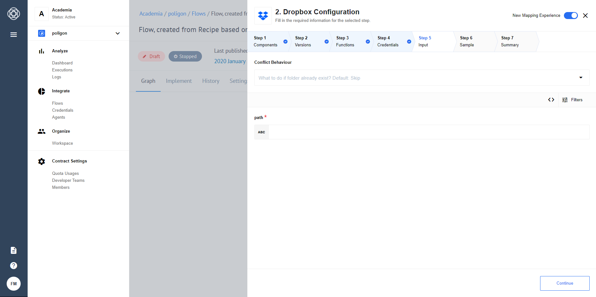
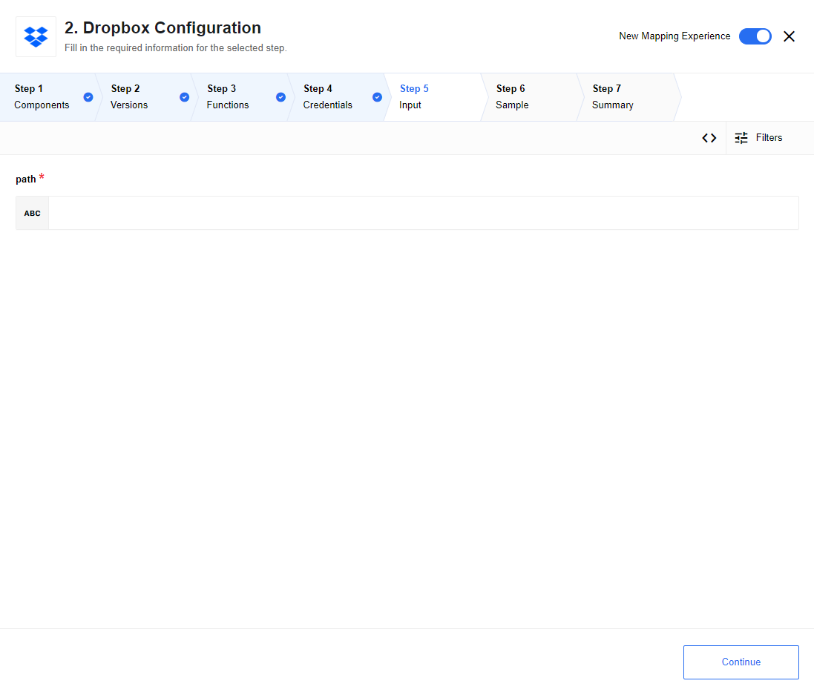
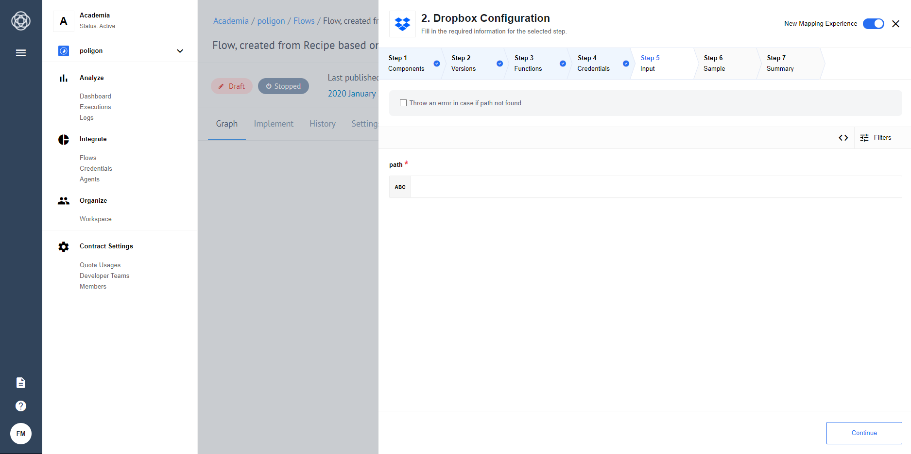

## General information

### Description

Component to interact with Dropbox. Dropbox is a cloud storage service, which allows copy files to the cloud and accesses them later from a different device.

### Technical Notes

The [technical notes](technical-notes) page gives some technical details about Dropbox component like [changelog](/components/dropbox/technical-notes#changelog) and [completeness matrix](/components/dropbox/technical-notes#completeness-matrix).

### SDK version

It is used [Dropbox JavaScript SDK](https://github.com/dropbox/dropbox-sdk-js).

### Environment variables

|Name|Mandatory|Description|Values|
|----|---------|-----------|------|
|`LOG_LEVEL`| false | Controls logger level | `trace`, `debug`, `info`, `warning`, `error` |
|`ATTACHMENT_MAX_SIZE`| false | For `{{site.data.tenant.name}}` attachments configuration. Maximal possible attachment size in bytes. By default set to 1000000 and according to platform limitations CAN'T be bigger than that. | Up to `1000000` bytes|

## Credentials

The Dropbox SDK uses OAuth 2 for authorizing API requests. Dropbox requires an access token to make authenticated requests.
You should create, set up your app, see [OAuth guide](https://www.dropbox.com/developers/reference/oauth-guide), and generate `access token`.
  ### Access Token
  please, provide there generated `access token`.

## Triggers

This component has no trigger functions. This means it will not be accessible to select as a first component during the integration flow design.

## Actions

### Get File By Path

Action to get file from Dropbox by provided path:



#### List of Expected Config fields

##### Allow Empty Result

Default `No`. In case `No` is selected - an error will be thrown when no files were found,
If `Yes` is selected -  an empty object will be returned instead of throwing an error.

##### Allow File name to be Omitted

Default `No`. In case `No` is selected - an error will be thrown when file path is missing in metadata, if `Yes` is selected - an empty object will be returned instead of throwing an error.

##### Enable File Attachments

Checkbox for attaching files content to action response

#### Metadata fields description

  * **path** - Full path to file

#### Input example:

```json
  {
      "path": "/inner_folder/file.any"
  }
```

#### Output example:

  - Successful response

```json
{
  ".tag": "file",
  "name": "file.any",
  "path_lower": "/file.any",
  "path_display": "/file.any",
  "id": "id:Ua3SpE_E_CAAAAAAAAAACA",
  "client_modified": "2020-03-31T11:25:40Z",
  "server_modified": "2020-03-31T11:25:40Z",
  "rev": "015a224d3e0147b00000001b724db90",
  "size": 28,
  "is_downloadable": true,
  "content_hash": "10931f016454cbd4d852632b81f2e5ab2502dc120e2afb7efcd6b64fb9d27e7a"
}
```

### Upsert File

Action upserts (create or replace) with file from attachment by provided path in Microsoft One Drive. If more then 1 attachments (or no attachments) provided the action will throw an error:



#### Metadata fields description

  * **Path** - Full path to item to create or replace

#### Input example:

```json
{
    "path": "/base_folder/inner_folder/file.any"
}
```

#### Output example:

  - Successful response

```json
{
  ".tag": "file",
  "name": "file.any",
  "path_lower": "/file.any",
  "path_display": "/file.any",
  "id": "id:Ua3SpE_E_CAAAAAAAAAACA",
  "client_modified": "2020-03-31T11:25:40Z",
  "server_modified": "2020-03-31T11:25:40Z",
  "rev": "015a224d3e0147b00000001b724db90",
  "size": 28,
  "is_downloadable": true,
  "content_hash": "10931f016454cbd4d852632b81f2e5ab2502dc120e2afb7efcd6b64fb9d27e7a"
}
```

### Delete Folder Or File By Path

Action to delete folder or file from Dropbox by provided path:



#### List of Expected Config fields

* **Throw an error in case if path not found** - select the behaviour in case when specified path not found.

#### Metadata fields description

* **Path** - Full path to a file or a folder

#### Input example:

```
  {
      "path": "base_folder/inner_folder/file.any"
  }
```

#### Output example:

  - Error response example

```json
 {
   "metadata": {
     "path": "/test/DeleteByPath/Document.docx"
   },
   "result": "path_lookup/not_found/...",
   "error": {
     ".tag": "path_lookup",
     "path_lookup": {
       ".tag": "not_found"
     }
   }
 }
```

- Successful response

```json
{
  "metadata": {
    ".tag": "file",
    "name": "Document.docx",
    "path_lower": "/test/deletebypath/document.docx",
    "path_display": "/test/DeleteByPath/Document.docx",
    "id": "id:o0yGDTvyrFAAAAAAAAAAIw",
    "client_modified": "2020-03-31T13:32:00Z",
    "server_modified": "2020-03-31T13:32:01Z",
    "rev": "015a22697b3373f000000013a1ecc50",
    "size": 10982,
    "is_downloadable": true,
    "content_hash": "8424108d60c2a77a6c36355e4a974882a79ca4ecd25a611f0c0b68713d31a044"
  },
  "result": "deleted"
}
```

### Create Folder

Create new folder in provided `path`. Path should contains folder name:


#### Input fields description

  * **Conflict Behaviour** - behaviour in case folder already exists. Default: `Fail`. Options: `Fail`, `Rename`, `Skip`.
      1. `Fail` - fails if folder with same name already exists under provided `path`
      2. `Rename` - rename folder if folder with same name already exists under provided `path`. Examples: `exists` -> `exists (1)`, `exists (1)` -> `exists (1) (1)`
      3. `Skip` - ignore error for already existing folder, returns `{}` if selected

#### Metadata fields description

  * **Path** - Path to to folder where new folder will be created. Use empty string or `/` for root

#### Input example:

```json
{
    "path": "/test/create/folder"
}
```

#### Output example:

  - Successful response

```json
{
    "name": "Folder",
    "path_lower": "/test/create/folder",
    "path_display": "/test/create/Folder",
    "id": "id:U6e6XFFVGvAAAAAAAAAAlw"
}
```

## Known Limitations

1. Maximal possible size for an attachment is 10 MB.
2. Attachments mechanism does not work with [Local Agent Installation](/getting-started/local-agent).
