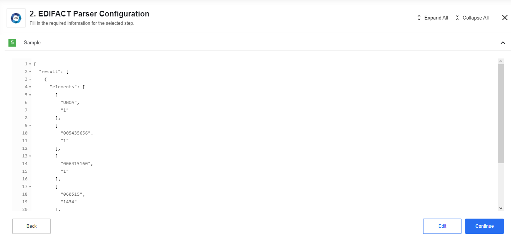

## Authentication

This component requires no authentication.

## How it works

EDIFACT Parser component expects an incoming message(es) with EDI attachment(s) in it. You can test it using SFTP component like this:



Sample example:

```json
{
  "result": [
    {
      "elements": [
        ["UNOA", "1"],
        ["005435656", "1"],
        ["006415160", "1"],
        ["060515", "1434"],
        ["00000000000778"]
       ],
      "name": "UNB"
    }
  ]
}
```

> Sample EDI files you can find [here](https://raw.githubusercontent.com/elasticio/edifact-parser-component/master/samples/INVOICE.edi), and [here](https://github.com/elasticio/edifact-parser-component/blob/master/samples/INVOICE.edi.json) you will see resulting JSON message body after parsing.

### Technical Notes

The [technical notes](technical-notes) page gives some technical details about Edifact-parser component like [changelog](/components/edifact-parser/technical-notes#changelog).

## Triggers

This component has no trigger functions. This means it will not be accessible to
select as a first component during the integration flow design.

## Actions


### EDIFACT Parse

EDIFACT Parse action expects an incoming message(es) with EDI attachment(s) in it.

Sample EDI file you can find [here](https://raw.githubusercontent.com/elasticio/edifact-parser-component/master/samples/INVOICE.edi), and [here](https://github.com/elasticio/edifact-parser-component/blob/master/samples/INVOICE.edi.json) you will see resulting JSON message body after parsing.
