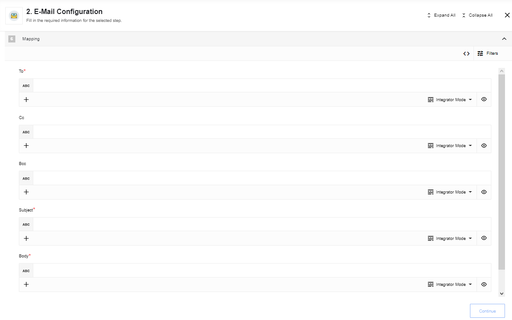

{{page.description}}

## How works

The component sends a new transaction through Mandrill using the [Send](https://mandrillapp.com/api/docs/messages.JSON.html#method=send) API resource for each incoming message.

## Requirements

### Environment variables

The component can be configured using the following environmental variables

Name|Mandatory|Description|Values|
|----|---------|-----------|------|
|`MANDRILL_API_KEY`| true | You can use API key provided by platform or [generate](https://mailchimp.com/developer/transactional/guides/quick-start/#generate-your-api-key) it by yourself (required for custom component/installation) | any `string` |
|`MANDRILL_FROM_EMAIL`| false | Sender email address, `no-reply@elastic.io` by default | any `string`|
|`MANDRILL_FROM_NAME`| false | Sender name, `elastic.io` by default | any `string`|
|`MANDRILL_URL`| false | Base path and version of mandrill installation, `https://mandrillapp.com/api/1.0` by default | any `string`|
|`MAX_BODY_LENGTH`| false | Maximum email message size (including attachments), `10485760` (10MB) by default | any `number`|

>**Please note:** that you must [verify your domain](https://mailchimp.com/developer/transactional/docs/authentication-delivery/#authentication) before using this component and configuring it with your environmental variables.

### Technical Notes

The [technical notes](technical-notes) page gives some technical details about Email component like [changelog](/components/email/technical-notes#changelog).

## Triggers

This component has no trigger functions. This means it will not be accessible to
select as a first component during the integration flow design.

## Actions

### Send Email

For each incoming message the component send a new transactional message through Mandrill using the [Send new message](https://mailchimp.com/developer/transactional/api/messages/send-new-message/) API resource.

#### Configuration Fields

* **Do not throw an error when e-mail send failed** - (checkbox, required): If checked, component will not throw an error when sending failed, details will be provided in output message.

#### Input Metadata

* **To** - (string, required): The email address(es) for primary recipients, you can fill comma separated list
* **Cc** - (string, optional): Comma separated list of E-mail addresses to receive a copy of the mail
* **Bcc** - (string, optional): Comma separated list of E-mail addresses to receive a blind copy of the mail
* **Subject** - (string, required): Subject of the E-mail
* **Body** - (string, required): The content of the E-mail to be sent. If body is a JSON object/array, then it will be stringified
* **Attachments** (array, optional): Series of objects with the following format:
    * **Attachment URL** (string, required): URL to file (platform storage or external)
    * **Filename** (string, required): Name of the attached file that will appear in the received email

#### Output Metadata

As a result of sending you will get object **"results"** which contain result entities of sending messages for each recipient, consists of:

* **To** - (string): the email address of the recipient
* **RecipientType** - (string): Type of recipient, possible values: `to`, `cc`, `bcc`
* **Message** - (string): The sending status of the recipient, possible values: `OK` or `QUEUED` - if successful, `REJECTED` or `INVALID` on fail
* **MessageID** - (string): The message's unique id
* **SubmittedAt** - (string): Date, when message was submitted in format - `YYYY-MM-DDTHH:mm:ss.SSSSSSSZ`
* **ErrorCode** - (number): deprecated parameter, always `0`
