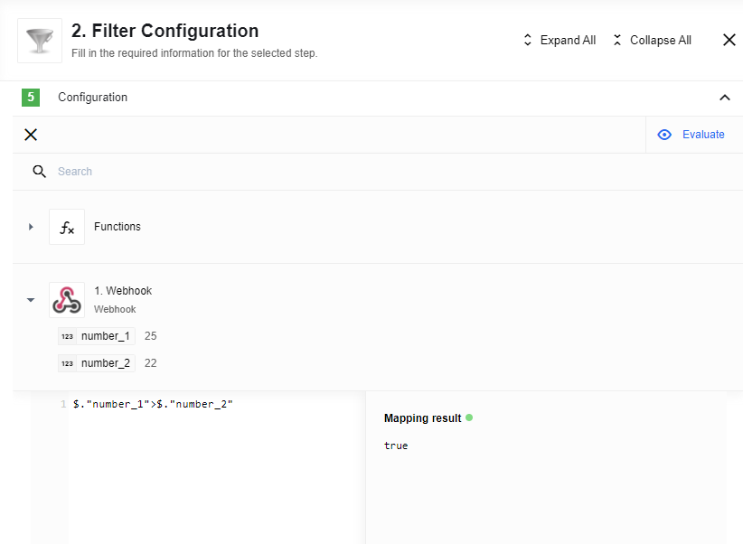

## Description

A component to filter the incoming data based on an arbitrary JSONata expression.

## How it works

Filter will pass through the incoming data if it matches the JSONata condition
specified in the configuration. You can use any valid **JSONata** expression,
so you can be creative. Here are some examples that are possible:

*   `true`
*   `false`
*   `$not(false)`
*   `$not(true)`
*    `20 > 5`
*   `body.foo` - is true if `body.foo` is defined and not `false`

## Requirements

### Environment variables

By default no environment variable is necessary to operate the component.

## Triggers

This component has no trigger functions. This means it will not be selectable as
the first component in an integration flow.

## Actions

### Simple JSONata Filter

This action has two parameters and a checkbox:

#### Parameters:

`Filter condition` - A **JSONata** expression passed in through the cfg.
The expression will be evaluated to a value of  `true` or `false`.

*   If `false` - a message will be logged to the console and the msg will not be sent forward to the next component.
*   If `true` - a new message with empty body will be passed forward along with all data that passed the condition.

#### Checkbox:

* If checked, the checkbox adds `Assertion` functionality. Instead of doing nothing,
the component will throw an error when the condition is not met.

* `Metadata To Response` Adding passthrough from a previous step to message body as `elasticioMeta` variable, if enabled.

## Additional Notes

The JSONata Filter expression can be a valid expression however it can cause an
error to be thrown if it is invalid based on the context. For example,
`$number(hello) > 5` where `hello: "world"`. This JSONata expression is valid
but an error will be thrown as `hello` is `NaN`.
