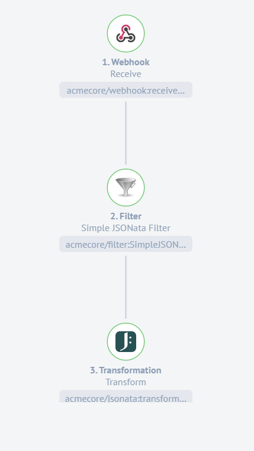
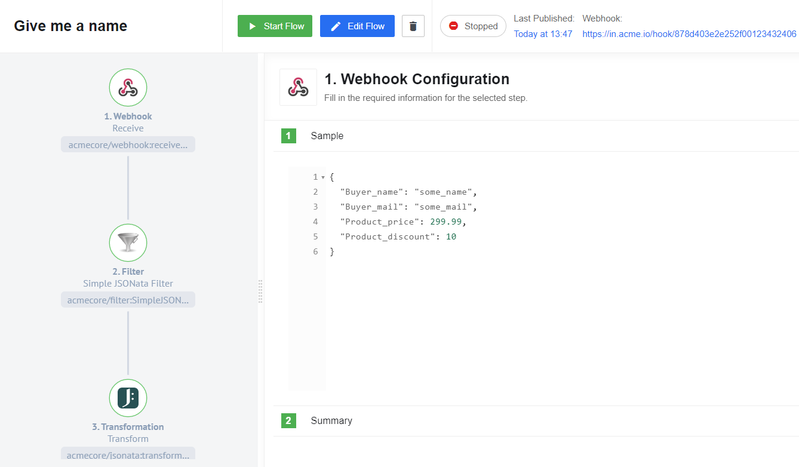
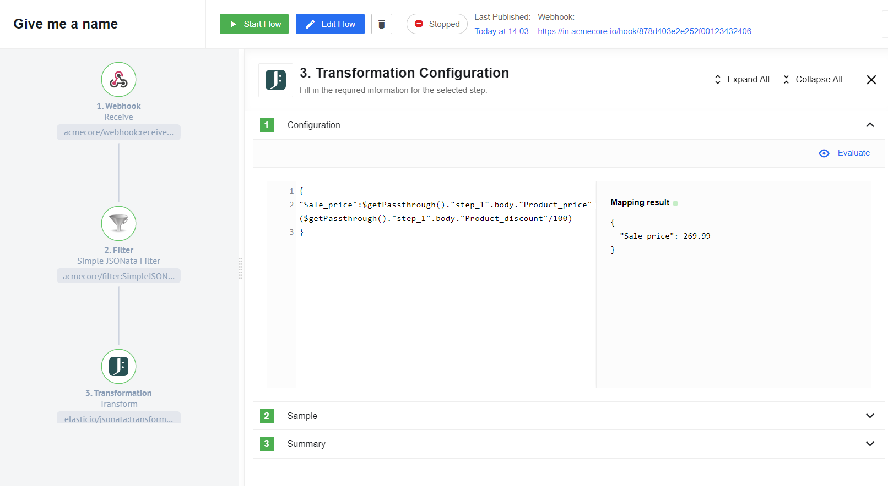

## Calculate discount if exists

In this example we want to create a flow that will calculate the discount of your buyers if it exists. The Filter will pass the message if the condition is true. This functionality is similar to what the [Router](/components/router) component offers. The main difference between Filter component and Router component is that the second creates branches for different conditions. The Filter doesn’t route branches, it just passes a message if it is true. If the Router has only one branch it can do the same action as a Filter. Here you can see this flow:



At the beginning of our flow, we will use a [Webhook](/components/webhook) component. At this stage, we will receive client data and pass it on to the Filter component.



The next step is to define the configuration of the Filter component. As we mentioned earlier, we are only interested in the case where there is a product discount. If the value is false then the message will show the error because there is enabled Assertion functionality.


>Filter component configuration expression:
```
$exists($."Product_discount")!=0
```

In the last step, we use the [Transformation aka Jsonata](/components/jsonata) component. Here we calculate the sale price.



>Transformation component configuration expression:
```
{
"Sale_price":$getPassthrough()."step_1".body."Product_price"-$round($getPassthrough()."step_1".body."Product_price")*($getPassthrough()."step_1".body."Product_discount"/100)
}
```
For more Information on what the Passthrough feature is please read this [article](/guides/passthrough-feature)
