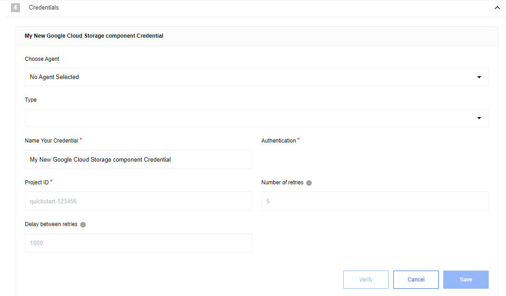

## Description

Google Cloud Storage Component is designed to connect to Google [Cloud Storage JSON API](https://cloud.google.com/storage/docs/json_api)
The current release of component support JSON API `v1`.

## Environment variables

|Name|Mandatory|Description|Values|
|----|---------|-----------|------|
|`MAX_FILE_SIZE`| false |  Maximum file size that can be downloaded from cloud storage to platform in **megabytes (mb)** (100MB by default) | any `integer` above 0|

## Credentials

Before building any integration flow you must at first configure the app from inside the [Google Developers Console](https://console.cloud.google.com/).
1. Go to the `APIs & Services` -> `Enabled APIs & services` page and enable the following:
- Cloud Storage
- Google Cloud Storage JSON API
2. Go to the `Credentials` section and create a new credential of type  `OAuth client ID`.
- Set Application type to `Web application`
- Add Authorized redirect URI as: `https://{your-tenant-address}/callback/oauth2`
3. Create new or link existing [Billing account](https://console.cloud.google.com/billing/) to your project in `Billing` section - it must be valid (Status: active) to use this service

In case of new domain you may get message like `This app isn't verified`. Please refer to this doc to check how to proceed:
https://support.google.com/cloud/answer/7454865?hl=en

Now you can create new credentials for component:

* **Type** (dropdown, required) - `OAuth2`
* **Choose Auth Client** (dropdown, required) - select one of created before or `Add New Auth Client`:
  * **Name** (string, required) - provide any name you want
  * **Client ID** (string, required) - put here `Client ID` from `Web application` in `Google Developers Console`
  * **Client Secret** (string, required) - put here `Client Secret` from `Web application` in `Google Developers Console`
  * **Authorization Endpoint** (string, required) - Google oauth2 authorization endpoint `https://accounts.google.com/o/oauth2/v2/auth`
  * **Token Endpoint** (string, required) - Google refresh token endpoint `https://oauth2.googleapis.com/token`
* **Name Your Credential** (string, required) - provide any name you want
* **Scopes (Comma-separated list)** (string, required) - Put here scopes to get access to your Storage - `https://www.googleapis.com/auth/devstorage.read_write`, [more info](https://cloud.google.com/storage/docs/authentication#oauth-scopes)
* **Additional parameters (Comma-separated list)** (string, required) - set it as `access_type:offline,prompt:consent` to make component works properly
* **Project ID** (string, required) - Get project ID from [Google Developers Console](https://console.cloud.google.com/)
* **Number of retries** (number, optional, 5 by default) - How many times component should retry to make request
* **Delay between retries** (number ms, optional, 10000 by default) - How much time wait until new try

## Triggers

### Get New and Updated Objects Polling

Retrieve all the updated or created objects within a given time range.

#### Configuration Fields
* **Bucket** - (dropdown, required): select one of the available buckets
* **Enable File Attachments** - (checkbox, optional): If checked, file will be uploaded to local storage and link provided in response
* **Time stamp field to poll on** - (dropdown, optional, default `Last Modified`): Select which date will be used to track files - `Last Modified` or `Created`
* **Emit Behavior** - (dropdown, optional, default `Emit individually`): Defines the way result objects will be emitted, one of `Emit page` or `Emit individually`.
* **Page Size** - (number, optional, defaults to 999, max 999): Indicates the size of pages to be fetched per request
* **Start Time** - (string, optional): The timestamp to start polling from (inclusive) - using ISO 8601 Date time utc format - YYYY-MM-DDThh:mm:ssZ. Default value is the beginning of time (January 1, 1970 at 00:00).
* **End Time** - (string, optional): The timestamp to stop polling (exclusive) - using ISO 8601 Date time utc format - YYYY-MM-DDThh:mm:ssZ. Default value is flow execution time.

#### Input Metadata

There is no input metadata in this trigger.

#### Output Metadata

Depends on `Enable File Attachments` and `Emit behavior` fields.
 * If `Emit behavior` field is equal to `Emit page` - object with property `results` that contains array of files
 * If `Emit behavior` field is equal to `Emit individually`, file information will fulfill whole message
 * If `Enable File Attachments` checked, for each file there will be additional field - `attachmentUrl`

#### Limitations

* Google Cloud Storage API doesn't support filtering by dates - as result we collect information about all files from selected Bucket and filter them locally (inside component) for each trigger execution
* From point above, option `Emit page` not always emit records according to `Page Size`

### Webhook

This trigger allow to track changes in bucket

#### Configuration Fields

* **Bucket** - (dropdown, required): select one of the available buckets
* **Enable File Attachments** - (checkbox, optional, `false` by default): If selected, the contents of the file will be exported in addition to the attachment

#### Input Metadata

There is no Input metadata in this trigger.

#### Output Metadata

* **operation** - (object, required): One of `Create`', `Update` or `Delete`
* **fileMetadata** - (object, required): File metadata from `Google Cloud storage`

If selected `Enable File Attachments` there will be additional field:
* **attachmentUrl** - (string, required): Url to file in internal storage

#### Limitations

1. `attachmentUrl` not available for Deleted objects
2. In an ordinary flow you need to follow the webhook URL after a flow started in order to correctly initialize it (no extra actions needed if a flow is real-time)

## Actions

### Delete File

Delete file from Google Cloud Storage

#### Configuration Fields

* **Bucket** - (dropdown, required): select one of the available buckets
* **Don't throw error** - (checkbox, optional, `false` by default): If got error (like file not found) emit empty message instead of throwing an error

#### Input Metadata

* **File name** - (string, required): Name of the file in Cloud Storage

#### Output Metadata

* **name** - name of deleted file

### Download file

Download file from Google Cloud Storage to internal storage

#### Configuration Fields

* **Bucket** - (dropdown, required): select one of the available buckets

#### Input Metadata

* **File name** - (string, required): Name of the file in Cloud Storage

#### Output Metadata

* **attachmentUrl** - (string, required): Url to file in internal storage
* **fileMetadata** - (object, required): File metadata from google cloud storage

### Upload file

Upload files from internal or external storage to Google Cloud Storage

#### Configuration Fields

* **Bucket** - (dropdown, required): select one of the available buckets

#### Input Metadata

* **Url** - (string, required): Link to the file, can be from the platform or external direct
* **File name** - (string, required): How to name this file in Cloud Storage

#### Output Metadata

* **kind** - (string, required): The kind of item this is. For objects, this is always "storage#object".
* **id** - (string, required): The ID of the object, including the bucket name, object name, and generation number.
* **selfLink** - (string, required): A URL for this object.
* **mediaLink** - (string, required): A URL for downloading the object's data.
* **name** - (string, required): The name of the object.
* **bucket** - (string, required): 	The name of the bucket containing this object.
* **generation** - (string, required): The content generation of this object. Used for object versioning.
* **metageneration** - (string, required): The version of the metadata for this object at this generation. Used for preconditions and for detecting changes in metadata. A metageneration number is only meaningful in the context of a particular generation of a particular object.
* **contentType** - (string, required): Content-Type of the object data
* **storageClass** - (string, required): [Storage class](https://cloud.google.com/storage/docs/storage-classes) of the object.
* **size** - (string, required): Content-Length of the data in bytes.
* **md5Hash** - (string, required): MD5 hash of the data, encoded using base64
* **crc32c** - (string, required): CRC32c checksum, as described in RFC 4960, Appendix B; encoded using base64 in big-endian byte order.
* **etag** - (string, required): HTTP 1.1 Entity tag for the object
* **timeCreated** - (string, required): The creation time of the object in RFC 3339 format.
* **updated** - (string, required): The modification time of the object metadata in RFC 3339 format. Set initially to object creation time and then updated whenever any metadata of the object changes.
* **timeStorageClassUpdated** - (string, required): The time at which the object's storage class was last changed. When the object is initially created, it will be set to timeCreated.

#### Limitations

* It is not possible to set the File/Object Metadata
* Maximum file size: 5 TiB
* If a file with provided name is already exist, it will be overwritten by new one

### Make Raw Request

Executes custom request.

#### Configuration Fields

* **Don't throw error on 404 Response** - (optional, boolean): Treat 404 HTTP responses not as error, defaults to `false`.

#### Input Metadata

* **Url** - (string, required): Path of the resource relative to the base URL.
* **Method** - (string, required): HTTP verb to use in the request, one of `GET`, `POST`, `PUT`, `PATCH`, `DELETE`.
* **Request Body** - (object, optional): Body of the request to send.

#### Output Metadata

* **Status Code** - (number, required): HTTP status code of the response.
* **HTTP headers** - (object, required): HTTP headers of the response.
* **Response Body** - (object, optional): HTTP response body.
