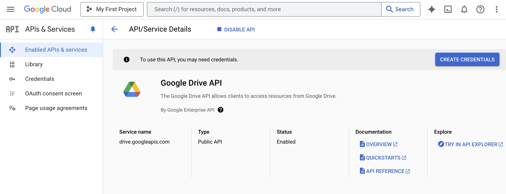
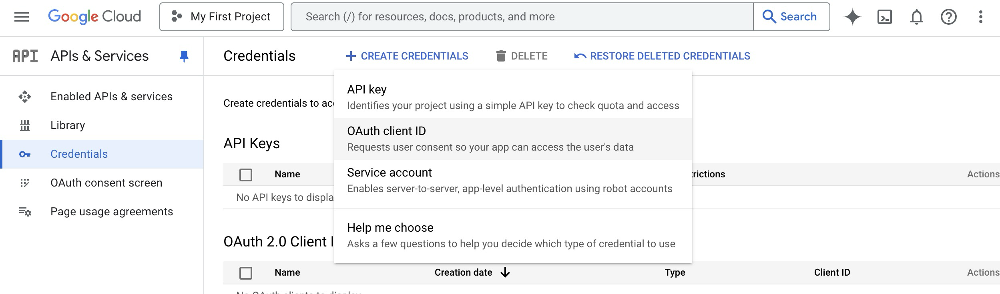
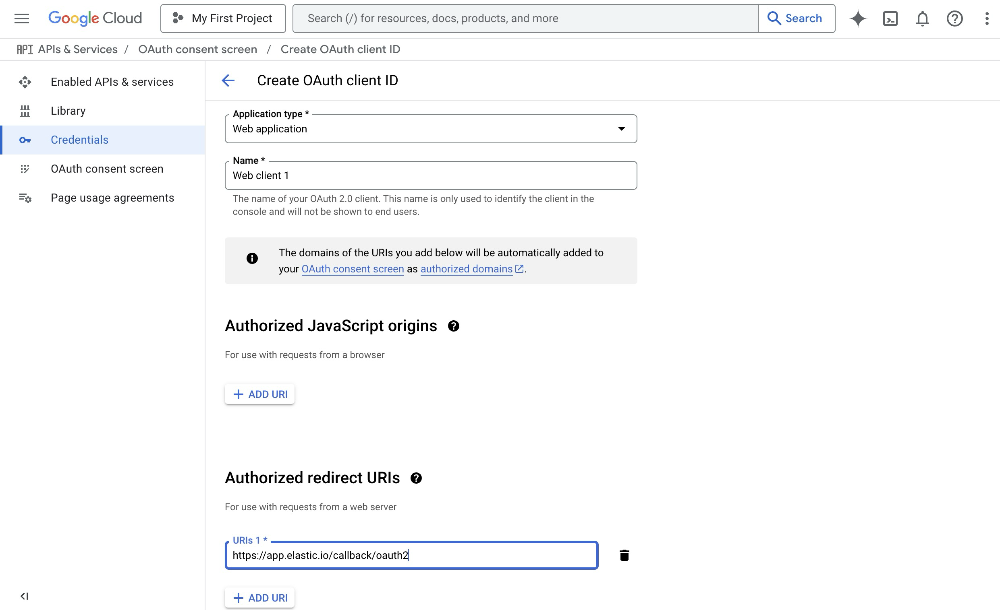

## Table of Contents

* [Description](#description)
* [Environment variables](#environment-variables)
* [Credentials](#credentials)
* [Triggers](#triggers)
  * [Get New and Updated Objects Polling](#get-new-and-updated-objects-polling)
* [Actions](#actions)
  * [Delete File](#delete-file)
  * [Download File](#download-file)
  * [Lookup Files](#lookup-files)
  * [Make Raw Request](#make-raw-request)
  * [Upload File](#upload-file)

## Description

Google Drive Component is designed to connect to the [Google Drive API](https://developers.google.com/drive/api/reference/rest/v3). The current release of the component supports Google Drive API v3.

## Environment variables

| Name              | Mandatory | Description                                                                 | Values              |
|-------------------|-----------|-----------------------------------------------------------------------------|---------------------|
| `MAX_FILE_SIZE`   | false     | Maximum file size that can be downloaded from cloud storage to platform in **megabytes (mb)** (100MB by default) | any `integer` above 0 |

## Credentials

Before building any integration flow you must at first configure the app from inside the [Google Developers Console](https://console.cloud.google.com/).
1. Go to the `APIs & Services` -> `Enabled APIs & services` page and enable the following:
- Google Drive API

2. Go to the `Credentials` section and create a new credential of type  `OAuth client ID`.

- Set Application type to `Web application`
- Add Authorized redirect URI as: `https://{your-tenant-address}/callback/oauth2`

Now you can create new credentials for the component:
* **Type** (dropdown, required) - `OAuth2`
* **Choose Auth Client** (dropdown, required) - select one of created before or `Add New Auth Client`:
  * **Name** (string, required) - provide any name you want
  * **Client ID** (string, required) - put here `Client ID` from `Web application` in `Google Developers Console`
  * **Client Secret** (string, required) - put here `Client Secret` from `Web application` in `Google Developers Console`
  * **Authorization Endpoint** (string, required) - Google oauth2 authorization endpoint `https://accounts.google.com/o/oauth2/v2/auth`
  * **Token Endpoint** (string, required) - Google refresh token endpoint `https://oauth2.googleapis.com/token`
* **Name Your Credential** (string, required) - provide any name you want
* **Scopes (Comma-separated list)** (string, required) - Put here scopes to get access to your Google Drive - `https://www.googleapis.com/auth/drive`, [more info](https://developers.google.com/drive/api/guides/api-specific-auth)
* **Additional parameters (Comma-separated list)** (string, required) - set it as `access_type:offline,prompt:consent` to make component works properly
* **Number of retries** (number, optional, 5 by default) - How many times component should retry to make request 
* **Delay between retries** (number ms, optional, 10000 by default) - How much time wait until new try

## Triggers
  
### Get New and Updated Objects Polling

Retrieve all the updated or created objects within a given time range.

#### Configuration Fields

* **Object Type** - (dropdown, required): select one of the available object types
* **Time stamp field to poll on** - (dropdown, optional, default `Modified Time`): Select which date type will be used to track files
* **Emit Behavior** - (dropdown, optional, default `Emit individually`): Defines the way result objects will be emitted, one of `Emit page` or `Emit individually`.
* **Page Size** - (number, optional, defaults to 100, max 100): Indicates the size of pages to be fetched per request
* **Start Time** - (string, optional): The timestamp to start polling from (inclusive) - using ISO 8601 Date time utc format - YYYY-MM-DDThh:mm:ssZ. Default value is the beginning of time (January 1, 1970 at 00:00).

#### Input Metadata

None.

#### Output Metadata

Depends on `Emit behavior` field.

 * If `Emit behavior` field is equal to `Emit page` - object with property `results` that contains array of files
 * If `Emit behavior` field is equal to `Emit individually`, file information will fulfill whole message

## Actions

### Delete File

Permanently deletes a file owned by the user without moving it to the trash.

#### Configuration Fields

* **Don't throw error** - (checkbox, optional, `false` by default): If got error (like file not found) emit empty message instead of throwing an error

#### Input Metadata

* **File ID** - (required, string): The unique identifier of the file to be deleted.

#### Output Metadata

* **File ID** - (required, string): The unique identifier of the deleted file.

### Download File

Provides a URL to download the file. The URL is valid for 24 hours from the time of creation.

#### Configuration Fields

* **Export MIME Type** - (dropdown, optional): Specifies the MIME type for downloading the file. This field is applicable only for Google Workspace documents. For supported MIME types, refer to [MIME types for Google Workspace documents](https://developers.google.com/drive/api/guides/ref-export-formats). If not set, the file will be downloaded in the default MIME type for the document, which may change in the future.

* **Download To Maester** - (checkbox, optional): If checked, the specified file will be downloaded to the Maester storage.

#### Input Metadata

* **File ID** - (required, string): The unique identifier of the file to be downloaded.

#### Output Metadata

* **File URL** - (required, string): The URL for downloading the file.

### Lookup Files

Lookup a set of objects based on a defined list of criteria. The results can be emitted in different ways.

#### Configuration Fields

* **Emit Behavior** - (dropdown, optional): Defines the way result objects will be emitted, one of `Emit page` or `Emit individually`.

#### Input Metadata

* **Page Size** - (number, optional, defaults to 100, max 100): Indicates the size of pages to be fetched per request.
* **Page Token** - (string, optional): The token for continuing a previous list request on the next page. This should be set to the value of `nextPageToken` from the previous response.
* **Filter Expression** - (string, optional): A query for filtering the file results. The query string contains the following three parts: `query_term operator values`, where `query_term` is the query term or field to search upon; `operator` specifies the condition for the query term; `values` are the specific values you want to use to filter your search results. See the [Search for files & folders](https://developers.google.com/drive/api/guides/ref-search-terms) guide for more information.
* **Order By** - (string, optional): Specifies the sorting order for files using a comma-separated list of keys. Valid keys include 'createdTime', 'modifiedTime', 'name', and others. Add 'desc' to a key for descending order (e.g., 'name desc').
* **Included fields** - (string, optional): Specify fields of the resulting object. Please separate the fields with a comma. [All fields available for the Files object type](https://developers.google.com/drive/api/reference/rest/v3/files#File)

#### Output Metadata

For `Emit Page` mode: An object with the key `results` that has an array as its value and key `nextPageToken` which contains a token for continuing a previous list request on the next page.
For `Emit Individually` mode: File object and key `nextPageToken` which contains a token for continuing a previous list request on the next page.

### Make Raw Request

Executes custom request.

#### Configuration Fields

* **Don't throw error on 404 Response** - (optional, boolean): Treat 404 HTTP responses not as error, defaults to `false`.

#### Input Metadata

* **Url** - (string, required): Path of the resource relative to the base URL. Here comes a part of the path that goes after `https://www.googleapis.com/drive/v3`.
* **Method** - (string, required): HTTP verb to use in the request, one of `GET`, `POST`, `PATCH`, `DELETE`.
* **Request Body** - (object, optional): Body of the request to send.

#### Output Metadata

* **Status Code** - (number, required): HTTP status code of the response.
* **HTTP headers** - (object, required): HTTP headers of the response.
* **Response Body** - (object, optional): HTTP response body.

### Upload File

Uploads a file to the Google Drive.

#### Configuration Fields

* **Folder** - (dropdown, optional): Specifies the folder file will be uploaded to. If not provided, the file will be uploaded to the root folder.

* **MIME Type** - (dropdown, optional): Specifies the MIME type for the file to be uploaded. This is relevant only for files that can be converted to Google Workspace documents. Refer to [MIME types for Google Workspace documents](https://developers.google.com/drive/api/guides/ref-export-formats) for more information.

#### Input Metadata

* **File URL** - (required, string): The URL for uploading the file.
* **Original File Name** - (required, string): The original name of the file you are uploading. Please specify the full file name with an extension, for example, test.jpg
* **New File Name** - (optional, string): Optional field to rename the file during upload. If not provided, the original name will be used.

#### Output Metadata

File information will be returned.