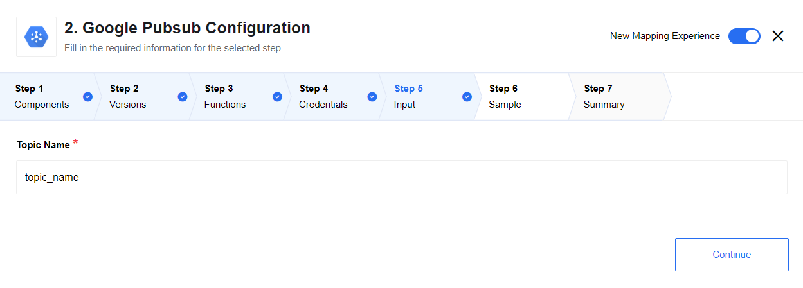

## Description

The component interacts with Google Pub-Sub API. The API is an asynchronous messaging service that decouples services that produce events from services that process events.

Pub/Sub offers durable message storage and real-time message delivery with high availability and consistent performance at scale. Pub/Sub servers run in all Google Cloud regions around the world.

## Requirements

### Core concepts

- **Topic:** A named resource to which messages are sent by publishers.
- **Subscription:** A named resource representing the stream of messages from a single, specific topic, to be delivered to the subscribing application. For more details about subscriptions and message delivery semantics, see the [Subscriber Guide](https://cloud.google.com/pubsub/subscriber).
- **Message:** The combination of data and (optional) attributes that a publisher sends to a topic and is eventually delivered to subscribers.
- **Message attribute:** A key-value pair that a publisher can define for a message. For example, key `iana.org/language_tag` and value `en` could be added to messages to mark them as readable by an English-speaking subscriber.

### Credentials

*   **Project ID**
*   **Client E-Mail**
*   **Private Key**

### Technical Notes

The [technical notes](technical-notes) page gives some technical details about Google PubSub component like [changelog](/components/google-pubsub/technical-notes#changelog) and.

## How authentication works

PubSub component authentication works with
[Google IAM Service Accounts](https://developers.google.com/identity/protocols/OAuth2ServiceAccount)
and two-legged OAuth, in order to authenticate your component you would
need to create a new Service Account on [Service Accounts Page](https://console.developers.google.com/permissions/serviceaccounts)
 of your project and download the JSON file with the private key.
 You would need ``client_email`` and ``private_key`` values
 on component authentication page (see [here](https://github.com/google/google-api-nodejs-client#using-jwt-service-tokens)
 for more information).

## Triggers

### Subscribe

The Subscribe trigger receives a message from a Topic, emits it, and sends an acknowledgment to Pub/Sub.

#### Configuration

- `Topic Name` - (required field) fully-qualified topic resource name string, e.g. `projects/<project_id>/topics/<topic_name>`

## Actions

### Publish

The Publish action retrieves message body from a previous step and sends a message to a Topic while remaining unaware of any existing subscriptions.

#### Configuration

- `Topic Name` - (required field) fully-qualified topic resource name string, e.g. `projects/<project_id>/topics/<topic_name>`

## Warning

Please take a special care of the indepmotency of your processing flow, here is the extract from [PubSub Subscriber Guide](https://cloud.google.com/pubsub/docs/subscriber)

> For the most part Pub/Sub delivers each message once, and in the order in which it was published. However, once-only and in-order delivery are not guaranteed: it may happen that a message is delivered more than once, and out of order. Therefore, your subscriber should be [idempotent](http://en.wikipedia.org/wiki/Idempotence#Computer_science_meaning) when processing messages, and, if necessary, able to handle messages received out of order. If ordering is important, we recommend that the publisher of the topic to which you subscribe include some kind of sequence information in the message; see [this page](https://cloud.google.com/pubsub/ordering) for a full discussion on message ordering. Messages that are not acknowledged, are retried indefinitely for up to seven days.
