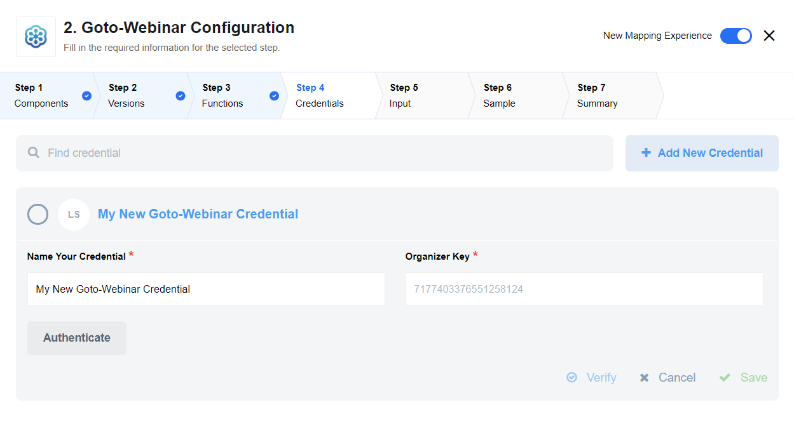
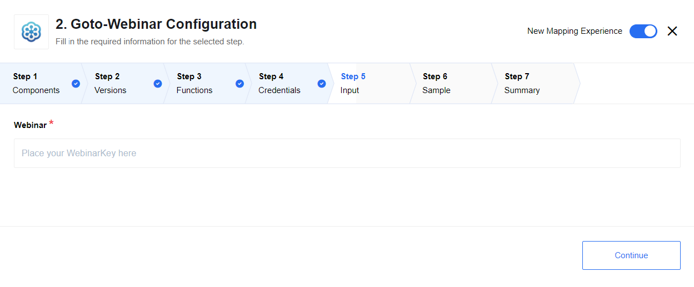

## Credentials

  * **Organizer Key**

## Environment Variables

This components uses OAuth 2.0 authentication from Citrix REST API, and would
need following ENV Vars to be set on repository - ``CITRIX_APP_ID`` and ``CITRIX_APP_SECRET``

> **Note**: when configuring callback url on Citrix please use ``https://your-tenant.address/callback/oauth2``

## Triggers

This component has no trigger functions. This means it will not be accessible to
select as a first component during the integration flow design.

## Actions

### Add Participant

## Known issues

OAuth 2.0 token that is obtained by the component is currently not refreshed,
this shortcoming need to be fixed later. Reason for that according
to the documentation issued token is valid **365 days**.
