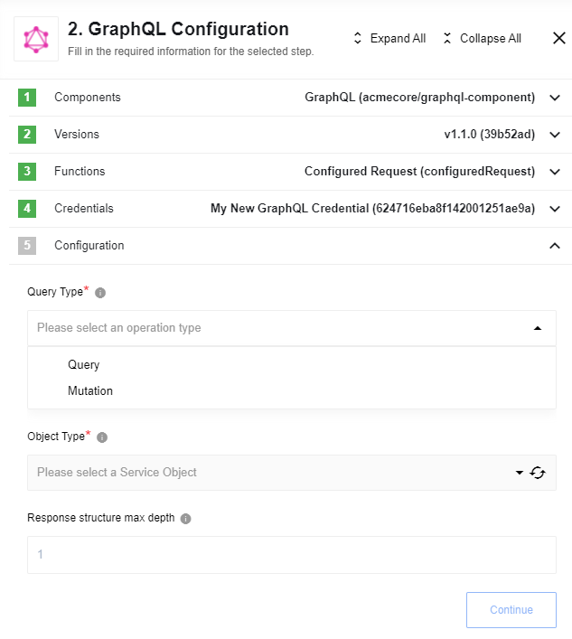

* [General information](#general-information)
   * [Description](#description)
   * [Completeness Matrix](/components/graphql/technical-notes#completeness-matrix)
* [Credentials](#credentials)
* [Actions](#actions)
   * [Raw Request](#raw-request)
   * [Configured Request](#configured-request)
* [Known Limitations](#known-limitations)

## General information

### Description
[GraphQL](https://graphql.org/) is a query language for APIs and a runtime for fulfilling those queries with your existing data.

## Credentials

* **Endpoint** - (string, required) set endpoint to your GraphQL API.
* **Type** - (dropdown, optional, default to `No Auth`) may be used when authorization needed
  * **No Auth** - don't use any authentication
  * **Basic Auth** - use HTTP Basic access authentication
    * **Username** - provide a username
    * **Password** - provide a password
  * **API Key Auth** - use HTTP Basic access authentication
    * **Header Key** - custom HTTP Header
    * **Header Value** - HTTP Header value

## Triggers

This component has no trigger functions. This means it will not be accessible to select as a first component during the integration flow design.

## Actions

### Raw Request

Action to execute provided raw GraphQL request string

#### Config Fields

There is no Config Fields in GraphQL component.

#### Input Metadata

* **Query** (string, required) - Your query, represented as text inside **"query"** key.


<details close markdown="block"><summary><strong>Click to expand for more details:</strong></summary>

```
{
  allFilms {
    films {
      title
    }
  }
}
```

</details>

#### Output Metadata

* Depends on Query execution result, represented as object inside **"data"** key.

<details close markdown="block"><summary><strong>Click to expand for more details:</strong></summary>

  ```json
   {
   "allFilms": {
      "films": [
         {
         "title": "A New Hope"
         },
         {
         "title": "The Empire Strikes Back"
         },
         {
         "title": "Return of the Jedi"
         },
         {
         "title": "The Phantom Menace"
         },
         {
         "title": "Attack of the Clones"
         },
         {
         "title": "Revenge of the Sith"
         }
      ]
   }
   }
  ```

</details>

### Configured Request

Action to execute custom GraphQL request for chosen service



#### Config Fields

* **Query Type** (dropdown, required) - Select one of the supported query types:
  * **Query** - use to fetch data
  * **Mutation** - use to modify server-side data
* **Object Type** (dropdown, required) - Select Object you want to fetch/modify
* **Response structure max depth** (number, optional) - Set dependent objects depth, defaults to - 1

#### Input Metadata

Autogenerated based on GraphQL introspection mechanism and includes all available query objects fields

#### Output Metadata

Depends on Query execution result, represent An object inside **"data"** key, includes Pagination and Edges


## Known limitations

1. `Configured Request` action does not support ENUM inputs.
2. Only arguments may be used in `Configured Request` action (selection of `fields` is not available yet and all available fields would be returned in response)
3. Configuration of `Response structure max depth` feauture in `Configured Request` action would not affect on actual result: all available fields would be returned with max available depth.
