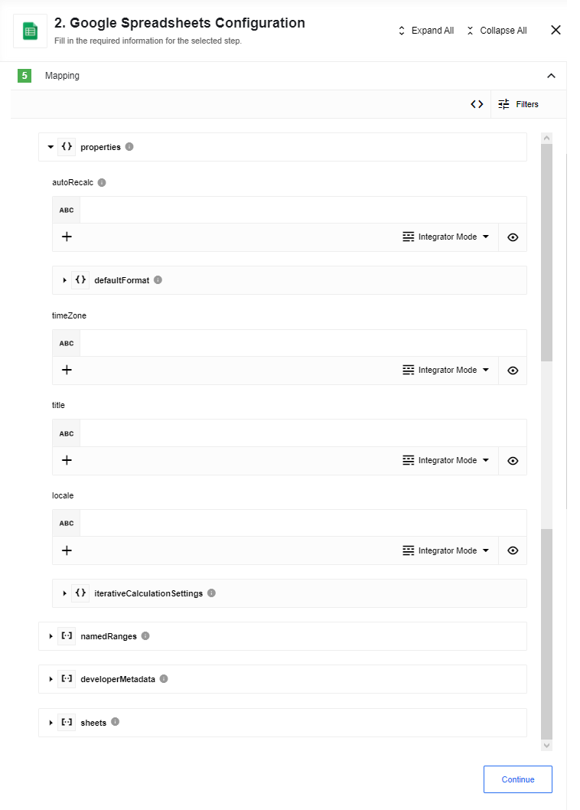
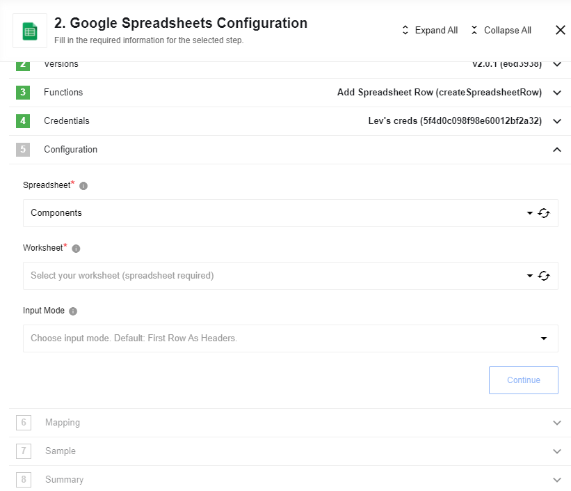
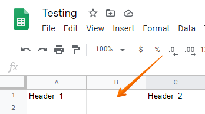
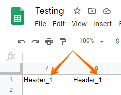

## Create new Spreadsheet

Action to create a new Google spreadsheet. This action is based on [Google Spreadsheets API v4](https://developers.google.com/sheets/api/reference/rest/v4/spreadsheets/create).
The action needs a JSON instance of a [Spreadsheet](https://developers.google.com/sheets/api/reference/rest/v4/spreadsheets#Spreadsheet) object in order to create a new spreadsheet.
All data structures and limitations are the same to Google API.

### Input fields:

1. **Properties** - A group of fields used to describe a specific object. These fields are grouped together so that it is possible to map data into them while having an overview over the structure of the object.

2. **namedRanges** - Group of fields used to describe a collection of objects of the same type. Mapping of collections has following limitations:
  * It is only possible to map data from objects inside collections
  * It is impossible to map properties from objects located in multiple collections
  * Integrator mode is available only

3. **developerMetadata** - Group of fields used to describe a collection of objects of the same type. Mapping of collections has following limitations:
  * It is only possible to map data from objects inside collections
  * It is impossible to map properties from objects located in multiple collections
  * Integrator mode is available only

4. **sheets** - Group of fields used to describe a collection of objects of the same type. Mapping of collections has following limitations:
  * It is only possible to map data from objects inside collections
  * It is impossible to map properties from objects located in multiple collections
  * Integrator mode is available only

## Add Spreadsheet Row

Action to create a new Google spreadsheet row. This action based on [Google Spreadsheets API v4](https://developers.google.com/sheets/api/reference/rest/).
Adds an array of given values to a spreadsheet as a new row. Data would be inserted in the same order as provided in the input array.
Data will be inserted into the last empty line, starting from the first table column.
A datatype of inserted values will be the same as for JSON type (string, numeric or boolean). Use "" value to make cell empty.

### Input fields:

1. **Spreadsheet** - Spreadsheet name to make changes.
2. **Worksheet** - Worksheet name of selected Spreadsheet to make changes.
3. **Input Mode** - Options: First Row As Headers, Array Based. Default is First Row As Headers
    * First Row As Headers (Default): generates input metadata based on values in first row cells.
    This method has few limitations:
        * There should be at least one value in first row;
        * Values in first row cells must be distinct;
        * There should be no empty cells in first row;
    * Array Based: generates input for array of `values`. Array mapped to `values` is going to be inserted as first row.

#### Common Errors

Input Mode: "First Row As Headers".

**1.** Requires first row to have at least one cell with value:

Please check there is at least one non-empty cell in first row.

**2.**  Requires cells in first row to be not empty:

Please check there are no empty cells **in between** in first row:

**3.**  Requires cells in first row to be unique:

Please check values in first row are distinct:

## Add Row(deprecated)

This action is `deprecated` - please use [Add Spreadsheet Row](#add-spreadsheet-row) action.

Your integration flow can also *write* or **add a row** to the given Google
Spreadsheet as an **action**. In this case, your spreadsheet will be the ***target spreadsheet***.

To use **add row** action the Google Spreadsheet file which will be receiving
new data must already be mapped using the Data Mapper. This means the target
spreadsheet columns need to be assigned to the specific `values` which are
expected from the components within the same integration flow that is sending the information.

> Please note that the system will write a new record using only a `STRING` data type.
