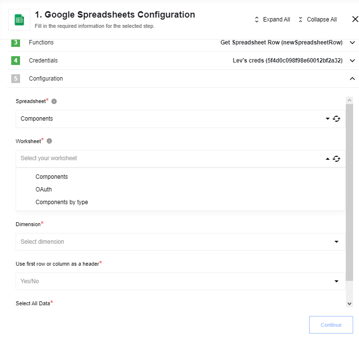

## Get Spreadsheet Row

The  **New Spreadsheet Row** *trigger* reads the data in each row of a given Google Spreadsheet
and passes it to the next stage of your integration flow.



### Input fields description

| Input field | Required | Description | Example |
|---------------------|--------|---------|---------|
| Spreadsheet                    | true | Spreadsheet which will be used for data reading | `MyTestSpreadsheet` |
| Worksheet                      | true | Worksheet of spreadsheet which will be used for data reading | `Sheet1` |
| Dimension                      | true | The major dimension of the values | `ROWS`, `COLUMNS` |
| Use first row/column as header | true | You should specify Yes if your data has a header in the first row/column and you want to use these values as json key in the output message. If you specify No, json key will be taken from row/column index according to A1 notation. Se example below | `Yes` |
| Select All Data                | true | You should specify Yes if you want to fetch all spreadsheet data whenever step starts. If you specify No, a step will be emitting only delta changes (lines which were added after last step runs) | `No` |

> **IMPORTANT:** Using `Use first row/column as header` feature, you must be sure that header values are unique.

Values from spreadsheets return as `UNFORMATTED_VALUE` [type](https://developers.google.com/sheets/api/reference/rest/v4/ValueRenderOption)

### The process

First, the system reads all the rows from a given Google
Spreadsheet and processes it further along with your designed integration flow. It will
also create an initial state of your spreadsheet, we call it a ***snapshot***,
in order to have something to compare with after your data is updated.

After the initial read, any further requests for an update will be compared to this
snapshot and in case any changes are detected they will be passed along with the integration
flow as well. If `Select All Data` configuration property has value `Yes`, the system will read all the rows from a given Google
Spreadsheet whenever flow processes the message.

### Cases with ROWS dimension:


After a trigger execution, data will be extracted from the table above and the following message will be emitted:

#### 1) Dimension: `ROWS`, Use first row/column as header: `Yes`

```js
  {
    "FirstName": "Tom1",
    "LastName": "Smith1"
  }
  {
    "FirstName": "Tom2",
    "LastName": "Smith2"
  }
  -----------------------
  {
    "FirstName": "Tom10",
    "LastName": "Smith10"
  }

```

#### 2) Dimension: `ROWS`, Use first row/column as header: `No`

```js
  {
    "A": "FirstName",
    "B": "LastName"
  }
  {
    "A": "Tom1",
    "B": "Smith1"
  }
  {
    "A": "Tom2",
    "B": "Smith2"
  }
 ---------------------
  {
    "A": "Tom10",
    "B": "Smith10"
  }
```

### Cases with COLUMNS dimension:


After a trigger execution, data will be extracted from the table above and the following message will be emitted:

#### 1) Dimension: `COLUMNS`, Use first row/column as header: `Yes`

```javascript
  {
    "FirstName": "Tom1",
    "LastName": "Smith1"
  }
  {
    "FirstName": "Tom2",
    "LastName": "Smith2"
  }
  -----------------------
  {
    "FirstName": "Tom10",
    "LastName": "Smith10"
  }

```

#### 2) Dimension: `COLUMNS`, Use first row/column as header: `No`

```js
  {
    "1": "FirstName",
    "2": "LastName"
  }
  {
    "1": "Tom1",
    "2": "Smith1"
  }
  {
    "1": "Tom2",
    "2": "Smith2"
  }
 ---------------------
  {
    "1": "Tom10",
    "2": "Smith10"
  }
```

### Limitations

Trigger can emit maximum 1000 messages per one execution.

Trigger uses version 4 of [Google Sheet API](https://developers.google.com/sheets/api/).
You can find more information in the [Google Sheets API Documentation](https://developers.google.com/sheets/api/samples/reading).

## Rows(deprecated)

Trigger is `deprecated` - please use [Get Spreadsheet Row](/components/gspreadsheet/triggers#get-spreadsheet-row) trigger.

The  **Rows** *trigger* reads the data in each row of a given Google Spreadsheet
and passes it to the next stage of your integration flow.

### The process

In the beginning, the system will read all the rows from a given Google
Spreadsheet and process it further along with your designed integration flow. It will
also create an initial state of your spreadsheet, we call it a ***snapshot***,
in order to have something to compare after your data is updated.

After the initial read, any further requests for an update will be compared to this
snapshot and if any changes are detected they will be passed along the integration
flow as well. It is, therefore, imperative to provide a **readable spreadsheet**
for smooth integration.

### What is a readable spreadsheet?

The nature of API that the platform uses to read the rows in Google Spreadsheets
dictates the use of certain rules that it is useful to follow for a smooth
integration of your data. In addition to the **Minimum Requirements** your spreadsheet
must have:

1.  **No empty spaces** - This means no empty columns, no empty rows, and no spaces or newlines after each record. The **reading process stops if it encounters empty columns or rows** since there is no way to know if there are new or more records afterward.
2.  **Only `STRING` values** - Your data will be processed as a `STRING` data type.
3.  **No formula** - If you calculate the value of any field using a formula the system will only read the `VALUE` of that field and convert it into a `STRING` data type.
4.  **One sheet only** - Your Google Spreadsheet must contain **only one sheet**. Even if you insert a second one, it will be ignored by the system.

### External and internal ID for each row

When any given row is processed by the system it receives a *unique name* or a
unique ID so that it can be recognized by the system afterward if you want to
make any changes to the values in that specific row.

> In our system the row number in the Google Spreadsheet is taken as a unique ID to process through the integration flow.
