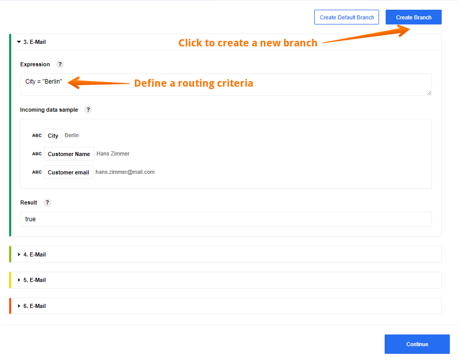

## Introduction

Google tables are used for a huge number of tasks. In our case, we use tables as a small database that contains data about customers of a small company. We will use the Google Spreadsheet component as a trigger and source of information for our flow. The flow itself performs the simplest function - send an email to a new client from different cities.

## Flow example

In this example, we want to send welcome emails to new customers in different cities. To accomplish the task, we created this flow:

As mentioned earlier, our source of information is the Google spreadsheet. It contains three parameters - city name, customer name and his email:

First, use a Google Spreadsheets component **"Get Spreadsheet Row"** function that will allow you to use the information from the pre-created spreadsheet you saw above. Use a row as a dimension and first row as a header.

Here you can see a Sample. All the data we need - city, customer name and customer email - we received and divided into 12 separate Samples.

After that use a[Router component](/components/router/index) to sort the data by city. Create 4 different branches, in each of which select a criteria for routing. In our case, this is the name of the city: Berlin, Chicago, Sydney and Boston:

Here you can see 4 brunches, each of which sends a welcome email to customers in different cities:

The last step is to configure the [E-mail component](/components/email). We are welcoming a new client in one of 4 cities. Thanks to the [Router component](/components/router), each client will receive a message in accordance with their city:

