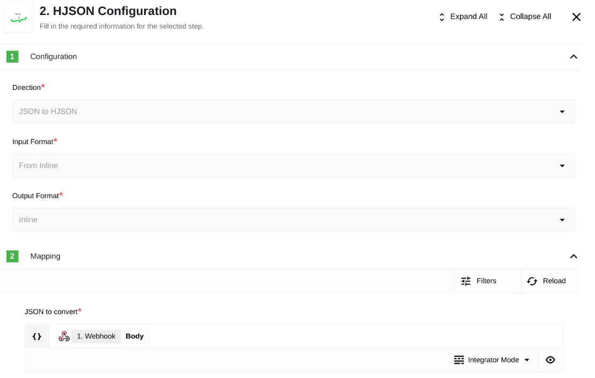

## JSON to HJSON

The first flow allows you to convert a JSON document to HJSON through the work of this component. Flow is as simple as possible and is a webhook which waits to send a JSON document (request body) and then converts it to HJSON and sends it back. Here you can see how HJSON component configuration looks like:

Using Webhook we will send a small JSON code we want to convert into HJSON:

As a result of the component's work, we will receive a document in the HJSON format:

## HJSON to JSON

The second flow is exactly the same except that it works in the opposite direction. Here you can see how HJSON configuration looks like:

Using Webhook we will send a small HJSON document we want to convert into JSON:

> **Please Note:** in order to pass an HJSON document in an inline string, we will need to make a json document containing that string.

As a result of the component's work, we will receive a document in the JSON format:

