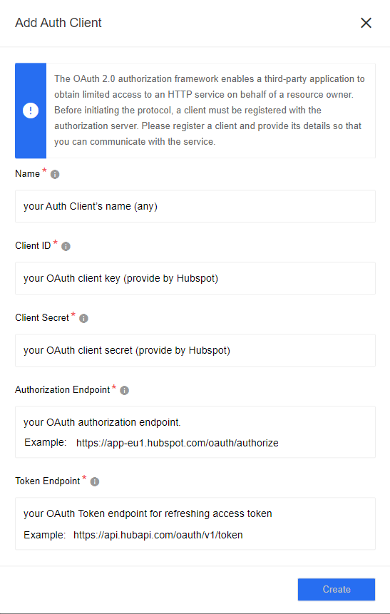
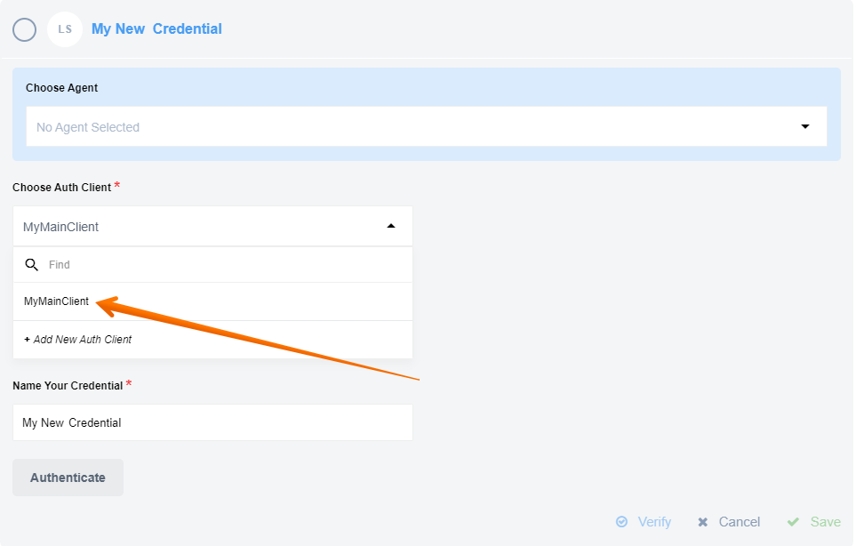

Authentication occurs via OAuth 2.0.

In order to make OAuth work, you need a new App in your Hubspot.

More information you can find [here](https://developers.hubspot.com/docs/api/working-with-oauth).

During credentials creation you would need to:

- select existing Auth Client from drop-down list ``Choose Auth Client`` or create the new one.
For creating Auth Client you should specify following fields:

|Field name|Mandatory|Description|
|----|---------|-----------|
|Name| true | your Auth Client's name (any) |
|Client ID| true | your OAuth client key (provide by Hubspot) |
|Client Secret| true | your OAuth client secret (provide by Hubspot) |
|Authorization Endpoint| true | your OAuth authorization endpoint. ex: <br>`https://app-eu1.hubspot.com/oauth/authorize` |
|Token Endpoint| true | your OAuth Token endpoint for refreshing access token: <br>`https://api.hubapi.com/oauth/v1/token`|


- fill field ``Name Your Credential`` (any)

- fill field ``Scopes`` - must be the same as provided during app creation in Hubspot, use space separated list (not comma):

```
crm.objects.contacts.readcrm.objects.contacts.writecrm.schemas.contacts.readcrm.schemas.contacts.writecrm.objects.owners.read
```




Here you can see how to select an existing `client`:



- click on ``Authenticate`` button - if you have not logged in Hubspot before, then log in by entering data in the login window that appears
- click on ``Verify`` button for verifying your credentials
- click on ``Save`` button for saving your credentials

For more information pleas read our [Secrets feature](/getting-started/secrets) article.
