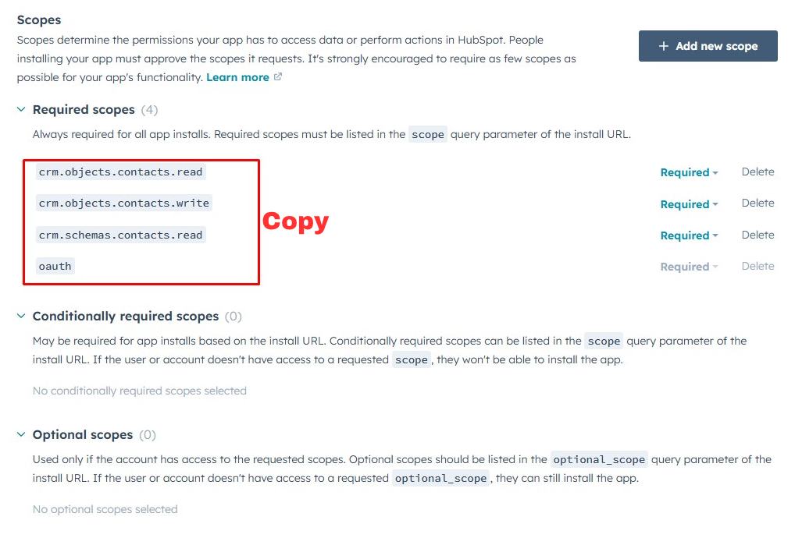
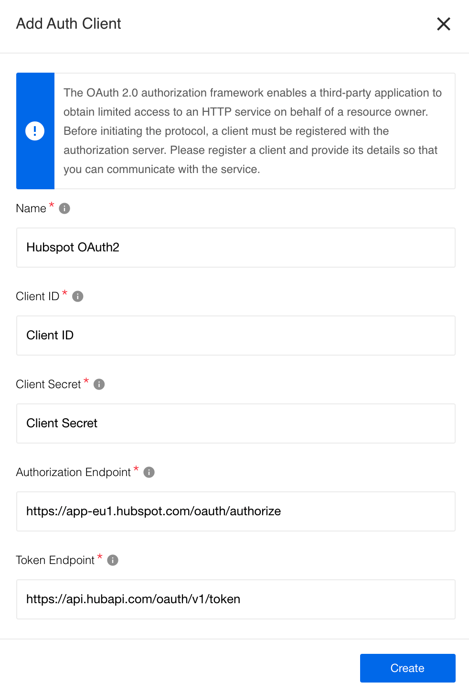

{{page.description}}

## Creating OAuth2 App

HubSpot component authentication occurs via OAuth 2.0. Before you can make it work
on our platform you MUST create an OAuth2 App on HubSpot side.

The HubSpot documentation already contains a detailed explanation of the process
and we encourage you to [follow it](https://developers.hubspot.com/docs/api/working-with-oauth).

During the OAuth2 App creation you would need to select an existing Auth Client
from the drop-down list **Choose Auth Client** or create the new one. Next you
MUST specify the following fields:

| Field name | Mandatory | Description |
|----|---------|-----------|
| Name | true | your Auth Client's name (any) |
| Client ID| true | your OAuth client key (provided by HubSpot) |
| Client Secret| true | your OAuth client secret (provided by HubSpot) |
| Authorization Endpoint | true | your OAuth authorization endpoint. ex: `https://app-eu1.hubspot.com/oauth/authorize` |
| Token Endpoint | true | your OAuth Token endpoint for refreshing access token: `https://api.hubapi.com/oauth/v1/token`|

*   Fill-in the field **Name Your Credential** (any)
*   Fill-in the field **Scopes** like: `crm.objects.contacts.read` `crm.objects.contacts.write` `crm.schemas.contacts.read` `crm.schemas.contacts.write` `crm.objects.owners.read`.

> **Please Note** When you select scopes here you will see them being added in
> the **Selected scopes** field. Copy them to use during the
> [credential creation process](index#credentials) on the platform.
> **These scopes MUST match** otherwise you will not be able to use this component.

## OAuth2 client creation

You can now create Auth Client using the details outputted by the HubSpot OAuth2 App
creation. Select **+Add New Client** option from the **Choose Auth Client**
drop-down while creating the HubSpot credential to see an OAuth2 client creation
pop-up form:

Fill-in the form as we show in the screenshot and press Save button to create
Auth Client to use for your [credential creation](index#credentials).
