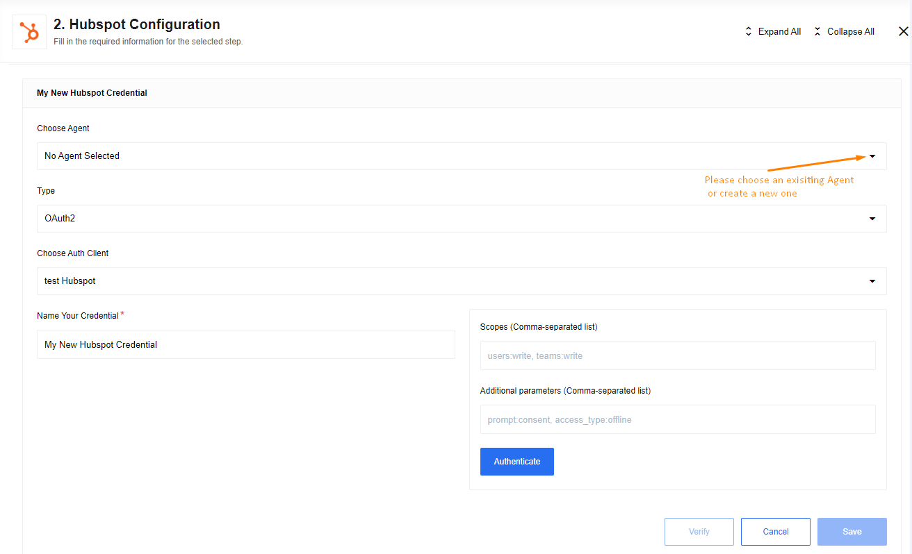

## General information

{{page.description}}

### Environment variables

| Name | Mandatory | Description | Values |
|----|---------|-----------|------|
| `REQUEST_MAX_RETRY` | false | The number of retries to HubSpot API the platform should do on errors (3 by default) | any `integer` above 0 |
|`RENEW_LIMIT`| false | Set biggest number of records in `Get New and Updated Objects` trigger before set new start date, 9800 by default | any `integer` above 0 and less 10000|

## Credentials

Authentication occurs via OAuth 2.0. To make OAuth work, you need to
[create a new OAuth2 App](creating-oauth-app-for-hubspot) in your HubSpot or use
an existing OAuth2 Client during the credentials creation process.



*   Leave the **Additional parameters** input empty.
*   Provide the following value in the **Scopes** input. If you wish to grant certain permissions, you can do so by removing them from this list.
```
crm.objects.contacts.read, crm.objects.contacts.write, crm.schemas.contacts.read, crm.schemas.contacts.write, crm.objects.owners.read
```

To complete the process:

*   click on **Authenticate** button - if you have not logged into HubSpot before, then log in by entering data in the login window that appears
*   click on **Verify** button for verifying your credentials
*   click on **Save** button for saving your credentials.

## Triggers

### Get New and Updated Objects

### Configuration Fields

*   **Object Type** dropdown: Select an Object Type to fetch.
*   **Emit behavior** dropdown: Choose between **emit objects individually** or **emit by page** options.
*   **Field to poll** dropdown: Used to select the field to poll (new objects or modified objects)
*   **Start Time** - Text field (string, optional): Used to set the time from which to start retrieving events
*   **End Time** - Text field (string, optional, defaults to never): When provided, don’t fetch records modified after this time
*   **Size of Polling Page** - Text field (optional, positive integer, max 100, defaults to 100): Set the size of the fetched pages
*   **Single Page per Interval** - Checkbox: Indicates that if the number of changed records exceeds the maximum number of results in a page, instead of fetching the next page at once, wait until the next flow start to fetch the next page

#### Output Metadata

- For `Fetch page`: An object with key ***results*** that has an array as its value
- For `Emit Individually`:  Each object fill the entire message

#### Limitations

After reaching **9800** records flow will find largest `Field to poll` in last Polling Page and use it as `Start Time` for next iterations, results with this date will be excluded from that iteration and include in the next one

### Webhook

Receive data from HubSpot based on configured [webhooks](https://developers.hubspot.com/docs/api/webhooks)

### Configuration Fields

**Client secret** - Provide Client secret from HubSpot application here otherwise
you will get an error during the webhook requests in case of incorrect or missing value.

#### Output Metadata

Triggered object from HubSpot

## Actions

### Raw Request

Action to call any Hubspot API endpoint

#### Configuration Fields

**Throw Error on 404 Response** - (optional) Treat 404 HTTP responses as errors, defaults to `false`.

#### Input Metadata

*   **URL** - Path of the resource relative to the URL base (`https://api.hubapi.com`), required.
*   **Method** - Allowed values `GET`, `POST`, `PUT`, `PATCH`, `DELETE`, required. HTTP verb to use in the request.
*   **Request Body** - Body of the request to send

### Upsert

Action to make upsert (update/create) object in HubSpot

#### Configuration Fields

*   **Object type** - Object type for upsert like `Companies`, `Contacts`, `Deals`, `Line Items` or `Tickets`.
*   **ID to Search On** - Identifier to search objects like **HubSpot Id** or **Email**. Use **Email** for `Object Type` in the **Contacts**.

#### Input Metadata

Dynamically generated

For each custom file field, an object is generated to upload the custom file
to populate that field. That object includes the following:

*   Attachment URL (URL containing the file contents to upload)
*   Folder Path
*   File Name
*   Charset Hunch
*   Access
*   TTL
*   Overwrite
*   Duplicate Validation Strategy
*   Duplicate Validation Scope

We use [Files API](https://developers.hubspot.com/docs/api/files/files) for file uploading.

#### Known limitations

Please, don't use platform attachments url
(like `http://steward-service.platform.svc.cluster.local:8200/v2/objects/xxxxx`)
for fields `Attachment URL`. The component will throw an exception `process.uncaughtException`.

### Lookup Set Of Objects By Unique Criteria

Action to lookup object in HubSpot.
Lookup Set will make sure all the items in the set should be there, otherwise throw an error.

#### Configuration Fields

*   **Object type** - Object type for lookup like `Companies`, `Contacts`, `Deals`, `Line Items` or `Tickets`.
*   **ID to Search On** - Identifier to search objects like **HubSpot Id** or **Email**. Use **Email** for `Object Type` in the **Contacts**.
*   **Enable download attachments** - Checkbox for enabling attachment download for the `file` field type

#### Input Metadata

An array where each item is an ID

### Lookup Object (at most one)

Action designed to lookup one object by unique field

#### Configuration Fields

*   **Object Type** dropdown: Select an Object Type to lookup.
*   **ID to Search On** dropdown: Used to search a unique field.
*   **Allow ID to be omitted** Checkbox: Select to make the ID field optional (default: required).
*   **Allow zero results** Checkbox: Select to allow zero results. System will emit an empty object `{}`, otherwise system will through an error in case of zero results.
*   **Enable download attachments** - Checkbox for enabling attachment download for the `file` field type.

#### Input Metadata

**ID value** Text field: value for `ID to Search On` (unique field value by itself)

### Lookup Objects (Plural)

Action to lookup objects in HubSpot

#### Configuration Fields

*   **Object Type** dropdown: Select an Object Type to find.
*   **Behaviour** dropdown with options: `Fetch all`, `Fetch page`, `Emit individually`, required.
*   **Enable download attachments** - Checkbox for enabling attachment download for the `file` field type.

#### Input Metadata

**Search Criteria** Array: Combine each search term with an `AND` operator.

> **Please note:** HubSpot support up to three criteria

Example:
Records created after `2021-10-01T03:30:17.883Z` with property `firstname` containing `Tony`

```
["createdate GT 1633059017883", "firstname CONTAINS_TOKEN Tony"]
```

Supported operators:

| OPERATOR | DESCRIPTION |
| ---- | ------ |
| `EQ` | equal to |
| `NEQ` | not equal to |
| `LT` | less than |
| `LTE` | less than or equal to |
| `GT` | greater than |
| `GTE` | greater than or equal to |
| `HAS_PROPERTY` | has property value |
| `NOT_HAS_PROPERTY` | does not have property value |
| `CONTAINS_TOKEN` | contains token |
| `NOT_CONTAINS_TOKEN` | does not contain token |

If selected `Fetch page` additional metadata fields:
*   **Page Size** - Number of records to retrieve, limit - 100.
*   **Page Number** - Number of pages to skip.
*   **Order** - Order direction, **ASCENDING** or **DESCENDING**

Order example:

```
'createdate DESCENDING'
```

#### Output Metadata

*   For `Fetch page`: An object with:
    *   key `results` that has an array as its value
    *   key `*totalCountOfMatchingResults` containing the total number of results (not just on the page) matching the search criteria
*   For `Fetch All`:  An object, with key `*results` that has an array as its value
*   For `Emit Individually`:  Each object fill the entire message

### Create Association

#### Configuration Fields

*   **From Object Type** dropdown: Choose an object type to create association
*   **To Object Type** dropdown: Choose an object type to associate to

> **Please note**: We do not retrieve objects to associate dynamically. Check the
> HubSpot documentation to verify that the association between selected objects is possible.

#### Input Metadata

*   **From Object ID** - HubSpot id of object which needs to create association
*   **To Object ID** - id of associated object

#### Output Metadata

Object with `statusCode` key that represent result of request

### Remove Association

#### Configuration Fields

*   **From Object Type** dropdown: Choose from which object to remove association
*   **To Object Type** dropdown: Choose to which object

> **Please note**: We do not retrieve objects to associate dynamically. Check the
> HubSpot documentation to verify that the association between selected objects is possible.

#### Input Metadata

*   **From Object ID** - HubSpot id of object which needs to remove association
*   **To Object ID** - id of associated object

#### Output Metadata

Object with `statusCode` key that represent result of request

### Delete Object

Action designed to delete one object by unique field

#### Configuration Fields

*   **Object Type** dropdown: Indicates Object Type to find
*   **ID to Search On** dropdown: Indicates unique field to search on

#### Input Metadata

**ID value** text field: value for `ID to Search On` (unique field value by itself)

#### Output Metadata

The expected output is an object with a `id` property. `id` value stands for id of delete object.


## Known Limitations

1.  [Rate Limits](https://developers.hubspot.com/docs/api/usage-details#rate-limits)
2.  Please, use a timer (around 5 seconds) if you need to build a flow like `Upsert Object Action` -> any type of `Lookup Object(s) Action` with enabled feature `Enable download attachments`. Uploading the file to HubSpot on `Upsert Object Action` takes some time, your might get `404` error on lookup.
