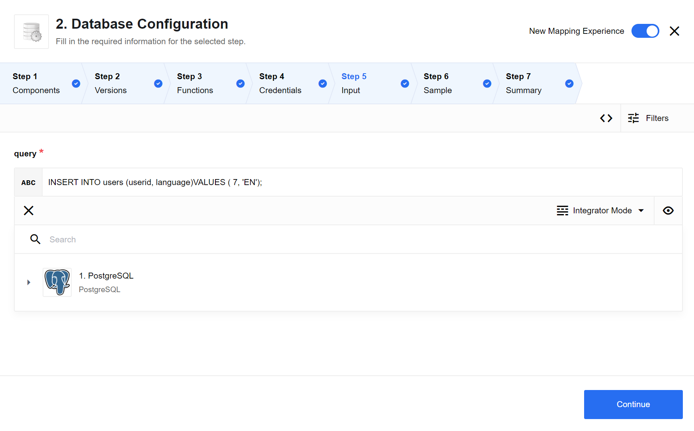
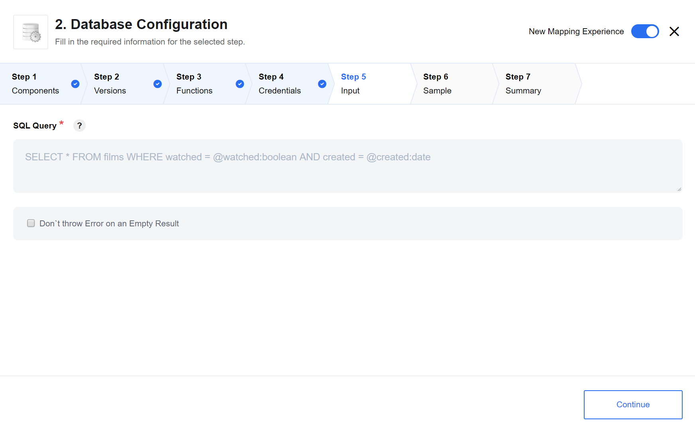
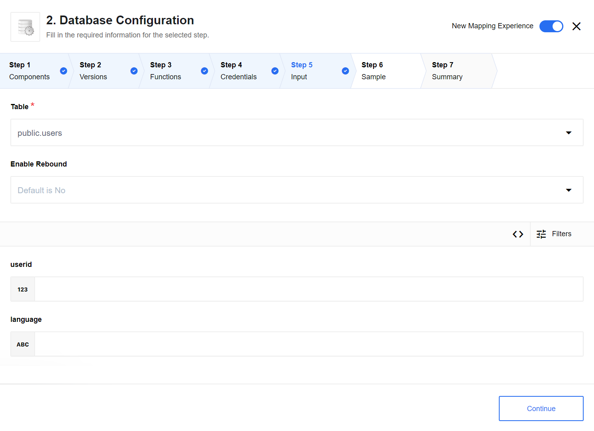
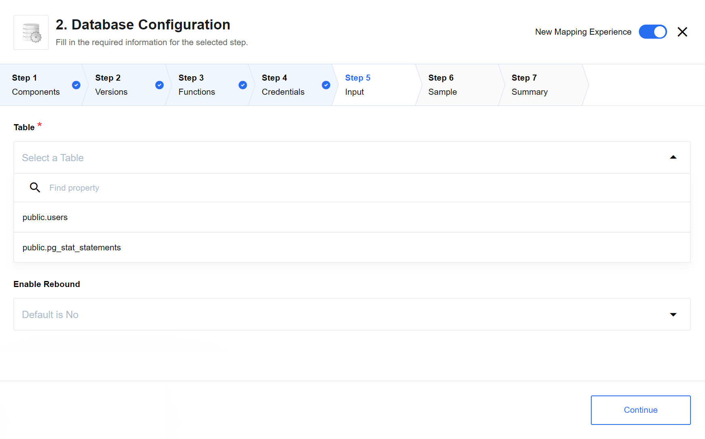
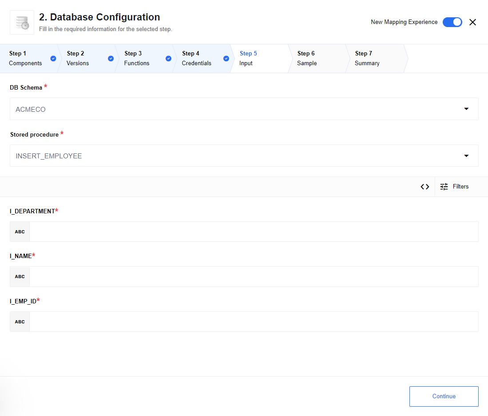
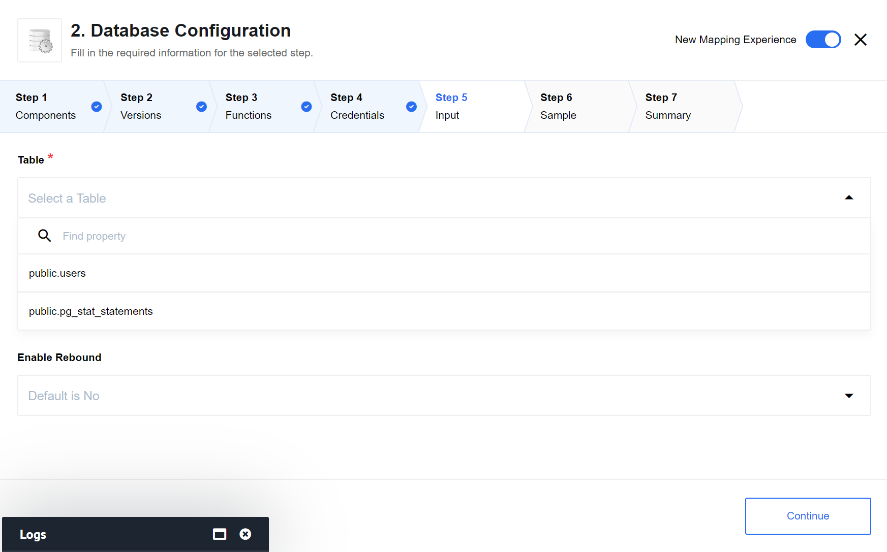
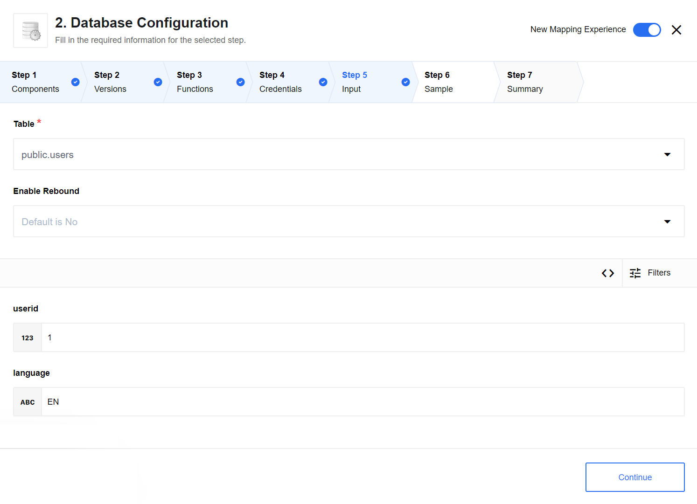
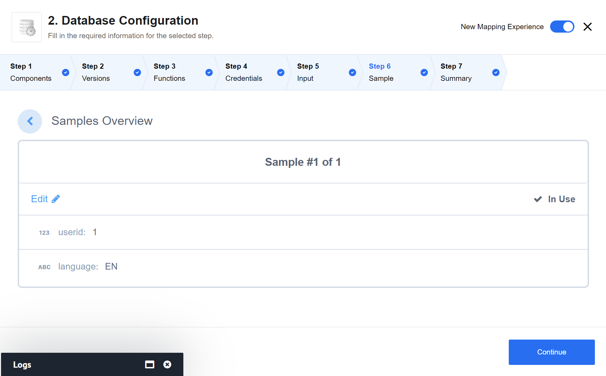
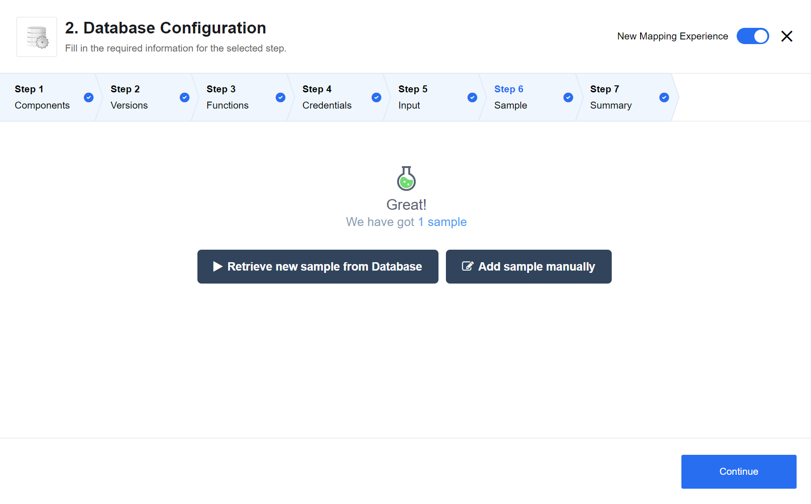
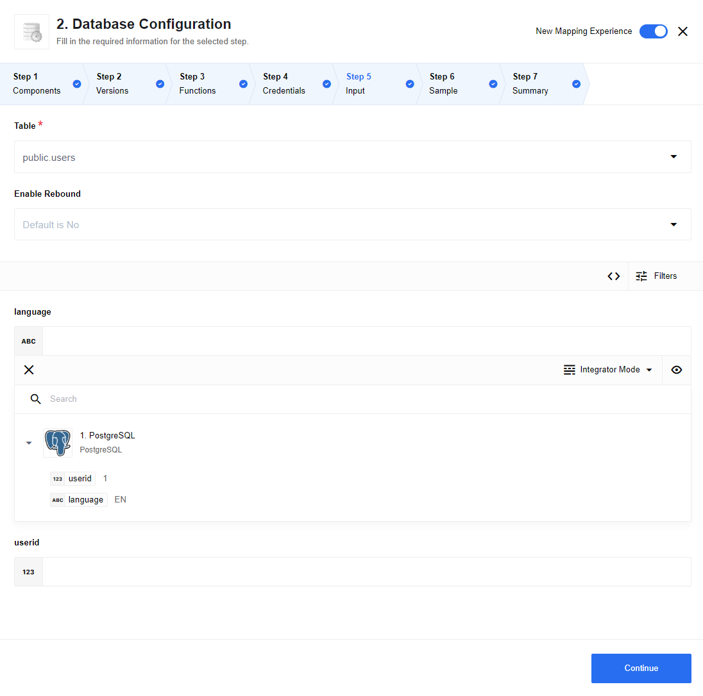

## Execute custom query action

Action to execute custom SQL query from provided request string.

> **Note:** SQL request will be executed according to chosen database JDBC specification.

Execution result returns as array of objects. If request contains multiple sql statements - them will execute inside one transaction.
If one of statements fails, transaction will be rollbacked.



### Input fields description

As input metadata, you will get one field named `query` to provide request string

### Query Samples:

Select:
```sql
SELECT name, size FROM stars
```

Update:
```sql
INSERT INTO stars values (1,'Taurus', '2015-02-19 10:10:10.0', 123, 5, 'true', '2015-02-19')
```

Posgresql batch multiple statements request:
```sql
DELETE FROM stars WHERE id = 1;
UPDATE stars SET radius = 5 WHERE id = 2;
```

## Select action



The action will execute an [SQL](https://en.wikipedia.org/wiki/SQL "SQL") query that can return multiple results, it has limitations on the query and suited only for SELECT type of queries.
In SQL query you can use clause variables with specific data types.
Internally we use prepared statements, so all incoming data is
validated against SQL injection, however we had to build a connection from JavaScript types to the SQL data types
therefore when doing a prepared statements, you would need to add ``:type`` to **each prepared statement variable**.

> **Note:** prepared statement variables name could contain: any characters between a-z or A-Z, a digit and a character `_` (`[a-zA-Z0-9_]`).

For example if you have a following SQL statement:

```sql
SELECT
FROM users
WHERE userid = @id AND language = @lang
```

you should add ``:type`` to each ``@parameter`` so your SQL query will looks like this:

```sql
SELECT
FROM users
WHERE userid = @id:number AND language = @lang:string
```

Following types are supported:
 * ``string``
 * ``number``
 * ``bigint``
 * ``boolean``
 * ``float``
 * ``date``


Checkbox ``Don't throw Error on an Empty Result`` allows to emit an empty response, otherwise you will get an error on empty response.

### Input fields description

Component supports dynamic incoming metadata - as soon as your query is in place it will be parsed and incoming metadata will be generated accordingly.

## Lookup Row By Primary Key action


The action will execute select query from a ``Table`` dropdown field, as criteria can be used only [PRIMARY KEY](https://en.wikipedia.org/wiki/Primary_key "PRIMARY KEY"). The action returns only one result (a primary key is unique).
Checkbox ``Don't throw Error on an Empty Result`` allows to emit an empty response, otherwise you will get an error on empty response.

### Input fields description


As an input metadata you will get a Primary Key field to provide the data inside as a clause value.

## Insert action

The action will execute ``INSERT`` command into the table from ``Table`` dropdown list the values specified in the body.


### List of Expected Config fields

   * `Enable Rebound` if `Yes` in case of deadlocks rebound message using Sailor rebound mechanism, number of rebound can be specified via environment variable: `ELASTICIO_REBOUND_LIMIT` recommended value 3

### Input fields description

Action contains only one configuration field `Table` - dropdown list with available table names.



### Expected input metadata

As input metadata, you will get all fields of the selected table except for fields with `auto-increment` or `auto-calculated` property.

### Expected output metadata

As output metadata, you will get execution insert result like:
```json
{
  "result": true
}
```

## Delete Row By Primary Key action



The action will execute delete query from a ``Table`` dropdown field, as criteria can be used only [PRIMARY KEY](https://en.wikipedia.org/wiki/Primary_key "PRIMARY KEY"). The action returns count of affected rows.
Checkbox ``Don't throw Error on an Empty Result`` allows to emit an empty response, otherwise you will get an error on empty response.

`Enable Rebound` if `Yes` in case of deadlocks rebound message using Sailor rebound mechanism, number of rebound can be specified via environment variable: `ELASTICIO_REBOUND_LIMIT` recommended value 3

### Input fields description


As an input metadata you will get a Primary Key field to provide the data inside as a clause value.

## Execute stored procedure action

This action calls stored procedure from selected `DB Schema` and `Stored procedure` name

### Input fields description

- **DB Schema** - a schema that contains a procedure to call. Must be selected from the dropdown list before `Stored procedure` name
- **Stored procedure** - a name of a procedure to call, can be selected from the dropdown list

Metadata generates automatically using `IN` & `IN OUT` procedure parameters for input, and `OUT` & `IN OUT` procedure parameters for output.

As array fields this action now support ONLY:
- CURSOR (as SQL type)
- REF CURSOR (as ORACLE type)
The result for this type of fields would be returned as an array of JSON objects.

This action DOES NOT processing MSSql @RETURN_VALUE.

- For MySQL component same to DATABASE is same to SCHEMA by it's
[definition](https://dev.mysql.com/doc/refman/8.0/en/getting-information.html), so DB Schema dropdown is empty for MySQL.

- [MSSQL DB](https://docs.microsoft.com/en-us/sql/t-sql/statements/create-procedure-transact-sql?view=sql-server-2017) stored procedures has only IN and INOUT fields.

### Usage case example

For Oracle DB procedure:

```
create PROCEDURE "INSERT_EMPLOYEE"(
        i_emp_id IN EMPLOYEE.EMPID%TYPE,
        i_name IN EMPLOYEE.EMPNAME%TYPE,
        i_department IN EMPLOYEE.DEPARTMENT%TYPE)
IS
BEGIN
  INSERT INTO EMPLOYEE (EMPID, EMPNAME, DEPARTMENT)
  VALUES (i_emp_id, i_name, i_department);
END;
```

Component generates next metadata:



## Upsert Row By Primary Key action

The action will execute ``SELECT`` command from a ``Tables`` dropdown field, as search criteria can be used only [PRIMARY KEY](https://en.wikipedia.org/wiki/Primary_key "PRIMARY KEY"), and execute ``INSERT`` command by PRIMARY KEY with specified field, if result does not found, else - action will execute ``UPDATE`` command by PRIMARY KEY with specified field. The action returns only one result row (a primary key is unique).

Select table from `Table` dropdown list,



specify input(`userid` field is in our case a Primary key) data and click "Continue". You can also enable rebound mechanism if needed.



Retrieving sample



Retrieve sample result, click "Continue" and finish component configuration.



### Input fields description

* `Enable Rebound` if `Yes` in case of deadlocks rebound message using Sailor rebound mechanism, number of rebound can be specified via environment variable: `ELASTICIO_REBOUND_LIMIT` recommended value 3

As an input metadata you will get all fields of selected table. [PRIMARY KEY](https://en.wikipedia.org/wiki/Primary_key "PRIMARY KEY") is required field and other input fields are optional.




## Create or update record action (Deprecated)

This action exists in JDBC component only for backward compatibility.
Please use [**Upsert row by primary key**](#upsert-row-by-primary-key-action) instead.
