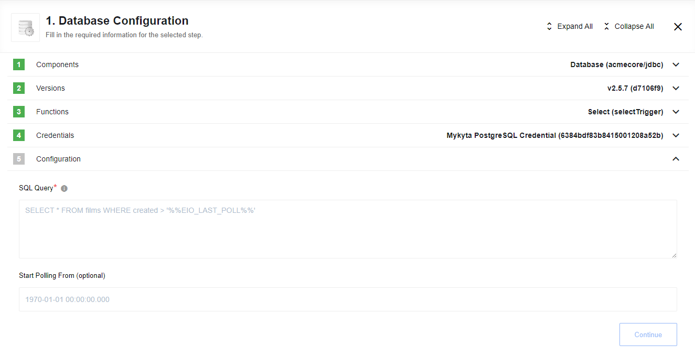

## Select trigger

You are able to provide SELECT query with last execution timestamp as WHERE clause criteria.

Before executing the the statement %%EIO_LAST_POLL%% will be replaced with ISO Date of the last execution or max value of the last pooled datetime, for example ``2018-08-01T00:00:00.000``.
During the first execution, date will be equal to ["start" of Unix Time](https://en.wikipedia.org/wiki/Unix_time) - ``1970-01-01 00:00:00.000``.
Precision of the polling clause can be till milliseconds.
The format of ``Start Polling From (optional)`` field should be like ``yyyy-mm-dd hh:mi:ss[.sss]``, where
- ``yyyy`` - year
- ``mm`` - month
- ``dd`` - day
- ``hh`` - hour
- ``mi`` - minute
- ``ss`` - second
- ``sss`` - millisecond (optional)

## Get Rows Polling trigger

This trigger can polling data from provided table. As WHERE clause you can use column, which has datatype like DATE or TIMESTAMP.

Before executing the the statement %%EIO_LAST_POLL%% will be replaced with ISO Date of the last execution or max value of the last pooled datetime, for example ``2018-08-01T00:00:00.000``.
During the first execution, date will be equal to ["start" of Unix Time](https://en.wikipedia.org/wiki/Unix_time) - ``1970-01-01 00:00:00.000``.
Precision of the polling clause can be till milliseconds.
The format of ``Start Polling From (optional)`` field should be like ``yyyy-mm-dd hh:mi:ss[.sss]``, where

- ``yyyy`` - year
- ``mm`` - month
- ``dd`` - day
- ``hh`` - hour
- ``mi`` - minute
- ``ss`` - second
- ``sss`` - millisecond (optional)

> **Please note** that Component Snapshot will not be overwritten in Real-Time flows due to platform behaviour, so we strongly recommend to use Get Rows Polling trigger in Keen Flows only*

### Input fields description

  * Tables List

Dropdown list with available table names, required field

  * Timestamp (or similar) Column

Dropdown list with available Column names, that have a type like `java.sql.Date` or `java.sql.Timestamp`, required field

  * Start Polling From (optional)

Optional field, indicates the beginning time to start polling from (defaults to the current time)

## SELECT trigger (Deprecated)

This action exists in JDBC component only for backward compatibility. New [**Select trigger**](#select-trigger) is recommended to use.
