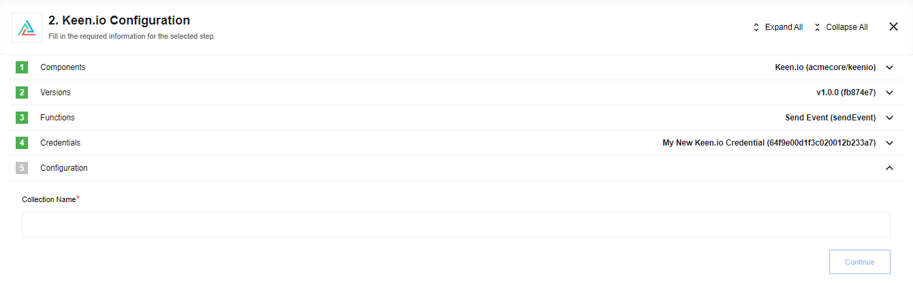

## Description

This is an open source component template for [Keen.io](https://keen.io/) Online Analytics System which is developed specifically to run on [{{site.data.tenant.name}} platform](http://www.{{site.data.tenant.name}}).

### Technical Notes

The [technical notes](technical-notes) page gives some technical details about Keenio component like [changelog](/components/keenio/technical-notes#changelog).

## Credentials

## Triggers

This component has no trigger functions. This means it will not be accessible to
select as a first component during the integration flow design.

## Actions

### Send Event

