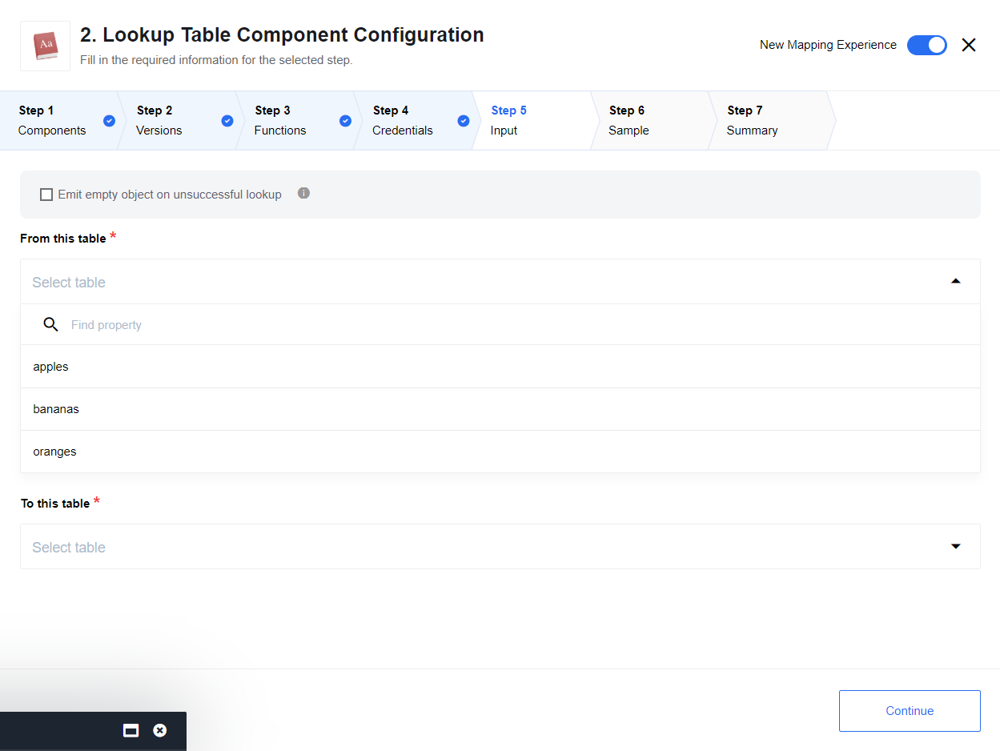

## Description

The Lookup From Table Component can be used to convert from different tables that
parsed as a CSV.

### Credentials

`CSV Table`: The CSV is entered on the Credentials page as a list of separated
items. Any delimiter is supported. The CSV will be parsed using the first row as
a header for each column below it. The CSV must be able to be interpreted as a
rectangle, i.e. it cannot be missing values.

For example,

```
English,Abbreviated,German
male,M,männlich
female,F,weiblich
other,O,divers
unknown,U,unbekannt
```

Will parse as

| English | Abbreviated | German    |
|---------|-------------|-----------|
| male    | M           | männlich  |
| female  | F           | weiblich  |
| other   | O           | divers    |
| unknown | U           | unbekannt |

and

```
English,Abbreviated,German
male,M,männlich
,F,weiblich
other,,
unknown,U,unbekannt
```

Will parse correctly as

| English | Abbreviated | German    |
|---------|-------------|-----------|
| male    | M           | männlich  |
|         | F           | weiblich  |
| other   |             |           |
| unknown | U           | unbekannt |

(though this may not be useful), but

```
English,Abbreviated,German
male,M,männlich
F,weiblich
other
unknown,U,unbekannt
```

will provide a failed result.

> The CSV can only be a maximum of 5kB, and if it contains any duplicate values
> in a given column, it will fail validation.

### Technical Notes

The [technical notes](technical-notes) page gives some technical details about Lookup Table component like [changelog](/components/lookup-table/technical-notes#changelog).

## Triggers

This component has no trigger functions. This means it will not be accessible to
select as a first component during the integration flow design.

## Actions

### Lookup From Table

The lookup from table action takes a table to lookup from, a table to translate
to, and an input value to translate. It returns an object in the form `{result: value}`
where the value is the result of the table lookup, if it exists:



#### Input Configuration

-   `Emit empty object on unsuccessful lookup`: if selected, an empty object `{}` will be emitted given an unsuccessful lookup where nothing is found. If *not* selected, an error will be thrown on unsuccessful lookup
-   `From this table`: the column to translate from
-   `To this table`: the column to translate to

#### Expected input metadata

- `Input`: the value to translate. Should be selected from the list of available values under `Values`

#### Expected output metadata

-   if lookup is successful, an object of the type `{"result": "value"}` will be emitted
-   if lookup is unsuccessful and emitting empty object, `{}` will be emitted
-   if lookup is unsuccessful and not emitting an empty object, and error will be emitted

## Additional Info

Any elements of the CSV that contain the delimiter in them should be wrapped in
`"double quotes"`. Any elements of the CSV that contain the delimiter and also
quotations should have the quotes backspaced.

e.g.

```
Full Name,First,Last
"Bond,James",James,Bond
"Johnson, Dwayne \"The Rock\"",Dwayne,Johnson
```

### Known Limitations

-   the CSV has a max size of 5kB
-   the CSV must be able to be parsed as a rectangle
-   the CSV must not contain any duplicates in column values
