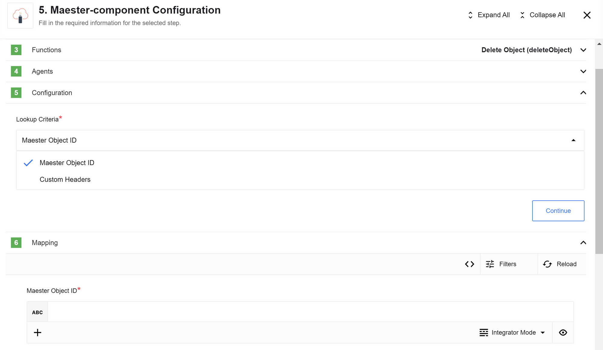
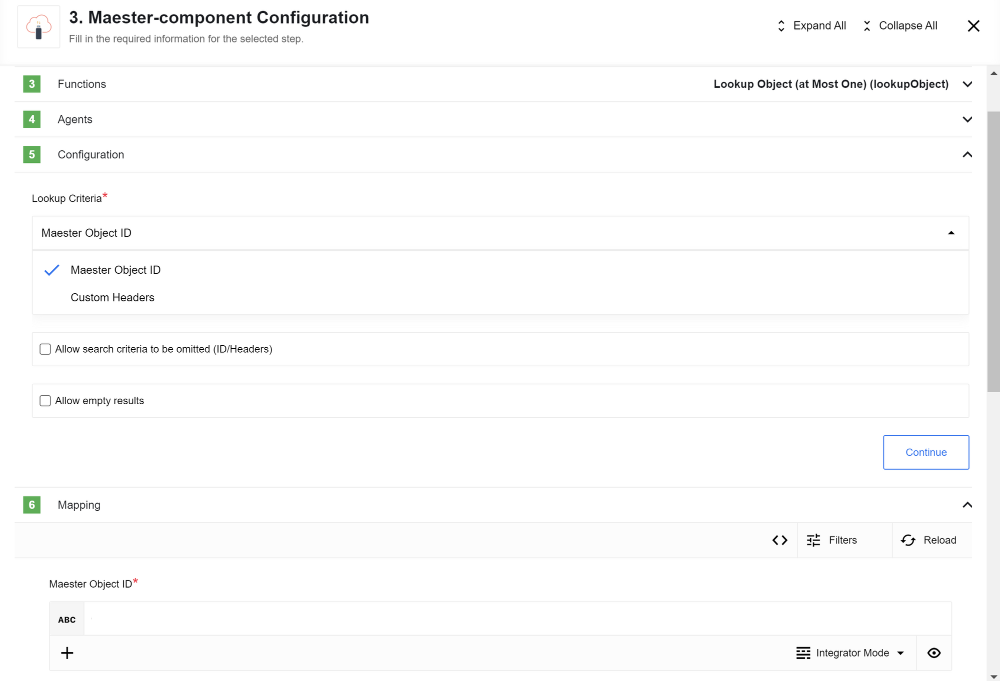
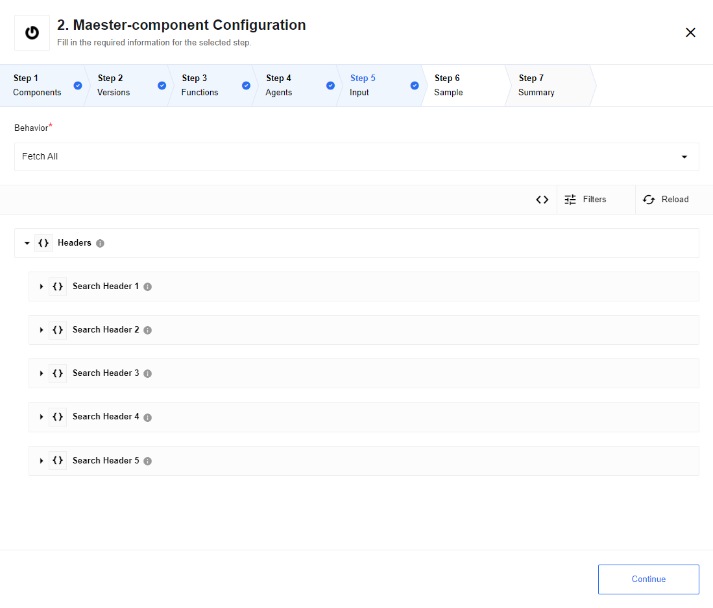
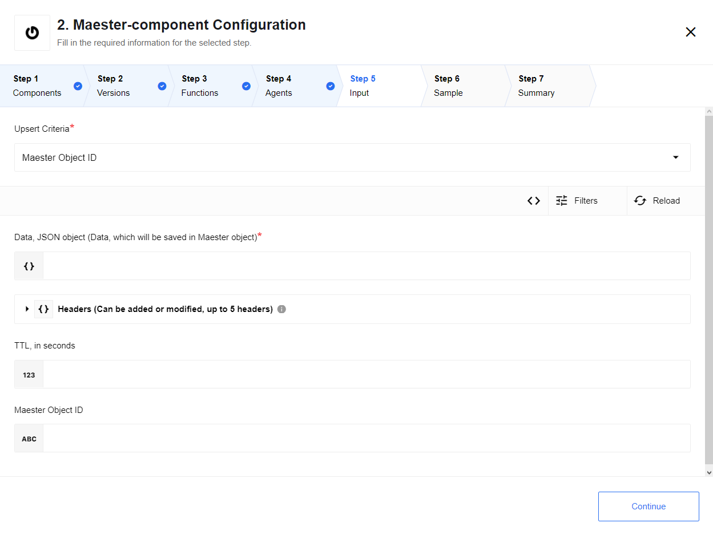

## General information

### Description

Maester component for the [{{site.data.tenant.name}} platform](http://www.{{site.data.tenant.name}}).

### Environment variables

No required Environment variables.

## Triggers

This component has no trigger functions. This means it will not be accessible to
select as a first component during the integration flow design.

## Actions

### Delete Object

#### Config Fields

* **Lookup Criteria** - (Dropdown with options: [`Maester Object ID`, `Custom Headers`], required)

#### Input Metadata

Dynamically generated

* `Maester Object ID` (string, uuid) - Used if `Upsert Criteria`: `Maester Object ID`. An id to find object in Maester. *Required*
* `Search Parameters` - Used if `Upsert Criteria`: `Custom Headers`. Array of headers `{ key: header-key-1, value: heder-value-1}` which will be used to find an object in Maester (up to 5 headers). *Required*
* `Data` (JSON object) - Data which will be stored in object by itself. Only plain objects are supported. *Required*
* `Headers` - Array of headers `{ key: header-key-1, value: heder-value-1}` which will be added to new objects. *Optional*
* `TTL` (number) - Time in seconds while which Maester object will be present in db. After this time object will be deleted and won't be available. Note: process of deleting objects from db starts every hour. By default will be used default expiration time from Maester installation. *Optional*

### Lookup Object (at Most One)

>**Please Note:** if more than one object found by `Search Parameters` - error will be thrown

#### Config Fields

* **Lookup Criteria** - (Dropdown with options: [`Maester Object ID`, `Custom Headers`], required)
* **Allow search criteria to be omitted (ID/Headers)** - Checkbox (optional, default false): When selected, if search criteria was not provided (`ID` in case of Lookup Criteria: `Maester Object ID`; at least on header in case of Lookup Criteria: `Custom Headers`) the empty object {} is emitted, otherwise typically an error would be thrown.
* **Allow empty results** - Checkbox (optional, default false): When selected, if zero results are returned, the empty object {} is emitted, otherwise typically an error would be thrown.

#### Input Metadata

Dynamically generated

* `Maester Object ID` (string, uuid) - Used if `Upsert Criteria`: `Maester Object ID`. An id to find object in Maester. *Required*
* `Search Parameters` - Used if `Upsert Criteria`: `Custom Headers`. Array of headers `{ key: header-key-1, value: heder-value-1}` which will be used to find an object in Maester (up to 5 headers). *Required*

### Lookup Objects

#### Config Fields

* **Behavior** - this selector configures output behavior of the component
 * `Fetch All` - the component output will be an array of messages
 * `Emit Individually` - Each object fill the entire message

#### Input Metadata

* `Headers` - Array of headers `{ key: header-key-1, value: heder-value-1}` with which will be searching

### Upsert Object

>**Please Note:** if more than one object found by `Search Parameters` - error will be thrown

#### Config Fields

* **Upsert Criteria** - (Dropdown with options: [`Maester Object ID`, `Custom Headers`], required)

#### Input Metadata

Dynamically generated

* `Maester Object ID` (string, uuid) - Used if `Upsert Criteria`: `Maester Object ID`. An id to find object in Maester. *Optional*
* `Search Parameters` - Used if `Upsert Criteria`: `Custom Headers`. Array of headers `{ key: header-key-1, value: heder-value-1}` which will be used to find an object in Maester (up to 5 headers). *Required*
* `Data` (JSON object) - Data which will be stored in object by itself. *Required*
* `Headers` - Array of headers `{ key: header-key-1, value: heder-value-1}` which will be added to new objects. Headers could be added to an existing object and modified as well, but they can not be deleted. *Optional*
* `TTL` (number) - Time in seconds while which Maester object will be present in db. After this time object will be deleted and won't be available. Note: process of deleting objects from db starts every hour. By default will be used default expiration time from Maester installation. TTL cannot be modified or deleted once object created. *Optional*

### Known issues

1. Object TTL is not included in the output metadata.
2. TTL can not be updated
