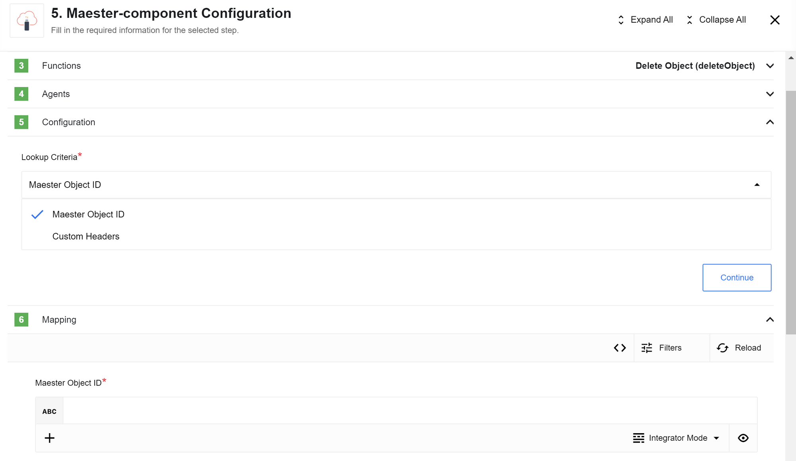
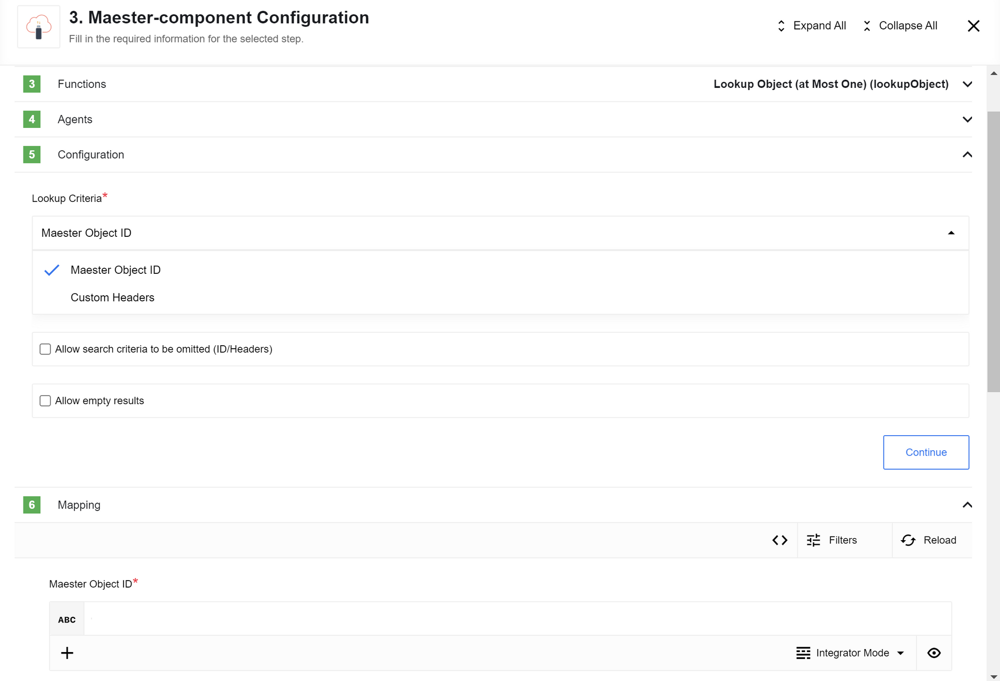
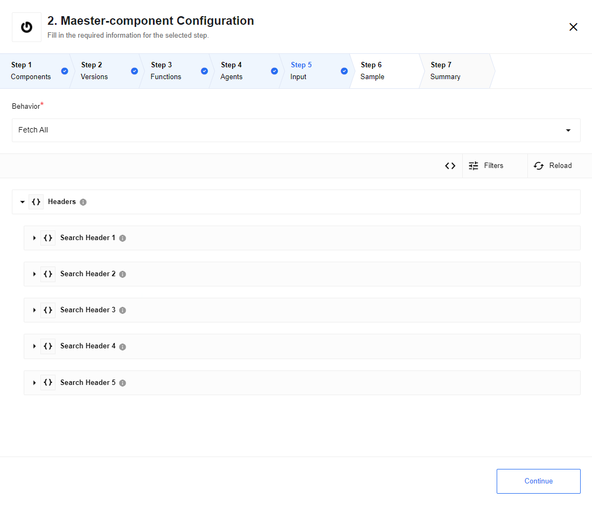
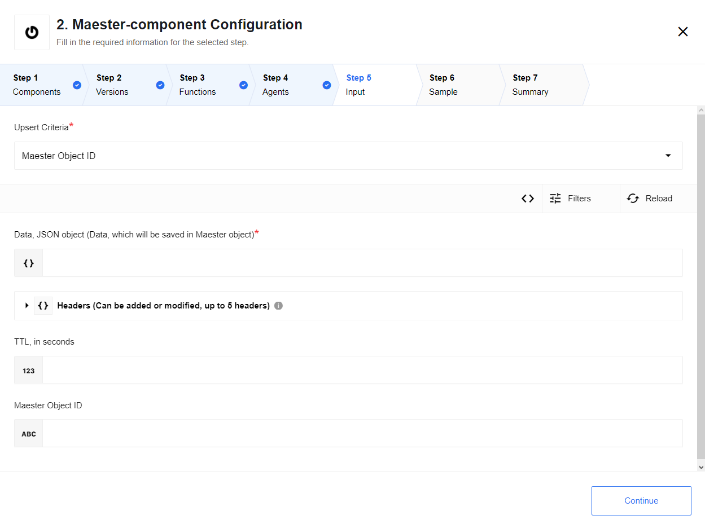

## Table of Contents
* [General information](#general-information)
  * [Description](#description)
  * [Environment variables](#environment-variables)
* [Actions](#actions)
  * [Delete Object](#delete-object)
  * [Lookup Object (at Most One)](#lookup-object-at-most-one)
  * [Lookup Objects](#lookup-objects)
  * [Upsert Object](#upsert-object)
* [Known issues](#known-issues)

## General information

### Description

This component provides direct communication with Maester, the object storage service on the [{{site.data.tenant.name}}](http://www.{{site.data.tenant.name}}) platform. It allows you to store, retrieve, search, and delete objects within your integration flows.

### Environment variables

There are no required environment variables for this component.

## Triggers

This component has no trigger functions. This means it will not be accessible to
select as a first component during the integration flow design.

## Actions

Within the Actions section of the documentation, you can leverage the Maester component, along with its [Upsert Object](#upsert-object) action, to seamlessly integrate your data. Simply provide the body of your [Webhook](/components/webhook) in the Data field. The **Upsert Criteria** will dynamically generate the `Maester Object ID`, which you can retrieve as an output.

In another flow, incorporating the Maester component and its [Lookup Object (at Most One)](#lookup-object-at-most-one) action, you can effortlessly retrieve the desired data. Choose the `Maester Object ID` as the **Lookup Criteria** and supply the `ID` obtained from the previous flow.

For further streamlining the connection of `Maester Object IDs` across your workflows, consider utilizing the [ID Linking](/components/id-linking) component.

### Delete Object
 Deletes a specific object from Maester based on the provided criteria.



#### Config Fields
* **Lookup Criteria** - (Dropdown with options: [`Maester Object ID`, `Custom Headers`], required): Specifies the method used to identify the object to delete.

#### Input Metadata
Dynamically generated based on `Lookup Criteria`:

* `Maester Object ID` (string, uuid) - **Required** if `Lookup Criteria` is `Maester Object ID`. The unique UUID of the object in Maester.
* `Search Headers` - **Required** if `Lookup Criteria` is `Custom Headers`. An array of headers `{ key: header-key-1, value: header-value-1 }` used to find the object (up to 5 headers).
* `Data` (JSON object) - **Required**. The data to be stored in the object. Only plain objects are supported.
* `Headers` - **Optional**. An array of headers `{ key: header-key-1, value: header-value-1 }` to be added to new objects.
* `TTL` (number) - **Optional**. Time-To-Live in seconds. The object will remain in the database for this duration. After expiration, it will be deleted. 
  >**Please Note:** The deletion process runs hourly. If omitted, the default expiration time of the Maester installation is used.

#### Output Metadata
<details close markdown="block"><summary><strong>Click to expand Delete Action Metadata for more details:</strong></summary>
```json
{
  "type": "object",
  "properties": {
    "id": {
      "type": "string"
    }
  }
}
```
</details>

### Lookup Object (at Most One)
Finds a single object in Maester.



> **Please Note:** If `Lookup Criteria` is `Custom Headers` and more than one object is found, an error will be thrown.

#### Config Fields
* **Lookup Criteria** - (Dropdown with options: [`Maester Object ID`, `Custom Headers`], required): Specifies the method used to find the object.
* **Allow search criteria to be omitted (ID/Headers)** - Checkbox (optional, default `false`): 
  * If selected and no search criteria are provided (e.g., missing ID or empty headers), an empty object `{}` is emitted.
  * If not selected, an error is typically thrown when criteria are missing.
* **Allow empty results** - Checkbox (optional, default `false`): 
  * If selected and no object is found, an empty object `{}` is emitted.
  * If not selected, an error is thrown when no object is found.

#### Input Metadata
Dynamically generated based on `Lookup Criteria`:

* `Maester Object ID` (string, uuid) - **Required** if `Lookup Criteria` is `Maester Object ID`. The unique UUID of the object in Maester.
* `Search Headers` - **Required** if `Lookup Criteria` is `Custom Headers`. An array of headers `{ key: header-key-1, value: header-value-1 }` used to find the object (up to 5 headers).

#### Output Metadata
<details close markdown="block"><summary><strong>Click to expand Lookup Action Metadata for more details:</strong></summary>
```json
{
  "type": "object",
  "properties": {
    "data": {
      "type": "object",
      "required": true
    },
    "maesterObjectId": {
      "type": "string",
      "required": true
    },
    "metaHeaders": {
      "type": "array",
      "items": {
        "type": "object",
        "properties": {
          "key": {
            "type": "object",
            "required": true
          },
          "value": {
            "type": "object",
            "required": true
          }
        }
      }
    },
    "searchHeaders": {
      "type": "array",
      "items": {
        "type": "object",
        "properties": {
          "key": {
            "type": "object",
            "required": true
          },
          "value": {
            "type": "object",
            "required": true
          }
        }
      }
    }
  }
}
```
</details>

### Lookup Objects
Searches for multiple objects in Maester based on custom headers.



#### Config Fields
* **Behavior** - Configures the output format:
 * `Fetch All` - The output will be a single message containing an array of all found objects.
 * `Emit Individually` - Each found object will be emitted as a separate message.

#### Input Metadata
* `Headers` - **Required**. An array of headers `{ key: header-key-1, value: header-value-1 }` used to search for objects.

### Upsert Object
Creates a new object or updates an existing one based on the criteria.



**Logic:**
1. **Upsert Criteria: Maester Object ID**
   * Attempts to find an object with the given ID.
   * If found: Updates the object.
   * If not found: Creates a *new* object.
   > **Please Note:** When a new object is created this way, it will be assigned a **NEW** ID generated by Maester. The provided ID is *not* used for the new object.

2. **Upsert Criteria: Custom Headers**
   * Attempts to find an object matching the given search headers (up to 5).
   * If found: Updates the object.
   * If not found: Creates a new object.
   > **Please Note:** If more than one object is found matching the headers, an error will be thrown.

#### Config Fields
* **Upsert Criteria** - (Dropdown with options: [`Maester Object ID`, `Custom Headers`], required): Specifies the method used to identify the object to upsert.

#### Input Metadata
Dynamically generated based on `Upsert Criteria`:

* `Maester Object ID` (string, uuid) - **Optional**. Used if `Upsert Criteria` is `Maester Object ID`. The ID to find the object.
* `Search Headers` - **Required** if `Upsert Criteria` is `Custom Headers`. An array of headers `{ key: header-key-1, value: header-value-1 }` used to find the object (up to 5 headers).
* `Data` (JSON object) - **Required**. The data to be stored in the object.
* `Headers` - **Optional**. An array of headers `{ key: header-key-1, value: header-value-1 }` to be added to the object.
  > **Please Note:** Headers can be added to an existing object or modified, but they cannot be deleted.
* `TTL` (number) - **Optional**. Time-To-Live in seconds.
  > **Please Note:** The deletion process runs hourly. If omitted, the default expiration time is used. **TTL cannot be modified or removed once the object is created.**

#### Output Metadata
<details close markdown="block"><summary><strong>Click to expand Upsert Action Metadata for more details:</strong></summary>
```json
{
  "type": "object",
  "properties": {
    "data": {
      "type": "object",
      "required": true
    },
    "maesterObjectId": {
      "type": "string",
      "required": true
    },
    "metaHeaders": {
      "type": "array",
      "items": {
        "type": "object",
        "properties": {
          "key": {
            "type": "object",
            "required": true
          },
          "value": {
            "type": "object",
            "required": true
          }
        }
      }
    },
    "searchHeaders": {
      "type": "array",
      "items": {
        "type": "object",
        "properties": {
          "key": {
            "type": "object",
            "required": true
          },
          "value": {
            "type": "object",
            "required": true
          }
        }
      }
    }
  }
}
```
</details>

### Known issues

1. Object TTL is not included in the output metadata.
2. TTL value will be ignored when updating an existing object.
