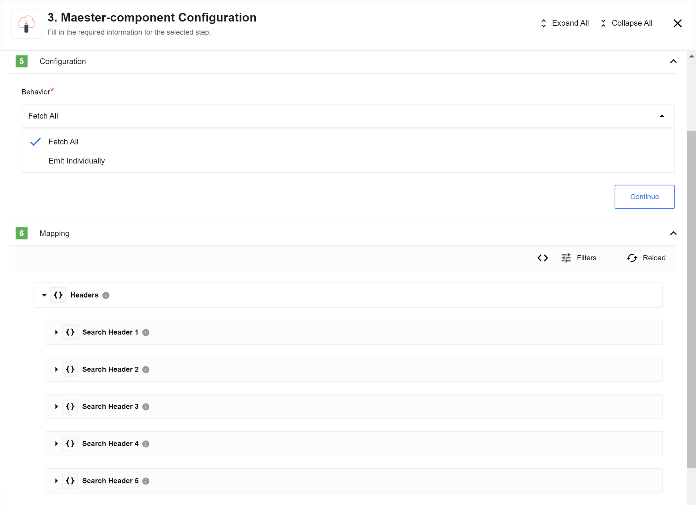
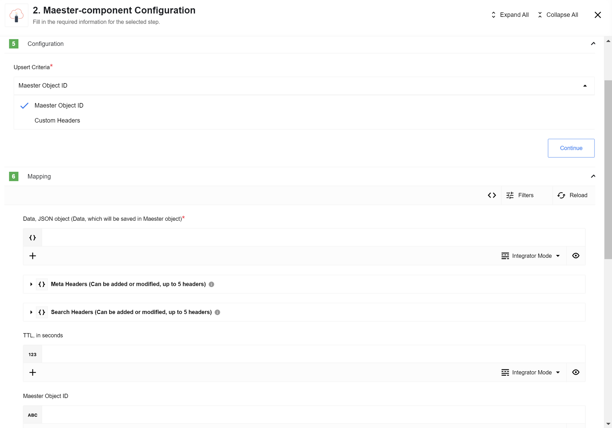

## General information

### Description

Maester component for the [{{site.data.tenant.name}} platform](http://www.{{site.data.tenant.name}}).

### Environment variables

No required Environment variables.

## Triggers

This component has no trigger functions. This means it will not be accessible to
select as a first component during the integration flow design.

## Actions

Within the Actions section of the documentation, you can leverage the Maester component, along with its Upsert Object action, to seamlessly integrate your data. Simply provide the body of your Webhook in the Data field. The Upsert Criteria will dynamically generate the Maester Object ID, which you can retrieve as an output.

In another flow, incorporating the Maester component and its Lookup Object (at Most One) action, you can effortlessly retrieve the desired data. Choose the Maester Object ID as the Lookup Criteria and supply the ID obtained from the previous flow.

For further streamlining the connection of Maester Object IDs across your workflows, consider utilizing the ID Linking component.

### Delete Object

#### Config Fields

* **Lookup Criteria** - (Dropdown with options: [`Maester Object ID`, `Custom Headers`], required)

#### Input Metadata

Dynamically generated

* `Maester Object ID` (string, uuid) - Used if `Upsert Criteria`: `Maester Object ID`. An id to find object in Maester. *Required*
* `Search Headers` - Used if `Upsert Criteria`: `Custom Headers`. Array of headers `{ key: header-key-1, value: heder-value-1}` which will be used to find an object in Maester (up to 5 headers). *Required*
* `Data` (JSON object) - Data which will be stored in object by itself. Only plain objects are supported. *Required*
* `Headers` - Array of headers `{ key: header-key-1, value: heder-value-1}` which will be added to new objects. *Optional*
* `TTL` (number) - Time in seconds while which Maester object will be present in DB. After this time object will be deleted and won't be available. Note: the process of deleting objects from DB starts every hour. By default will be used default expiration time from Maester installation. *Optional*

### Lookup Object (at Most One)

>**Please Note:** if more than one object found by `Search Headers` - error will be thrown

#### Config Fields

* **Lookup Criteria** - (Dropdown with options: [`Maester Object ID`, `Custom Headers`], required)
* **Allow search criteria to be omitted (ID/Headers)** - Checkbox (optional, default false): When selected, if search criteria was not provided (`ID` in case of Lookup Criteria: `Maester Object ID`; at least on header in case of Lookup Criteria: `Custom Headers`) the empty object {} is emitted, otherwise typically an error would be thrown.
* **Allow empty results** - Checkbox (optional, default false): When selected, if zero results are returned, the empty object {} is emitted, otherwise typically an error would be thrown.

#### Input Metadata

Dynamically generated

* `Maester Object ID` (string, uuid) - Used if `Upsert Criteria`: `Maester Object ID`. An id to find object in Maester. *Required*
* `Search Headers` - Used if `Upsert Criteria`: `Custom Headers`. Array of headers `{ key: header-key-1, value: heder-value-1}` which will be used to find an object in Maester (up to 5 headers). *Required*

### Lookup Objects

#### Config Fields

* **Behavior** - this selector configures output behavior of the component
 * `Fetch All` - the component output will be an array of messages
 * `Emit Individually` - Each object fill the entire message

#### Input Metadata

* `Headers` - Array of headers `{ key: header-key-1, value: heder-value-1}` with which will be searching

### Upsert Object

Depending on the 'Upsert Criteria' (see below) do the following:
1. Upsert Criteria: Maester Object ID. Look for an object with the given ID. If an object not found, creates a new object. If found - updates it.

>**Please Note**: If there is no object with given ID it creates a new object with the NEW ID. So the new object's id will differ from the provided one.

2. Upsert Criteria: Custom Headers. Look for an object with the given search headers (up to 5). Further logic is the same as in the previous item.

>**Please Note**: if more than one object found by `Search Headers` - error will be thrown

#### Config Fields

* **Upsert Criteria** - (Dropdown with options: [`Maester Object ID`, `Custom Headers`], required)

#### Input Metadata

Dynamically generated

* `Maester Object ID` (string, uuid) - Used if `Upsert Criteria`: `Maester Object ID`. An id to find object in Maester. *Optional*
* `Search Headers` - Used if `Upsert Criteria`: `Custom Headers`. Array of headers `{ key: header-key-1, value: heder-value-1}` which will be used to find an object in Maester (up to 5 headers). *Required*
* `Data` (JSON object) - Data which will be stored in object by itself. *Required*
* `Headers` - Array of headers `{ key: header-key-1, value: heder-value-1}` which will be added to new objects. Headers could be added to an existing object and modified as well, but they can not be deleted. *Optional*
* `TTL` (number) - Time in seconds while which Maester object will be present in DB. After this time object will be deleted and won't be available. Note: the process of deleting objects from DB starts every hour. By default will be used default expiration time from Maester installation. TTL cannot be modified or deleted once an object is created. *Optional*

### Known issues

1. Object TTL is not included in the output metadata.
2. TTL value will be ignored for updating existing object
