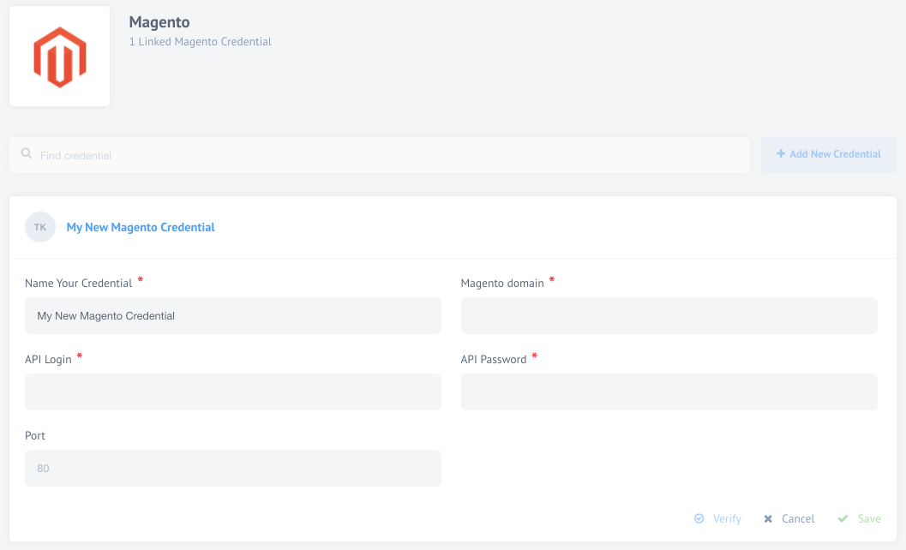

## Latest changelog

**1.3.1 (March 3, 2020)**

* Add configuration for Secured connection in credentials

> To see the full **changelog** please use the following [link](/components/magento1/changelog).

## Description

Magento 1 component for the {{site.data.tenant.name}} platform.

> **Note:** Magento 1 end of life was announced. It will be [supported through June 2020](https://magento.com/blog/magento-news/supporting-magento-1-through-june-2020).
> We recommend migrating to [Magento 2](/components/magento2) any time soon.

Magento is a very flexible and scalable eCommerce software and platform that
allows online merchants to control the look, content and functionality of their
eCommerce store.

Magento offers a number of powerful marketing, search engine optimisation and
catalog-management tools that help you really boost your online shop.

## Requirements

> Our Magento connector talks to **XML-RPC v1 API** of Magento. It is available in
> all versions of Magento starting from 1.1, including Enterprise, Go, and Community.
> More information can be found in [Magento API documentation](https://devdocs.magento.com/guides/m1x/api/soap/introduction.html).

### Credentials

To use Magento component, you need to add your account details into our system
or as we call it authenticate it. This means finding the right kind of
information from your Magento installation and filling-in the form when adding
the new Magento account.

*   **Name your account** (required) - Give any name that you can easily recognise afterwards.
*   **Magento domain** (required) - This is your site domain name excluding `http://` and special symbols (e.g. slashes). For example, if your Magento domain on your browser window is something like `http://magento.yoursite.com/ID` then you must input only `magento.yoursite.com` part in this field.
*   **API Login** (required) - Your Magento API Login. **This is NOT your admin or username that you use to login into your Magento installation.** This is a separate API login that you have to create (read further for more).
*   **API Password** (required) - Your Magento API login password. Again **this is NOT your admin or user password that you use to login into the Magento installation**. This API password is created separately along with the API login name (read further for more).
*   **Port** - Automatically set to `80`.
*   **Secured** - configuration for Secured connection in credentials. Can be `enabled` and
`disabled`.

To set your API login and API password follow instructions presented in a
[dedicated page](set-api-login-password).

## Triggers

### Query Sales Orders

Magento connector can also be used to **Query Sales Orders** from your Magento
Account. This trigger provides a possibility to get more than 425 unique record
fields for each sales order. The only required field here is the Magento account credentials.

### Get Customers

Magento connector can be used as a trigger component to **Get Customers** data
which would return 38 unique fields for each customer including billing and
shipping address fields. The only required field here is the Magento account access.

## Actions

### Create / Update Product

Create or Update Product action can accept data in 31 unique fields from the
previous connector, while only one field, **Product SKU** is required for this
connector to function along with connected Magento account.

To fully use the abilities of this connector we have provided additional filtering
possibilities that can help you to access only one specific segment of products.
To achieve that you can select the appropriate drop-down menu options to suit your needs.

Here is a quick overview of the values that you can expect from these menu options:

*   **Product Attribute Set** - This is the information you can access in your Magento Admin panel by going to **Catalog** > **Attributes** > **Manage Attribute Sets**. This is specific to your Magento eCommerce store.
*   **Product Type** - This information can be accessed by going into your Magento Admin panel **Catalog** > **Manage Products** where the Type is one of the columns in the table. It is not the scope of this document to describe all the product types but generally they can be:
    *   Simple products,
    *   Grouped products,
    *   Configurable products,
    *   Virtual products,
    *   Bundle products and
    *   Downloadable products.
*   **Default product status** - This field can have two values - `enabled` or `disabled`.

### Assign Product Category

This connector accepts information only in 3 fields, two of which are required:
*   **Category ID** (required)
*   **Product ID or SKU** (required)
*   Product position

### Update Inventory

**Update Inventory** action can accept data in 16 unique fields describing the
product inventory. For this connector to function we need at least one field,
**Product ID or SKU** to have a value.
