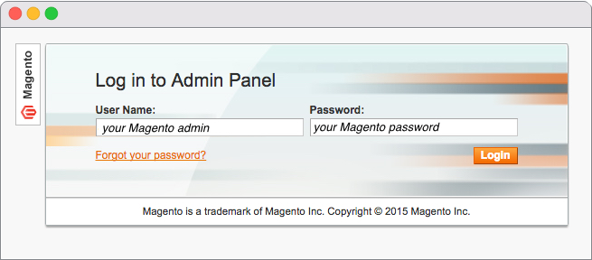
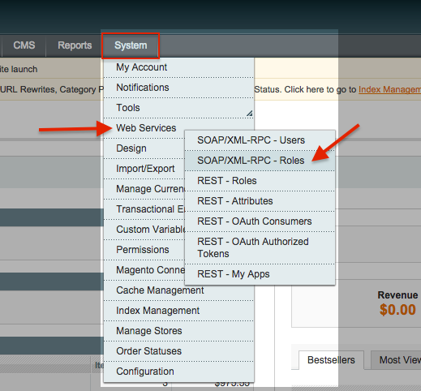
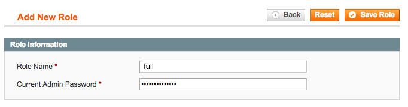
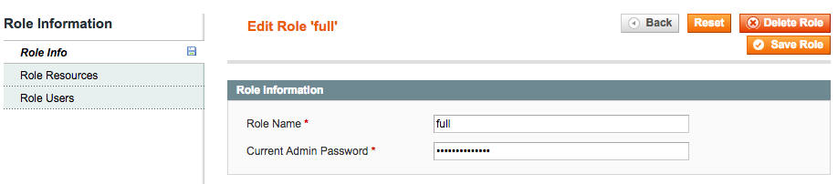
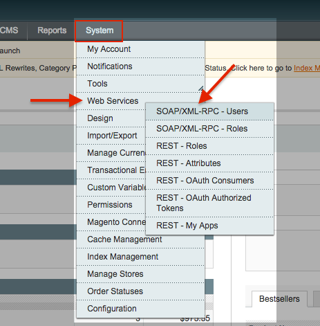
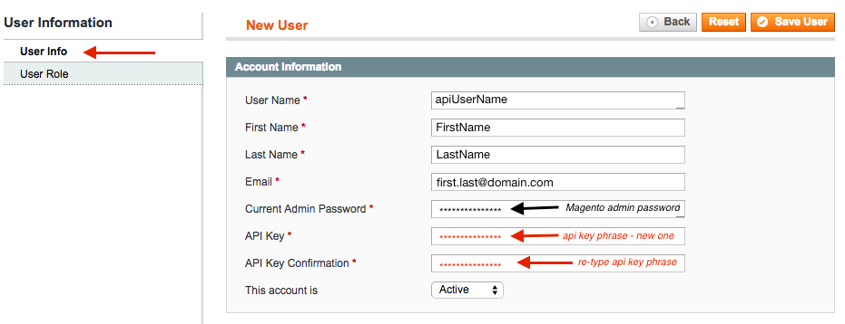
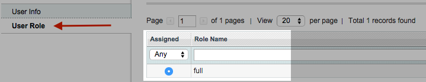

## Description

These are the instructions on how to set the API login and API password for Magento 1
installation to be used for [credentials section](index#credentials) of Magento 1 component.

We are going to assume that we have a fresh Magento 1 installation The default setup
for the new installed Magento 1 has no API users nor API roles, which means we
need to configure both. Here are the steps necessary to follow.

## Login to Magento admin panel

Here we use admin username and password to login into the Magento installation.

## Create API Role

Go to **System** > **WebServices** > **SOAP/XML-RPC - Roles**:

After when you click you are given an opportunity to **Add New Role**. If you
had already added an API Role then keep reading further.

For a simplicity, we can name this new Role `full` since we are going to give
this role full access. Please type your administrative password to create this role.

When the role is created we can check to see the setup of that role. The _**Role Info**_
is currently displayed here.

Role Resources tab has the necessary setup option that we need to tune. If we
pull-down the menu near the **Resource Access** we can choose between All or Custom.
From here we can do all sorts of customizations but for simplicity, we will choose
**All** and save this role.

The **Role Users** tab is empty by default if you have just created this role.
However, it would contain the users who have this particular role if you have
already done this procedure before.

## Create a new user with this specific role

Go to **System** > **WebServices** > **SOAP/XML-RPC - Users**:

Here we need to add a new user:

Now we need to fill in all the necessary information:

*   **User Name** - give a username which you can remember. This username is going to be used as API Login.
*   **First Name** - Fill in as appropriate.
*   **Last Name** - Same, fill-in as appropriate.
*   **Email** - a valid e-mail address.
*   **Current Admin Password** - give the current Magento installation admin password.
*   **API Key** - type-in a memorable phrase so that you can remember. This is not the same as admin password.
*   **API Key Confirmation** - re-type the same memorable phrase.

Navigate here to the _**User Role**_ tab and make sure that this newly created
user has the appropriate API Role. Since we named our role as `full` and we knew
that it actually means a full access:

After all our efforts, we can come back and add all the necessary
credentials in the **My New Magento Credential** form.

Go [back and input the values](index#credentials) in the correct places as it is shown above.
