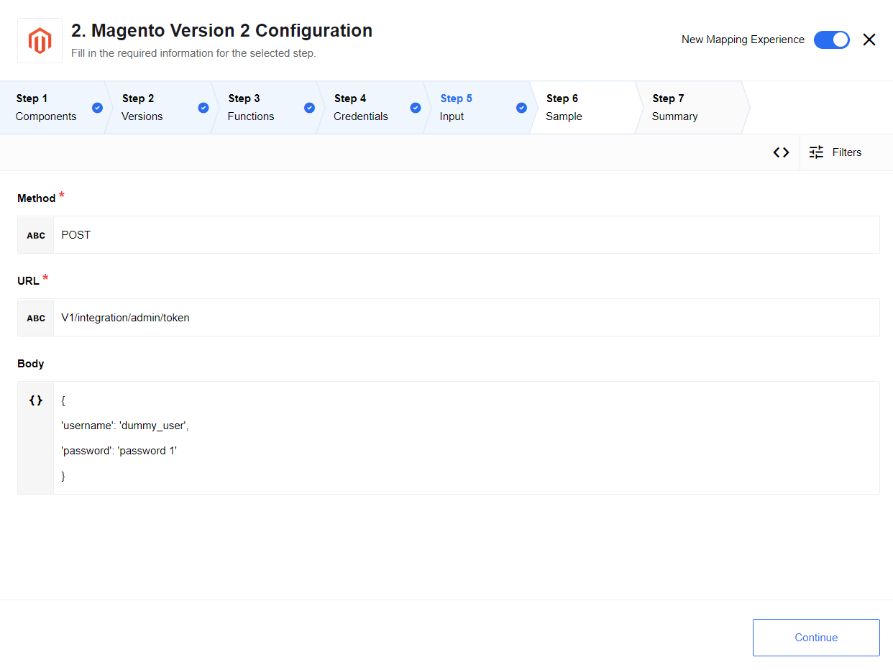
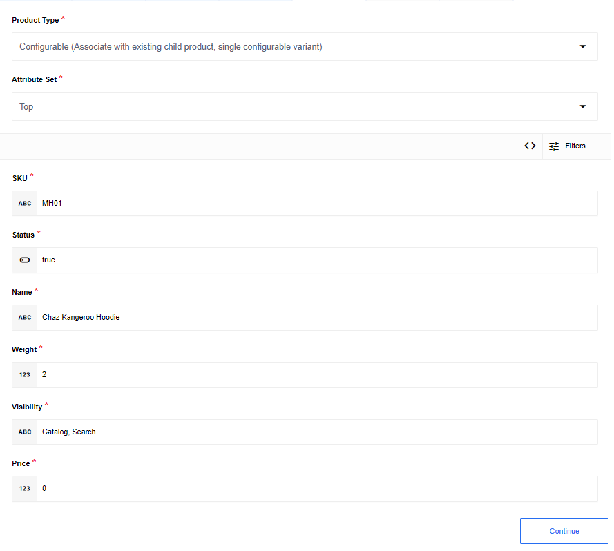

## Custom Request Action

You can do custom request using this action. You should manually specify `method`, `url` and `body`.

### Configuration Fields

There are two configuration fields:

**Don't throw error on 4XX/5XX HTTP response codes** - optional, if checked, the action will return the Magento response as an object, regardless of whether there is an error. However, authentication errors will still be thrown.

**Check if you'd like to make a series of calls (Developer Mode Only)** - optional, if checked, the action will allow a series of API calls as specified by `requests` array and emit an array of `responses`.

### Expected input metadata

Input metadata contains 3 fields:

**Method** - required, specify request method, you can choose one from currently supported by Magento 2 : `GET`, `POST`, `PUT`, `DELETE`. You also may choose any other new available method is case of Magento 2 API update.

**URL** - required, specify an endpoint for request, for example `V1/products/SKU-1`.

**Body** - object, specify body for request if it needed. For example:

```
{
   'username': 'dummy_user',
   'password': 'password 1'
}
```



If `Check if you'd like to make a series of calls (Developer Mode Only)` is checked, you will able to specify an array of requests to make. The fields available per request are the same as a single request. The JSON format is as following:

```
{
    "requests": [
      {
        "url" : "this/is/a/url",
        "method" : "supported method",
        "body" : "optional body..."
      },
      {
        "url" : "this/is/a/url",
        "method" : "supported method",
        "body" : "optional body..."
      },
      ...
    ]
}
```

### Expected output metadata

Output metadata is an object with the property `response`, which contains the response data, and the property `status`, which contains the response status code.

For example:

```
{
   'response': 'token'
   'status': 200
}
```

If `Check if you'd like to make a series of calls (Developer Mode Only)` is checked, the output metadata is an array of objects `responses`, each with their own response object and a property `status` which contains the response status code. The JSON format is as following:

```
{
    "responses": [
      {
        "response" : "Here's a response",
        "status" : "200",
      },
      {
        "response" : "Here's another response",
        "status" : "200",
      },
      ...
    ]
}
```  

## Set Inventory Action

This action allows you to set the quantity for an already existing product.

### Expected input metadata

Input metadata contains 3 fields:

**sku** - required, specify what product to set.

**qty** - required, specify what quantity to set.

**is_in_stock** - required, specify if product is in stock.

## Upsert Product Action

You can create new or update existing simple or configurable product and associate with existing child product (for configurable products).

### List of Expected Config fields

**Product Type** - dropdown list with product type options:

- Simple
- Configurable (Associate with existing child product, single configurable variant)

**Attribute Set** - dropdown list with all existing product attribute sets labels plus an options `Specify attribute set id from incoming message` and `Specify attribute set name from incoming message` to allow this to be populated from incoming message via attribute set id or name.



### Expected input metadata

Input metadata for simple product:

**SKU** - required, product sku that needs to be created or updated

**Status** - required, products status

**Name** - required, products name

**Weight** - required, products weight

**Visibility** - required, products visibility, enum of visibility labels

**Price** - required, products price

**Attribute Set id** - is present, if configuration field `Attribute Set` equals to `Specify attribute set id from incoming message`

**Attribute Set name** - is present, if configuration field `Attribute Set` equals to `Specify attribute set name from incoming message`

**Attribute** - dropdown list with all attributes labels, is present, if configuration field `Product Type` equals to `Configurable (Associate with existing child product, single configurable variant)`

**Custom Attributes** - object with global custom attributes and custom attributes for each store view

**Child skus** - an array of child SKUs that should be associated with the configurable product. Is present, if configuration field `Product Type` equals to `Configurable (Associate with existing child product, single configurable variant)`

### Expected output metadata

Output metadata contains created or updated product: `/lib/schemas/upsertProductNew.out.json`

## Set order as shipped Action

You can set order as shipped in this action.

### Expected input metadata

Input metadata contains 2 fields:

**Order Id** - required, specify order id, that needs to be set as shipped.

**skuQtyPairs** - required, array of objects with properties:

**sku** - product sku, than needs to be shipped

**qty** - quantity of products, than needs to be shipped

```json
[
   {
         "sku": "testSku",
         "qty": 1
   },
   {
         "sku": "testSku2",
         "qty": 3
   }
]
```

### Expected output metadata

Output metadata contains object with property `response` with shipment ID.

For example:

```json
{
   "response": "3"
}
```

## Set Sales Order External ID

This action allows to set or update Sales Order external ID for existing Order.

### Expected input metadata

**magento_order_id** - required, primary id of Sales Order entity for Magento 2 API.

**ext_order_id** - required, specify Sales Order an PID for external system.

```
{
   'magento_order_id': 1,
   'ext_order_id': 'some_external_id'
}
```

### Expected output metadata

Sales Order entity structure

| Type | Json schema location |
|-----------|------------- |
| SalesOrder  | `/lib/schemas/setSalesOrderExternalId.out.json` |

## Create Invoice Action

This action allows you to create an invoice for an already existing order using the order's `entity id`.

### Expected input metadata

Input metadata contains 2 fields:

**capture** - optional, indicate if payment was received for order. If true, payment was received.

**orderEntityID** - required, specify the order's `entity id`.

## Add Update To Sales Order

This action allows to set or update Sales Order status.

### Expected input metadata

**id** - required, primary id of Sales Order entity for Magento 2 API.

**isCustomerNotified** - optional boolean, is customer notified flag value. Default false.

**isVisibleOnFront** - optional boolean, is visible on storefront flag value. Default false.

**status** - optional string, new Sales Order status.

**comment** - optional string, add comment to Sales Order.

> **NOTE:** When updating of **status** property, please make sure that the input value is a valid status of your Magento2 system:  https://docs.magento.com/m2/ce/user_guide/sales/order-status.html.
The Component will not show an error if the **status** value is invalid, but Magento2 API will not validate this value.

```json
      {
          "id": 1,
          "isCustomerNotified": 1,
          "isCustomerNotified": 1,
          "status" : "Closed",
          "comment" : "Issue resolved. Order closed"
      }
```

### Expected output metadata

 Sales Order entity structure

|Type|Json schema location|
|-----------| -------------|
| SalesOrder  | [/lib/schemas/addUpdateToSalesOrder.out.json](/lib/schemas/setSalesOrderExternalId.out.json) |


## Lookup Object by ID

This action allows you to search up one of the object types:

- customer
- product
- sales order

by unique criteria.

### Expected input metadata

Input metadata will take the unique ID and an optional store view code. The store view will be set to `all` by default.

### Expected output metadata

The expected output will be the given object.

If `allow zero results?` is selected, the component will always return an empty object rather than an error if zero results are found.
If `allow ID to be ommitted` is selected, the ID field will not be required to run the action, but the item emitted by 'zero results found' will still be dependent on the other config field.

## Lookup Objects

Given a field-value return all matching records.

### List of Expected Config fields

#### Object Type

List contains default object types and custom object types.

|Supported default object types|
|-----------|
|Order|
|Product|
|Customer|

#### Emit Behaviour

Options are: `Emit Individually` emits each object in separate message, `Fetch All` emits all objects in one message,
`Fetch Page` emits all objects form selected paging iteration in one message

#### Number of search terms

- not required field, number of search terms.

Determines the number of search terms that the entity must match. Need to be an integer value from 1 to 99, default to 1.

### Expected input metadata

<details>
<summary>Input json Schema</summary>

```json

  {
    "type": "object",
    "properties": {
      "searchTerm0": {
        "title": "Search term",
        "type": "object",
        "properties": {
          "filterType": {
            "title": "Field Name",
            "type": "string",
            "required": true
          },
          "filterValues": {
            "title": "List of values",
            "description": "List of values to filter on in the specified fields.",
            "type": "array",
            "required": true,
            "items": {
              "value": {
                "type": "string"
              }
            }
          }
        }
      },
      "maxResultSize": {
        "description": "Positive integer that defaults to 1000",
        "required": false,
        "title": "Max result size",
        "type": "number"
      }
    }
  }

  ```

</details>

### Expected output metadata

Output metadata will be calculated dynamically according to Magento2 documentation

## Lookup Set Of Objects

Given an array of identities, this action allows you to find the corresponding objects. Currently, the following lookups are supported:
  - Customer
    - Email
    - Magento ID
  - Product
    - SKU
  - Sales Order
    - Magento ID
    - External Order ID

### Expected input metadata

Input metadata will take an array of string values (numbers for magento IDs) for the search field. For product lookups, there will be an optional store view code. If no store view code is provided, then data will be returned from the default magento store.

### Expected output metadata

The expected output is an object with a `resultsDictionary` property. The value of this `resultsDictionary` will be a dictionary where the keys are the lookup identity, and the key is the corresponding object.

### Configuration

If `Wait for objects to exist if they are not found.` is selected, the component will emit a rebound if not all identities are immediately found.  If this is not selected, then the component will immediately throw an error if any of the provided identities can not be matched to objects.

### Limitations

  * A maximum of 100 distinct ids can be provided.
  * `extenstion_attributes` of objects are not returned.

## Set Tiered Prices

This action takes an array as input, and therefore can only be used in **developer mode**.

### Input Metadata

The input metadata is a nested array that takes the following format:

```
   {
   "tieredPrices": [
   {
      "sku": string,                              # SKU for one product
      "prices": [                                 # sets tiered prices for SKU to this array of prices
         {
         "price": 100,                           # price (in currency)
         "price_type": "discount",               # either "discount" or "fixed"
         "website_id": "other_website",          # website ID can be given as either a string or an int
         "customer_group": "Retailer",           # Customer group must be given as a string
         "quantity": 45
         }
      ]
   }, {
      "sku": string,                              # SKU for one product
      "prices": []                                # providing an empty array will remove all existing tiered prices for this product
   }
   ]
}
```

### Output Metadata

The output will return an array of all the tiered prices for every SKU where they were changes.
If all tiered prices were removed, the output metadata will be `[]`.

## Upsert Customer

Updates a customer, or creates it if it doesn't exist. To update, you must provide the customer ID and website ID (Associate to Website). To create, do not enter a customer ID; the system will generate one.

> **Note**:
* The customer's addresses will be completely overwritten by the provided array of addresses
* Custom customer attributes can not be set

### Expected input metadata

**email** - required, unique email of the customer

**firstname** - required

**lastname** - required

### Expected output metadata

The output metadata is the created or updated product.

## Delete Object

This action allows you to delete the following object types:

- customer
- product

by unique criteria.

### Expected input metadata

To delete a customer, input either their customer ID or their email. To delete a product, input the product SKU.

### Expected output metadata

For customers, the output is their customer ID. For products, the output is its SKU.

## Read Store Config Action

You can read all the configured stores on a Magento instance (like [GET /V1/store/storeConfigs](https://devdocs.magento.com/swagger/#/storeStoreConfigManagerV1/storeStoreConfigManagerV1GetStoreConfigsGet))

> **Note**: As this information is very static, it is cached between calls within the same container life cycle.

### Expected output metadata

Output metadata contains object with property `storeConfigs`, which contains array of store configs.
For example:

<details>

<summary>Output metadata</summary>

```
{
  "storeConfigs": [
    {
      "id": 1,
      "code": "default",
      "website_id": 1,
      "locale": "en_US",
      "base_currency_code": "USD",
      "default_display_currency_code": "USD",
      "timezone": "UTC",
      "weight_unit": "lbs",
      "base_url": "http://magento_2_3_1/",
      "base_link_url": "http://magento_2_3_1/",
      "base_static_url": "http://magento_2_3_1/pub/static/version1554996639/",
      "base_media_url": "http://magento_2_3_1/pub/media/",
      "secure_base_url": "https://magento_2_3_1/",
      "secure_base_link_url": "https://magento_2_3_1/",
      "secure_base_static_url": "https://magento_2_3_1/pub/static/version1554996639/",
      "secure_base_media_url": "https://magento_2_3_1/pub/media/"
    },
    {
      "id": 2,
      "code": "other_store_view",
      "website_id": 2,
      "locale": "en_US",
      "base_currency_code": "USD",
      "default_display_currency_code": "USD",
      "timezone": "UTC",
      "weight_unit": "lbs",
      "base_url": "http://magento_2_3_1/",
      "base_link_url": "http://magento_2_3_1/",
      "base_static_url": "http://magento_2_3_1/pub/static/version1554996639/",
      "base_media_url": "http://magento_2_3_1/pub/media/",
      "secure_base_url": "https://magento_2_3_1/",
      "secure_base_link_url": "https://magento_2_3_1/",
      "secure_base_static_url": "https://magento_2_3_1/pub/static/version1554996639/",
      "secure_base_media_url": "https://magento_2_3_1/pub/media/"
    }
  ]
}
```  
</details>

## Create order

Creates an order on behalf of a customer given an existing customer id, or creates an order for a guest user.

### Expected input metadata

**customerId** - not required. The unique id for the customer in the Magento database. If not specified, order will be created from a guest cart instead of the customer's cart.

**order** - required. An array of store products, with **qty** (quantity) and **sku** (the unique product identifier) to add to the order.

**addressInformation** - required. The **shipping_address**, **billing_address**, **shipping_carrier_code**, and **shipping_method_code** for the order. See the component for more specific details.

**paymentMethod** - required. The payment method for the order.

### Expected output metadata

The output metadata is the contents of order that has just been created.

### Limitations

Due to a [preexisting issue with Magento 2.3.2](https://github.com/magento/magento2/issues/23908), this action does not work with Magento version 2.3.2.
