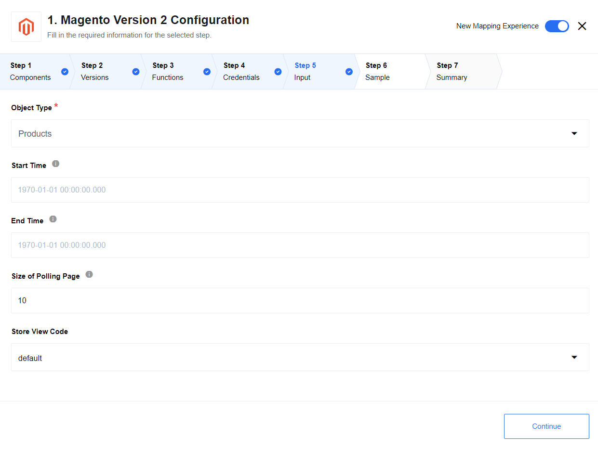
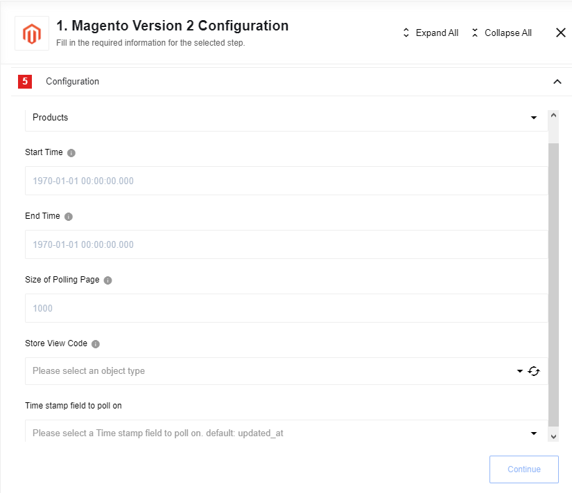

## Get New and Updated Objects Polling

Lookup objects polling trigger.

### Component's configuration:

**Object Type** - required, choose entity type for polling data. Possible options: Customers, Orders, Products.

**Start Time** - optional, indicates the beginning time to start polling from (defaults to the beginning of time).

**End Time** - optional, if provided, don’t fetch records modified after this time (defaults to never).

**Size of Polling Page** - optional, positive integer, indicates the size of pages to be fetched. Defaults to 1000 objects.

**Store View Code** - optional, the dropdown list with all store view codes, is useful for object type `Products`. With this option is possible to retrieve products for defined store view.

**pollConfig** - optional, a dropdown list allowing an integrator to specify polling based on updated_at or created_at timestamp

### Input Metadata

N/A

### Output Data

Each object emitted individually.

## Bulk Extract

Trigger for retrieval of large sets of person and person related data, using bulk Marketo API.

This trigger does not work as Get New and Updated Objects Polling trigger but for bulk operations due to Magento 2 API limitations. It will poll objects according to specified input parameters again after successful execution.

### Component's configuration:

**Object Type** - required, choose entity type for polling data. Possible options: Customers, Orders, Products.

**Store View Code** - optional, the dropdown list with all store view codes, is useful for object type `Products`. With this option is possible to retrieve products for defined store view.

### Input Metadata

N/A

### Output Data

Each object emitted individually.
