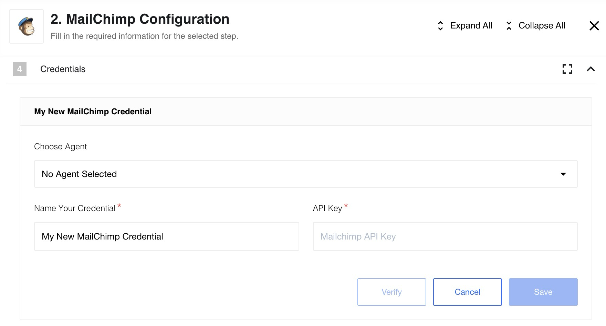
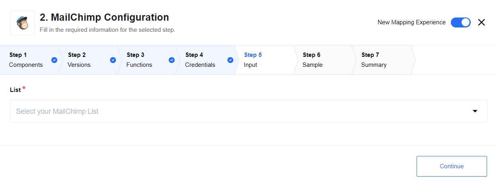
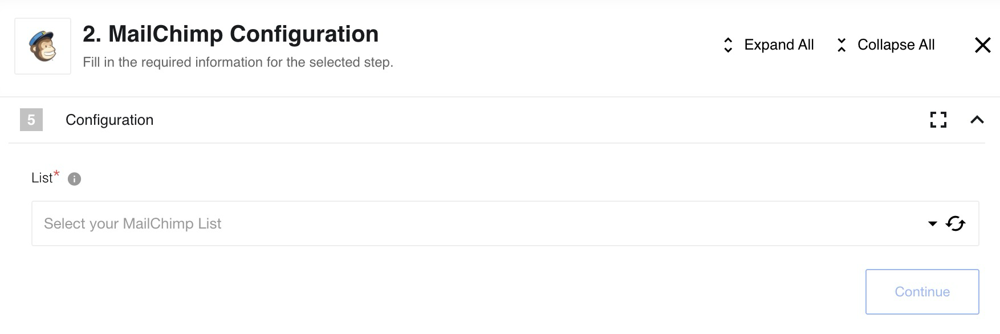
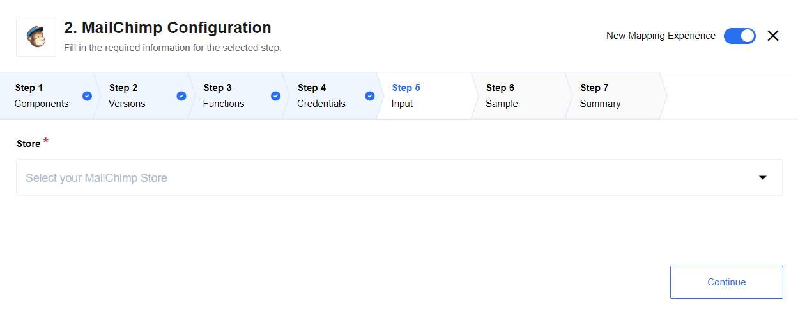

## Table of Contents

* [Description](#description)
* [Credentials](#credentials)
* [Actions](#actions)
  * [Add new Subscriber](#add-new-subscriber)
  * [Unsubscribe](#unsubscribe)
  * [Upsert Customer](#upsert-customer)

## Description

A robust connector designed to interface seamlessly with the Mailchimp API (v3.0). This component allows you to manage subscribers, handle unsubscriptions, and sync eCommerce customer data.

## Credentials

Authentication is handled via a Mailchimp API Key. You can generate this key within your Mailchimp account settings under Extras > API Keys.

## Triggers

This component has no trigger functions. This means it will not be accessible to
select as a first component during the integration flow design.

## Actions

### Add new Subscriber

This action adds a new member to a specified list or updates their information if the subscriber already exists (upsert).

**Dynamic Metadata:**
The mapping section for this action is dynamic. Once you select a Mailchimp List, the component automatically retrieves all specific **Merge Fields** (custom fields) defined for that list, allowing you to map them directly.

**API Endpoint:**
``PUT /lists/{list_id}/members/{subscriber_hash}``

See [here](http://developer.mailchimp.com/documentation/mailchimp/reference/lists/members/#edit-put_lists_list_id_members_subscriber_hash)
for more information

### Unsubscribe

This action unsubscribes a user from a selected list. It utilizes a permanent deletion method within the Mailchimp API.

**API Endpoint:**
``DELETE /lists/{list_id}/members/{subscriber_hash}``

See [here](http://developer.mailchimp.com/documentation/mailchimp/reference/lists/members/#delete-delete_lists_list_id_members_subscriber_hash)
for more information.

### Upsert Customer

This action syncs customer data into a Mailchimp eCommerce Store. It creates a new customer record or updates an existing one based on the provided external ID.

**API Endpoint:**
``PUT /ecommerce/stores/{store_id}/customers/{customer_id}``

See [here](http://developer.mailchimp.com/documentation/mailchimp/reference/lists/members/#delete-delete_lists_list_id_members_subscriber_hash)
for more information.
