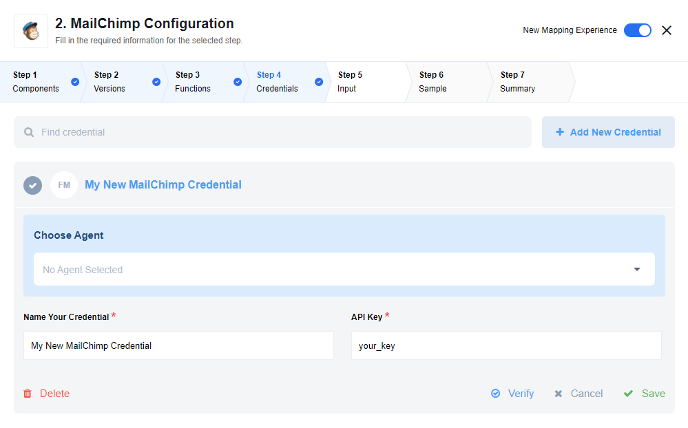
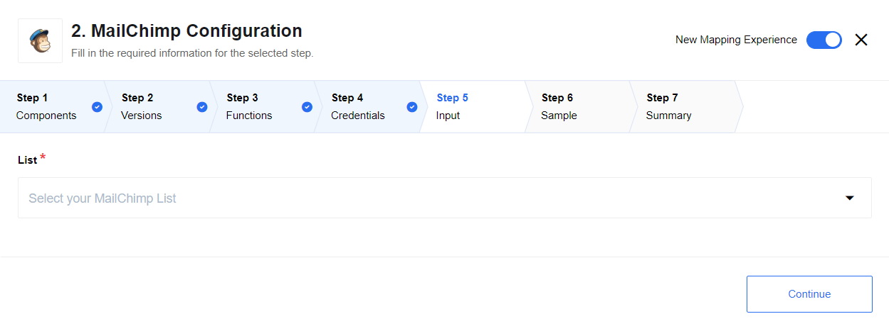

## Latest changelog

**1.0.1 (December 30, 2019)**

* Update component to new sailor version 2.5.4

> To see the full **changelog** please use the following [link](/components/mailchimp/changelog).

## Credentials

## Triggers

This component has no trigger functions. This means it will not be accessible to
select as a first component during the integration flow design.

## Actions

### Add new Subscriber

Upserts information about the subscriber in the list,
if subscriber with given e-mail already exists then information will be updated. If not will be added.

This method uses:

``PUT /lists/{list_id}/members/{subscriber_hash}``

See [here](http://developer.mailchimp.com/documentation/mailchimp/reference/lists/members/#edit-put_lists_list_id_members_subscriber_hash)
for more information

### Unsubscribe

This action unsubscribes user from the given list:

Actions uses following HTTP method:

``DELETE /lists/${listId}/members/${hash}``

See [here](http://developer.mailchimp.com/documentation/mailchimp/reference/lists/members/#delete-delete_lists_list_id_members_subscriber_hash)
for more information.

### Upsert Customer

Upserts information about the customer in the list,
if cubscriber already exists then information will be updated. If not will be added.

See [here](http://developer.mailchimp.com/documentation/mailchimp/reference/lists/members/#delete-delete_lists_list_id_members_subscriber_hash)
for more information.
