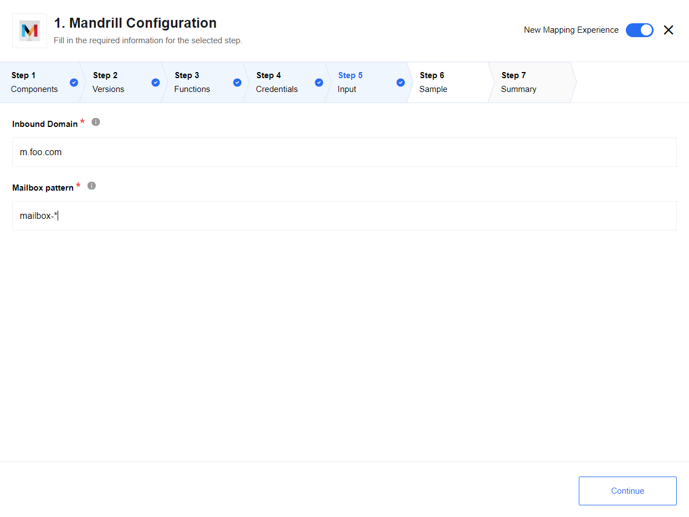

## Authentication

For authentication you would need a Mandrill API key. You can find it (or generate it) in the Mandrill UI:

## Triggers

### Inbound e-mail trigger

Intbound e-mail trigger can receive e-mails that are sent to mandrill inbox(es), it uses [Webhooks API](https://mandrill.zendesk.com/hc/en-us/articles/205583217-Introduction-to-Webhooks).

You have following configuration parameters.

## Actions

### Send Template

