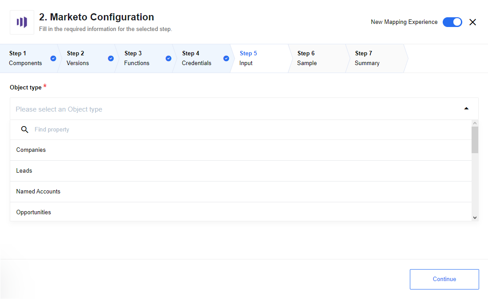
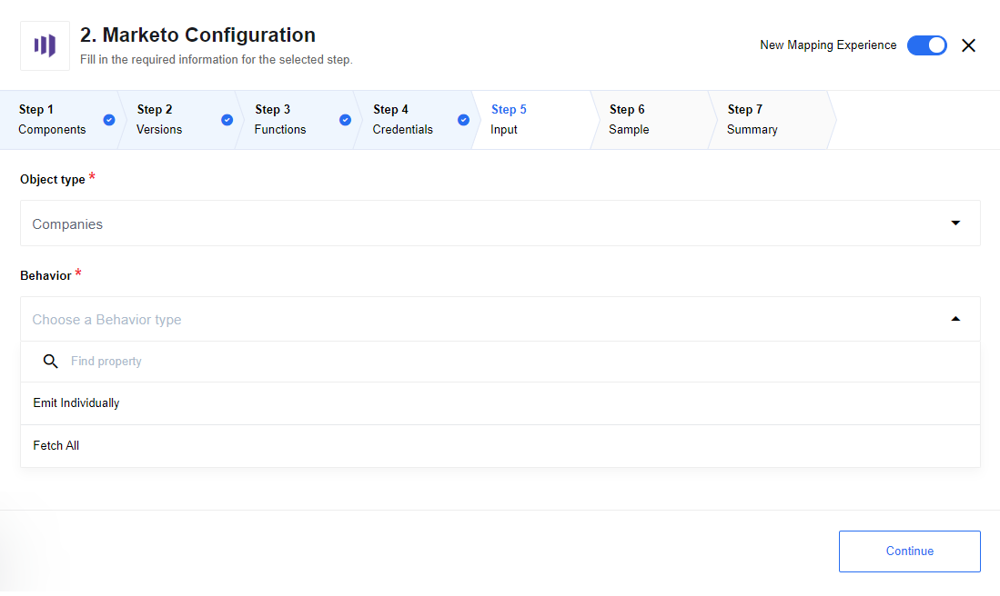
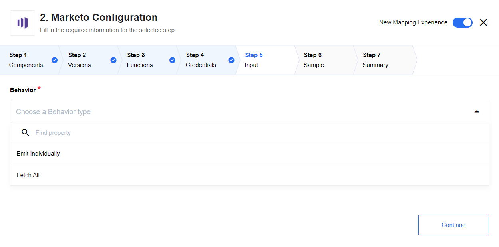
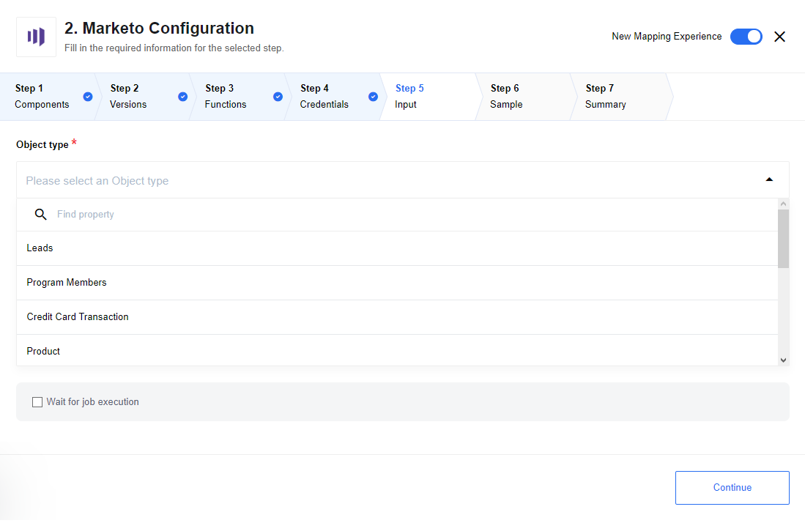
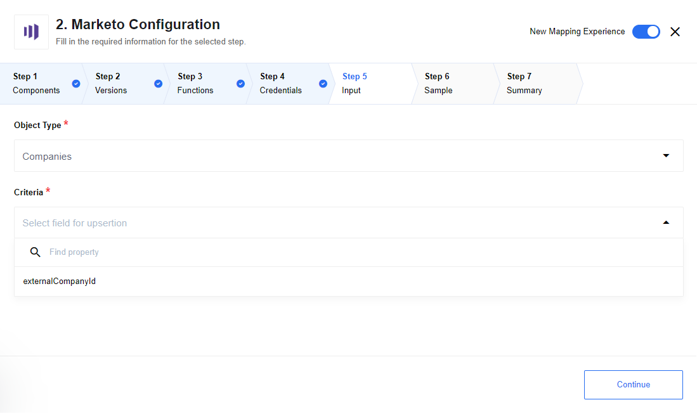
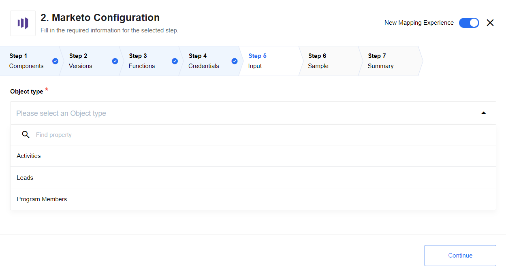
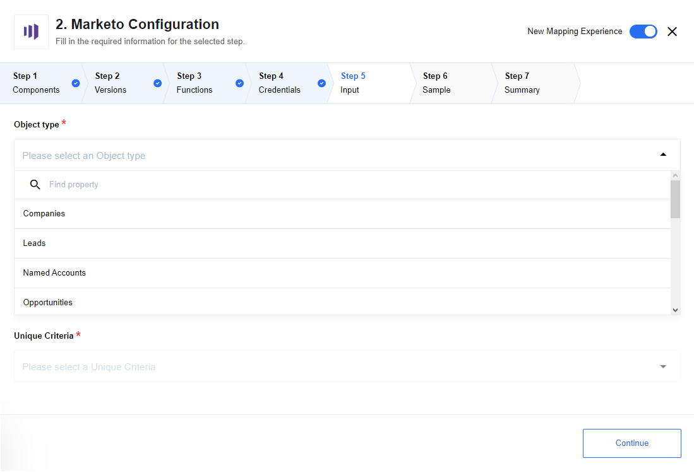
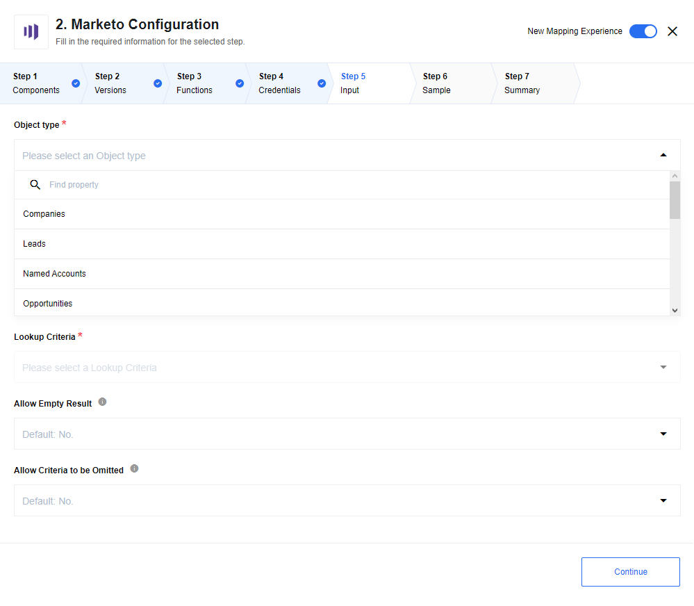

## Describe Object

Get describe Object metadata.



### List of Expected Config fields

List contains default object types and custom object types.

|Supported default object types|
|-----------|
|Companies|
|Leads|
|Named Accounts|
|Opportunities|
|Opportunity Roles|
|Sales Persons|

## List Custom Objects

Action will return a list of custom objects available in the destination instance, along with additional metadata about the objects.

## Lookup Objects

Lookup objects by criteria.



### List of Expected Config fields

List contains default object types and custom object types.

|Supported default object types|
|-----------|
|Companies|
|Leads|
|Named Accounts|
|Opportunities|
|Opportunity Roles|
|Sales Persons|

#### Emit Behaviour

Options are: `Emit Individually` emits each object in separate message, `Fetch All` emits all objects in one message

### Expected input metadata

<details>
<summary>Input json Schema</summary>

```json
{
  "type": "object",
  "properties": {
    "searchTerm0": {
      "title": "Search term",
      "type": "object",
      "properties": {
        "filterType": {
          "title": "Field Name",
          "type": "string",
          "required": true
        },
        "filterValues": {
          "title": "List of values",
          "description": "List of values to filter on in the specified fields.",
          "type": "array",
          "required": true,
          "items": {
            "value": {
              "type": "string"
            }
          }
        }
      }
    },
    "maxResultSize": {
      "description": "Positive integer that defaults to 1000",
      "required": false,
      "title": "Max result size",
      "type": "number"
    }
  }
}
```

</details>

### Expected output metadata

Output metadata will be calculated dynamically according to Marketo documentation

### Example of input message

```json
{
  "searchTerm0": {
    "filterType": "id",
    "filterValues": ["210","211","339","344","214","215","216"]
  }
}
```

## Lookup Activities

Lookup Activities by criteria.



### List of Expected Config fields

#### Emit Behaviour

Options are: `Emit Individually` emits each object in separate message, `Fetch All` emits all objects in one message

### Example of input message

```json
{
  "activityTypeIds": [1],
  "sinceDatetime": "2015-04-21T20:51:56.790Z"
}
```

>**NOTES:** If you want to generate the sample for Fetch All behavior, use a small period time in your filter criteria.
In other cases, you will receive a retrieve sample timeout error.

## Bulk Import

Action for insertion of large sets of person and person related data.



### List of Expected Config fields

#### Object Type

List contains default object types and custom object types.

|Supported default object types|
|-----------|
|Leads|
|Program Members|

### Wait for job execution

Checkbox, if unchecked - action returns the result of bulk import job creation if checked - the action starts to poll bulk import job status with the specified timeout (by default 10000 ms, or it is possible to configure environment variable `BULK_IMPORT_POLLING_TIMEOUT`): the action is executed successfully when job status becomes `Complete` and failed when job status becomes` Failed`.

### Expected input metadata

Input metadata depend on object type:

<details>
       <summary>Metadata for object type Leads</summary>

```json
{
"type": "object",
"properties": {
  "format": {
    "required": true,
    "type": "string",
    "enum": [
      "csv",
      "tsv",
      "ssv"
    ]
  },
  "lookupField": {
    "type": "string"
  },
  "partitionName": {
    "type": "string"
  },
  "listId": {
    "type": "number"
  }
}
}
```
</details>


<details>
       <summary>Metadata for object type Program Members</summary>

```json
{
"type": "object",
"properties": {
  "format": {
    "required": true,
    "type": "string",
    "enum": [
      "csv",
      "tsv",
      "ssv"
    ]
  },
  "programId": {
    "required": true,
    "type": "string"
  },
  "programMemberStatus": {
    "type": "string",
    "required": true
  }
}
}
```

</details>

<details>
       <summary>Metadata for custom objects type</summary>

```json
{
"type": "object",
"properties": {
  "format": {
    "required": true,
    "type": "string",
    "enum": [
      "csv",
      "tsv",
      "ssv"
    ]
  }
}
}
```
</details>

### Limitation

The action uses the attachment mechanism, so due to platform limitation doesn't work with Local Agent Installation.

## Upsert Objects

Action upsert objects by unique criteria.



### List Config fields

#### Object Type

 * Supported standard objects: Companies, Leads, Named Accounts, Opportunities, Opportunity Roles, Sales Persons
 * Also supports custom object types

#### Criteria

Field used for object upsertion. Note: if field is missed in input body error would be thrown

### Example of Usage

1. Upsert of one object:

* Object Type `Companies`
* Criteria `externalCompanyId`
* Input messsage:

```json
{ "values" : {
 "externalCompanyId": "19UYA31581L000000",
 "company": "Example"
  }
}
```

2. Upsert of multiple objects:

* Object Type `Companies`
* Criteria `externalCompanyId`
* Input messsage:

```json
{ "values" : [
{
 "externalCompanyId": "19UYA31581L000001",
 "company": "Example 1"
},
{
 "externalCompanyId": "19UYA31581L000002",
 "company": "Example 2"
},
{
 "externalCompanyId": "19UYA31581L000003",
 "company": "Example 3"
}
]}
```

### Limitations

1. Maximum number of upserted object in one message is 300

## Bulk Extract

Marketo provides interfaces for retrieval of large sets of person and person related data, called Bulk Extract.
Bulk extract is performed by creating a job, defining the set of data to retrieve, enqueuing the job,
waiting for the job to complete writing a file, and then retrieving the file over HTTP.
These jobs are executed asynchronously, and can be polled to retrieve the status of the export.
Action `Bulk Extract` creates a job with a defined set of data to retrieve. For polling status of the export
and retrieving file you should use trigger [Poll Bulk Extract Results](#poll-bulk-extract-results).



>**Please Note** action `Bulk Extract` and trigger `Poll Bulk Extract Results` should be used in different flows,
both flows: with action `Bulk Extract` and with trigger `Poll Bulk Extract Results`, should be created in the same workspace.

### List Config fields

#### Object Type

List contains object types that can be used for `Bulk extract` interface.

|Supported object types|
|-----------|
|Activities|
|Leads|
|Program Members|

### Expected input/output metadata

Input/output metadata depend on object type and generated from [Marketo swagger document](https://developers.marketo.com/swagger/swagger-mapi.json) for the corresponding object type, or you can specify another URL in environment variable `SWAGGER_URL`

### Example of Usage

1. Create first flow with 2 steps:
  - Simple Trigger
  - `Bulk Extract` action
2. Create second flow in the same workspace with 2 steps:
  - `Poll Bulk Extract Results` trigger
  - `E-Mail` action
3. Run first flow - Bulk Extract Job should be created
4. Run second flow - trigger waits for job completion
5. When the job is completed and trigger processing is finished, check mailbox - file with job result should be received.

### Limitations

 1. Mandatory fields are not marked in the input metadata for Activities and Program Members entities.  You can find this information in the [API documentation](https://developers.marketo.com/rest-api/bulk-extract)
 2. The action uses the attachment mechanism, so due to platform limitation doesn't work with Local Agent Installation.

## Delete Object By Unique Criteria

Delete Object By Unique Criteria.



### List Config fields

#### Object Type

List contains default object types and custom object types.

|Supported default object types|
|-----------|
|Companies|
|Leads|
|Named Accounts|
|Opportunities|
|Opportunity Roles|
|Sales Persons|

#### Unique Criteria

Drop-down list, it is needed to choose kind of field(s) for unique criteria.
All object types support following lookup criteria:

|Unique Criteria|
|-----------|
|Marketo ID|
|Dedupe Fields|

Except for `Leads` - only `Marketo ID` is supported.

### Expected input metadata

Input metadata depend on object type and unique criteria.

### Expected output metadata

Output metadata will be calculated for defined object type dynamically according to Marketo documentation. If an object was not found action returns empty object.
For instance for object type `Companies` it is:

<details>
<summary>Output metadata schema</summary>

```json
{
  "type": "object",
  "properties": {
    "result": {
      "type": "array",
      "items": {
        "type": "object",
        "properties": {
          "status": {
            "type": "string",
            "required": true
          },
          "id": {
            "type": "string",
            "required": true
          },
          "seq": {
            "type": "string",
            "required": true
          }
        }
      }
    }
  }
}

```

</details>

## Lookup Object (at most 1)

Lookup Object By Unique Criteria.



### List Config fields

#### Object Type

List contains default object types and custom object types.

|Supported default object types|
|-----------|
|Companies|
|Leads|
|Named Accounts|
|Opportunities|
|Opportunity Roles|
|Sales Persons|

#### Lookup Criteria

List needed to choose kind of field(s) for lookup criteria.

All object types support following lookup criteria:

|Lookup Criteria|
|-----------|
|Marketo ID|
|Dedupe Fields|

Except for `Leads` - only `Marketo ID` is supported.

#### Allow Empty Result

Default `No`. In case `No` is selected - an error will be thrown when no objects were found,
If `Yes` is selected -  an empty object will be returned instead of throwing an error.

#### Allow Criteria to be Omitted

Default `No`. In case `No` is selected - an error will be thrown when criteria are missing in metadata, if `Yes` is selected - an empty object will be returned instead of throwing an error.

### Expected input metadata

Input metadata depend on object type and lookup criteria.

### Expected output metadata

Output metadata will be calculated for defined object type dynamically according to Marketo documentation.
