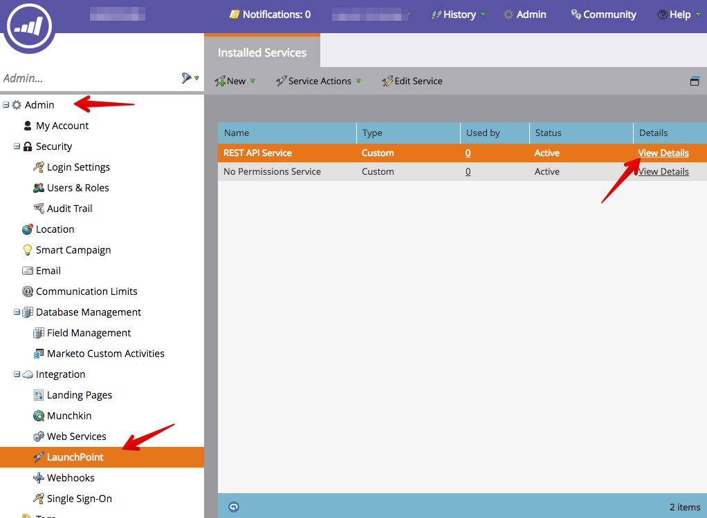
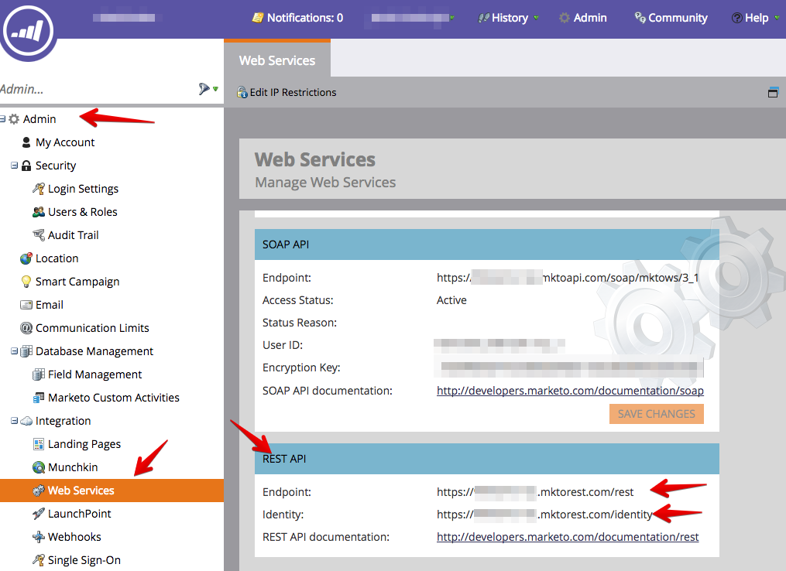
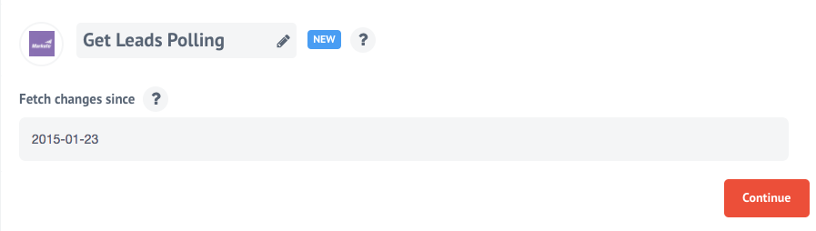

## Description

[Marketo](https://www.marketo.com/) is a marketing automation platform focused
on account-based marketing, including email, mobile, social, digital ads, web
management and analytics.

## Authentication

Marketo [provides instructions to grant API access](http://developers.marketo.com/rest-api/) under the section `Getting Started`.  The following permissions are required for the role:

 * `Access API`.`Read-Only Activity` -> For all polling tasks and for verifying
 credentials
 * `Access API`.`Read-Only Lead` -> For `GetLeadsPolling`

The instructions only need to be followed until the integrator has the following
pieces of information:
 * `Client Id`
 * `Client Secret`
 * `Endpoint`
 * `Identity`

First two items you can find here:

Other two here:

Once these values have been collected, they can be entered in the account information [{{site.data.tenant.name}}](http://www.{{site.data.tenant.name}}).

## Triggers

### Get Leads Polling

Will poll Marketo API and fetch new and updated Leads:

Has only one **optional** configruation option - `Fetch changes since`, it accepts an ISO 8601 date that will be used
as a beginning of fetch interval, e.g. `2015-01-01` will fetch all leads that were created and/or modified since 01.01.2015
when omitted no historical data will be fetched, only created and/or modified leads from the time when polling starts
will be fetched.

## Actions

This component has no action functions.

## Required environment variables

No environment variables are required.

## License

Apache-2.0 © [{{site.data.tenant.name}} GmbH](https://www.{{site.data.tenant.name}})
