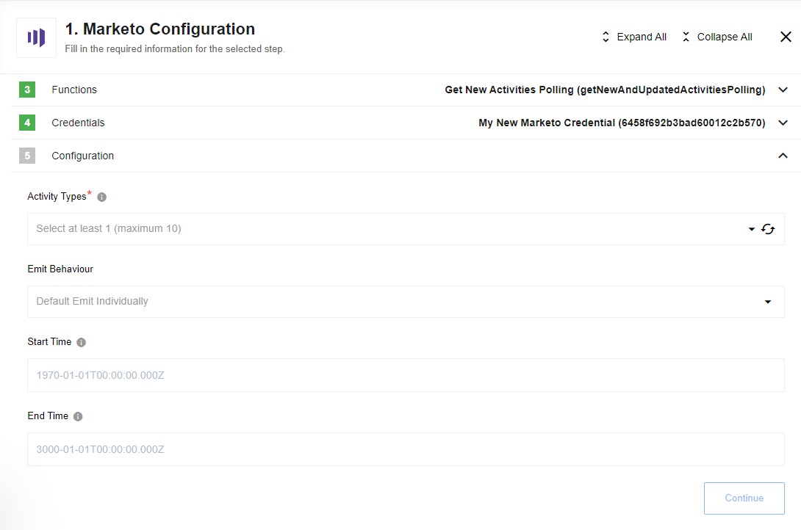
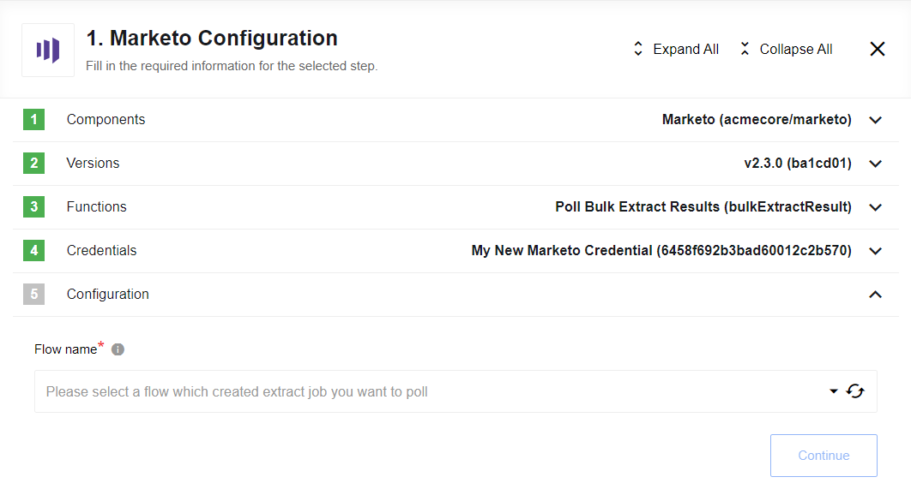

## Get New Activities Polling

Trigger to get all new and updated activities since last polling.

Trigger uses {endpointUrl}/v1/activities.json [url](https://developers.marketo.com/rest-api/endpoint-reference/lead-database-endpoint-reference/#/Activities/getLeadActivitiesUsingGET)

### List of Expected Config fields

* **Emit Behaviour** -  Options are: default is `Emit Individually` emits each object in separate message, `Fetch All` emits all objects in one message
* **Activity Types** - Dropdown list with activities types to choose (from 1 to 10)!
* **Start Time** - Start datetime of polling. Default min date: 1970-01-01T00:00:00.000Z
* **End Time** - End datetime of polling. Default max date: +275760-09-13T00:00:00.000

## Get New Leads Polling

Trigger to get all leads updates. Only [updated](https://developers.marketo.com/rest-api/lead-database/activities/#data_value_changes) leads fields wold be retrieved.

### List of Expected Config fields

* **Events type** - leads events type on Marketo: for leads changes select `Changes`, to get deleted leads - `Deleted`
* **Emit Behaviour** -  Options are: default is `Emit Individually` emits each object in separate message, `Fetch All` emits all objects in one message
* **Start Time** - Start datetime of polling. Default min date: 1970-01-01T00:00:00.000Z
* **End Time** - End datetime of polling. Default max date: +275760-09-13T00:00:00.000

## Poll Bulk Extract Results

Marketo provides interfaces for retrieval of large sets of person and person related data, called Bulk Extract.
Bulk extract is performed by creating a job, defining the set of data to retrieve, enqueuing the job,
waiting for the job to complete writing a file, and then retrieving the file over HTTP.
These jobs are executed asynchronously, and can be polled to retrieve the status of the export.
Action [Bulk Extract](#bulk-extract) creates a job with a defined set of data to retrieve.
This trigger `Poll Bulk Extract Results` is used for polling status of the export and retrieving file.
The bulk extract job result file is placed in the attachment and can be processed in the next flow step.

>**Please Note:** action `Bulk Extract` and trigger `Poll Bulk Extract Results` should be used in different flows,
 both flows: with action `Bulk Extract` and with trigger `Poll Bulk Extract Results`, should be created in the same workspace.

### List of Expected Config fields

#### Flow name

Drop-down list with all available flow in the current workspace.
It is necessary to choose flow with `Bulk Extract` action that should be polled.

### Example of Usage

The same as [Bulk Extract](actions#bulk-extract) action
